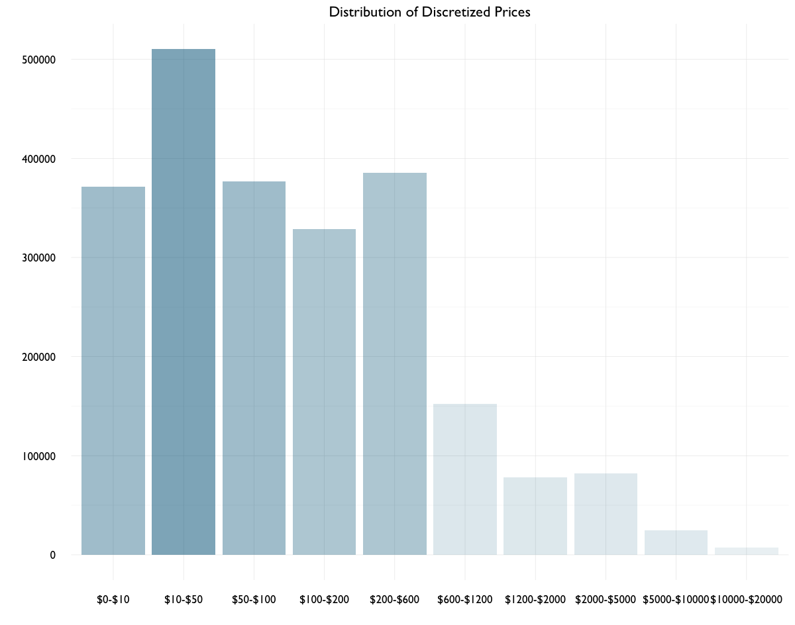

# Agora Association Rules - Preparation

- _outputs from the file_ [`agora-associations-04-cleanse.R`](R/agora-associations-04-cleanse.R)
- general application to different mining sessions
- basic info on [Association Rule Mining](AgAssociation-Basics.md)
- forward to mining: [Agora Association Rules](AgAssociationRules-04-04.md)

Contents:

- [Preparation](#preparation)
- [Discretize Prices](#discretize-prices)
- [Anonymize Vendors](#anonymize-vendor-names)
- [Transaction Conversion](#transaction-conversion)
- [References](#references)

```{R}

library(arules)
library(arulesViz)
library(data.table)
library(igraph)
library(geomnet)
library(ggplot2)
library(anonymizer)

a <- fread("~/GitHub/agora-data/agora-01b.csv", stringsAsFactors = T)
```

Even though association rule mining is often written about in terms of finding novel itemsets and rules, I'm going to be focusing more on seeing what traverses this market network, what relationships might exist, and looking at probabilities for different classes occurring as a means to advise in selecting features. 

While the market is large, you might say the products on offer fall into 'niche' categories. I think of looking for novel itemsets/rules here as being akin to doing so at a supermarket but limiting yourself to only the produce section. Basically, I'm not hoping to find out something akin to sales of Pop-Tarts spiking before hurricanes<sup>[1](#references)</sup> - and nevermind about diapers and beer. There's less of a chance for "surprises" when the range of items doesn't span Amazon's entire catalog. 

That said - finding rules that traverse the network should still prove informative and interesting. 

What does the probability of a specific cateogory appearing in the network reveal? And a specific price cluseter, or location? Or any combination of these factors?  

# Preparation

## Subset and Categorize

```{r}
ag <- subset(a, a$usd <= 20000) # 2319949
```

Why subset for prices under $20,000? 

Often on Agora there will be products listed at exorbitant prices.

While on the surface they may resemble scams, it's been observed that these prices are here for vendors to keep their listings active while waiting for their supply to be restocked <sup>[2](#references)</sup><sup>,</sup><sup>[3](#references)</sup>. The prices are set high to discourage transactions, but keep their listings active to maintain their market presence and 'advertise' for the near-future when supply is replenished. While there is some gray area where 'placeholders' will mingle amongst potentially legitimate listings, the number of these listings is quite small compared to the population and can be easily subsetted and examined were it an issue. 

An example of this 'mingling': sorting the data by price might show a $45,000 gram of cannabis, next to a $47,000 listing for a kilogram of cocaine. One being an outrageous price for quantity, and other being just about fair street value. 


## Combine Subcategories


```{r}
# convert NA to blank
ag$subcat[is.na(ag$subcat)] <- ""
ag$subsubcat[is.na(ag$subsubcat)] <- ""

# combine subcategory and sub-subcategory
ag$sc <- paste(ag$subcat, ag$subsubcat, sep = ", ")
levels(as.factor(ag$sc))
ag$sc <- gsub("\\b,\\s$", "", ag$sc)

# convert to factor
levels(as.factor(ag$sc))
ag$sc <- factor(ag$sc) # 106 levels
```

From the HTML, 3 categories could be extracted from each page/listing. These would range from high-level description (e.g. '**Drugs**') to finer-grain sub- and sub-subcategories (e.g. '**Cannabis**', '**Concentrates**') further down the menu. Each is it's own variable in the data, but they're inextricably linked by the listing itself.

For the purposes of association rule mining, it was decided to aggregate sub- and sub-subcategories into one variable to avoid superflous itemsets and rules. It also provides a nicer description when plotted and still comes out to right number of levels as a factor. A look at the top:

```{R}

levels(ag$sc)
  [1] "Accessories"                "Accounts"                  
  [3] "Advertising"                "Aliens/UFOs"               
  [5] "Ammunition"                 "Anonymity"                 
  [7] "Barbiturates"               "Barbiturates, Barbiturates"
  [9] "Benzos"                     "Cannabis"                  
 [11] "Cannabis, Concentrates"     "Cannabis, Edibles"         
 [13] "Cannabis, Hash"             "Cannabis, Seeds"           
 [15] "Cannabis, Shake/trim"       "Cannabis, Synthetics"      
 [17] "Cannabis, Weed"             "Clothing"                  
 [19] "Containers"                 "Disassociatives"           
 [21] "Disassociatives, GBL"       "Disassociatives, GHB"      
 [23] "Disassociatives, Ketamine"  "Disassociatives, MXE"      
 [25] "Disassociatives, Other"     "Dissociatives, GBL"        
 [27] "Dissociatives, GHB"         "Dissociatives, Ketamine"   
 [29] "Dissociatives, MXE"         "Dissociatives, Other"      
 [31] "Dissociatives, PCP"         "Doomsday"                  
 [33] "eBooks"                     "Economy"                   
 [35] "Ecstasy"                    "Ecstasy, Ecstasy"          
 [37] "Ecstasy, MDA"               "Ecstasy, MDMA"
 ...

```

# Discretize Prices

Using `discretize` from the `arules` packsage previously involved a choice of whether to bin values by equal intervals or cluster. To inform that decision - a look at the distribution of list prices.

### Price Distributions

```{R}
# discretize prices - but into cluster or interval?
ag$usd <- round(ag$usd, 2)

summary(ag$usd)
#  Min.  1st Qu.   Median     Mean  3rd Qu.     Max. 
# 0.00    24.28    84.97    426.40   290.20 20000.00

quantile(ag$usd)
#   0%      25%      50%      75%     100% 
# 0.00    24.28    84.97   290.19 20000.00 
```

I'll venture that most of the values are towards the left...Although the summary shows a mean price of $426.40, a mean value well above the median _and_ 3rd quartile might be a strong indicator of left skew.

```{r}
par(mfrow = c(2, 2), mar = c(6, 6, 6, 6), family = "GillSans")

hist(ag$usd, breaks = 100, main = "n < $20,000", 
     xlab = "", ylab = "Frequency")
hist(ag$usd, breaks = 100, xlim = c(0, 5000), 
     main = "n < $5,000", xlab = "", ylab = "")
hist(ag$usd, breaks = 1000, xlim = c(0, 1000), 
     main = "n < $1,000", xlab = "price in USD", ylab = "Frequency")
hist(ag$usd, breaks = 10000, xlim = c(0, 200),
     main = "n < $200", xlab = "price in USD", ylab = "")
```


As suspected. Lognormal? 

```{R}
# heavy on the left/long tail - quick check of the log
ag$log.usd <- log(ag$usd)

summary(ag$log.usd)
#  Min. 1st Qu.  Median    Mean 3rd Qu.    Max. 
# -Inf   3.190   4.442    -Inf   5.671   9.903 

exp(c(4, 4.25, 4.5, 4.75, 5))
# 54.59815  70.10541  90.01713 115.58428 148.41316

ggplot(ag, aes(x = log.usd)) + 
  geom_histogram(binwidth = 0.20, color = "black", alpha = 0, size = 0.5) +
  scale_x_continuous(breaks = seq(-5, 10, 1)) +
  theme_minimal(base_size = 16, base_family = "GillSans") +
  theme(axis.text.y = element_text(size = 14),
        axis.text.x = element_text(size = 14),
        panel.grid.major = element_line(color = "gray82"),
        plot.margin = unit(c(1, 1, 1, 1), "cm")) +
  labs(title = "log Distribution of Prices, n = 2317353",
       x = "", y = "")
```


Visually it appears the mean of the log distribution of prices falls around 4.5 - of course, visually, that might change depending on the number of breaks/binwidth. But assuming that's case, prices can be observed in a range from about $60-$100 near the mean. This is judging from exponentiating 4.25 and 4.75 out. 

The spike at at/near zero seems to indicate a number of $1 listings. From exploratory plots, this spike is likely the result of eBook listings. But since that anomaly was observed, it might be a good idea to look more closely at distributions of prices by specific intervals.

### Price Distributions by Interval


```{R}
# plot under 200 to under 10 dollar
par(mfrow = c(2, 2), mar = c(6, 6, 6, 6), family = "GillSans")
hist(ag200, breaks = 150, xlim = c(0, 200), main = "usd < $200", ylab = "")
hist(ag100, breaks = 150, xlim = c(0, 100), main = "usd < $100", ylab = "")
hist(ag50, breaks = 150, xlim = c(0, 50), 
     main = "usd < $50", xlab = "price in USD", ylab = "")
hist(ag10, breaks = 100, xlim = c(0, 10), 
     xlab = "price in USD", main = "usd < $10", ylab = "")

# look at densities under $200
plot(density(subset(ag$usd, ag$usd <= 200.00)), main = "usd < $200")
plot(density(ag100 <- subset(ag$usd, ag$usd <= 100.00)), main = "usd < $100", ylab = "")
plot(density(subset(ag$usd, ag$usd <= 50.000)), main = "usd < $50")
plot(density(subset(ag$usd, ag$usd <= 10.000)), main = "usd < $10", ylab = "")
```


Spikes at certain denominations: 1, 5, 10, 15, 20, 25, 30, 35...


``` {R}
# look at distributions between 500-5000
hist(ag5000, breaks = 200, xlim = c(2000, 5000), main = "$2000 < usd < $5000")
hist(ag2000, breaks = 200, xlim = c(1200, 2000), main = "$1200 < usd < $2000", ylab = "")
hist(ag1000, breaks = 150, xlim = c(600, 1200), main = "$600 < usd < $1200")
hist(ag600, breaks = 150, xlim = c(200, 600), main = "$200 < usd < $600", ylab = "")
```


The trend sequence continues in prices through $2000: 200, 250, 300, 350, 400...


```{R}
# distributions between 5000-20000
hist(ag$usd, breaks = 1000, xlim = c(5000, 7500), ylim = c(0, 400),
     main = "$5000 < n < $7500", xlab = "", ylab = "Frequency")
hist(ag$usd, breaks = 1000, xlim = c(7500, 10000), ylim = c(0, 150),
     main = "$7500 < n < $10,000", xlab = "", ylab = "")
hist(ag$usd, breaks = 1000, xlim = c(10000, 15000), ylim = c(0, 150),
     main = "$10,000 < n < $15,000", xlab = "", ylab = "Frequency")
hist(ag$usd, breaks = 1000, xlim = c(15000, 20000), ylim = c(0, 30),
     main = "$15,000 < n < $20,000", xlab = "", ylab = "")
```


A closer reveals that many prices will be at intervals of 5 or 10 then 50 or 100 e.g. $50, $100, $500, $750. This trend goes from prices $0-$2000, and tails off at prices above $2000. Above $2k, frequencies also diminish, eventually under 150 listings. From $15k-20k prices, frequency drops to under 30 listings - sparse.

### Actually Discretize

Eventually I decided to bin the prices myself (after trying by `cluster` and `interval` on previous mining sessions). The bins were mostly following the results of discretizing by cluster, but accounting more specifically for the inflated price frequencies under $100.

```{R}
# manually discretize
ag$p <- ag$usd
ag$p <- ifelse(ag$p <= 10.00, "$0-10", 
               ifelse(ag$p > 10 & ag$p <= 150.00, "$10-150",
                      ifelse(ag$p > 150 & ag$p <= 600.00, "$150-600",
                             ifelse(ag$p > 600 & ag$p <= 2000.00, "$600-2000",
                                    ifelse(ag$p > 2000 & ag$p <= 10000, "$2000-10000",
                                           ifelse(ag$p > 10000, "$10000-20000", NA))))))


ag$p <- factor(ag$p)  # 6 levels
```


```{r}
ggplot(ag, aes(reorder(p), color = "black", fill = p)) + geom_bar() +
  scale_fill_manual(values = c("#EE2C2C32", "#EE2C2C94", "#EE2C2C02", 
                               "#EE2C2C44", "#EE2C2C10", "#EE2C2C20"),
                    guide = F) +
  theme_minimal(base_size = 16, base_family = "GillSans") +
  theme(plot.margin = unit(c(2, 2, 2, 2), "cm"),
        axis.text.y = element_text(size = 14.75),
        axis.text.x = element_text(size = 14.75),
        legend.position = "none") +
  labs(title = "Distribution of Discretized Prices", 
       x = "", y = "", colour = "", fill = "")
```      

Above is a histogram of the manually binned prices, fill opacity set to relative frequency (x2) by some quick calculations:

``` {r}
summary(ag$p)
#  $0-10      $10-150 $10000-20000     $150-600  $2000-10000    $600-2000 
# 371235      1086166         7393       515111       106747       230701 

371235/nrow(ag)   # 0.1601979
1086166/nrow(ag)  # 0.4687098
7393/nrow(ag)     # 0.003190278
515111/nrow(ag)   # 0.2222842
106747/nrow(ag)   # 0.04606419
230701/nrow(ag)   # 0.09955367
```

# Anonymize Vendor Names

I'm no expert or even novice at cryptography; but decided it was worth the extra measure of anonymizing vendor names before using them as variables in mining. Even though vendor names provided were all online handles - as seen in the case of one vendor, even with just a handle a real identity could be uncovered<sup>[4](#references)</sup>. 

```{R}
ag$v2 <- ag$vendor
ag$v2 <- anonymize(ag$v2, .algo = "sha256", .seed = 144, 
                   .chars = letters[seq(from = 1, to = 26)])

nchar(ag$v2[234]) # 64
ag$v3 <- abbreviate(ag$v2, minlength = 6, strict = F, method = "left.kept")
levels(as.factor(ag$v3))

ag$v3 <- factor(ag$v3)
summary(ag$v3)
```
From reading the manual pages, `anonymize` salts then hashes a vector with a few choices for algorithms. `SHA256` felt the appropriate hashing algorithm, and in what might be an insecure method I abbreviated the output to 6 characters afterwards for clarity. 

In practical terms though, anyone caring to download the dataset could easily find the vendor names. Anonymization, in this case, is done partly for security but mostly out of respect for privacy.

# Convert to Transactions

next: [Variable Selection, Transaction Conversion, and Mining](R/arules-md/agora-associations-04-04.md)

# References

_in progress_

<sup>1</sup> Borne, Dr. Kirk. "Association Rule Mining – Not Your Typical Data Science Algorithm | MapR." Association Rule Mining – Not Your Typical Data Science Algorithm | MapR. N.p., 2014. Web. 25 [Sept. 2016](https://www.mapr.com/blog/association-rule-mining-not-your-typical-data-science-algorithm).

<sup>2</sup> "Shedding Light on the Dark Web." The Economist. The Economist Newspaper, 2016. Web. 23 [Sept. 2016.](http://www.economist.com/news/international/21702176-drug-trade-moving-street-online-cryptomarkets-forced-compete)

<sup>3</sup> Demant, Munksgaard, & Houborg 2016, “Personal use, social supply or redistribution? cryptomarket demand on Silk Road 2 and Agora” [August 2016](http://www.gwern.net/docs/sr/2016-demant.pdf)

<sup>4</sup> Economist, op. cit.


