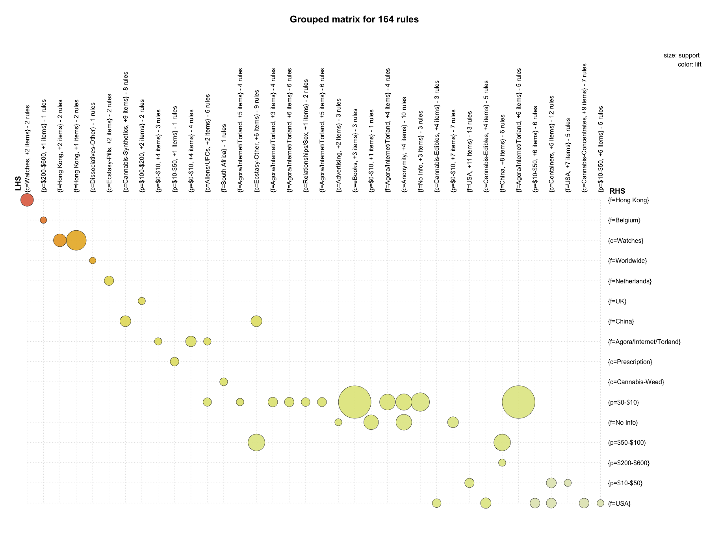
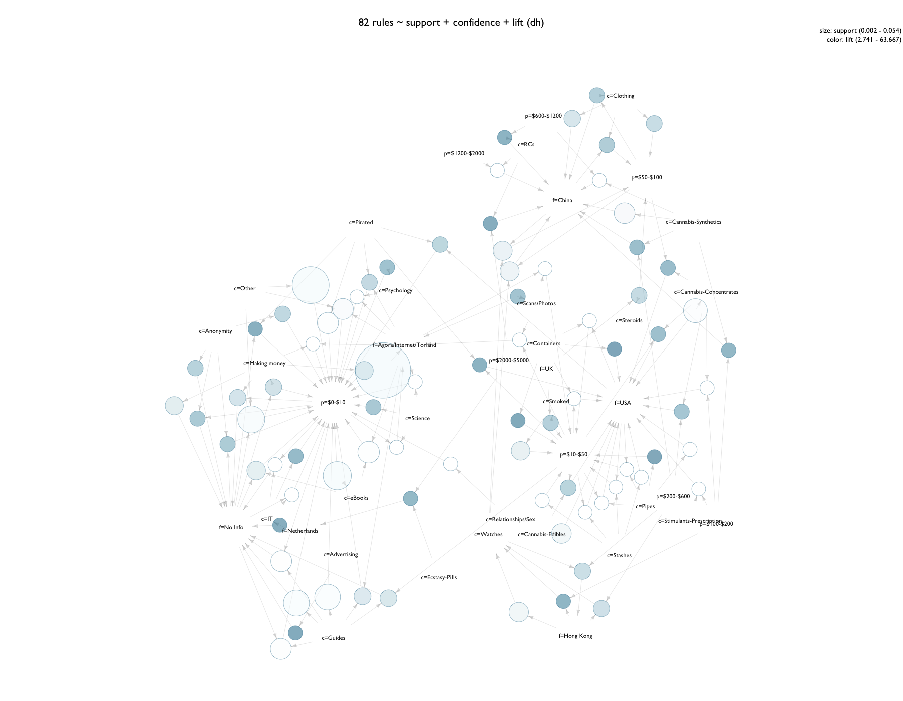

# Agora Associations 06

R script: [**_agora-associations-06.R_**](R/arules/agora-associations-06.R)


- [Variable Selection](#variable-selection)
- [Transaction Conversion](#transaction-conversion)
- [Item Frequency / Frequent Itemsets](#item-frequency)
- [Mining Association Rules](#mining-association-rules)
- [Vis: Grouped Matrices](#visualizations---grouped-matrices)
- [Vis: Network Graphs](#visualizations---network-graphs)


# Variable Selection

dataframe: **ag**

2317353 observations of 4 variables:

| name  | variable      | levels    |   notes                                       |
|-------|---------------|-----------|-----------------------------------------------|
| `p`   | price         | 10        | discretized into 10 bins                      |
| `f`   | from          | 85        | product origin location                       |
| `sc`  | subcategory   | 105       | subcategory as labeled on Agora               |

Price `p` ranged from $0-20,000 and was discretized manually into 10 bins: 

- $0-10
- $10-50
- $50-100
- $100-200
- $200-600
- $600-1200
- $1200-2000
- $2000-5000
- $5000-10000
- $10000-20000

While not in equal intervals, these bins reflect the distribution of prices on the market and take into account a large number of listings under 10- and 200- USD.

Although vendors did not use given names, there have been cases where even a vendor's online name could be used to identify them<sup>[1](#references-and-notes)</sup>. To avoid this implication, names were run through the function `anonymize`. This salted and then hashed the names using SHA256, and from there names were abbreviated for clarity. While likely not following the strictest security protocol, this level of anonymization felt suited for the application. In practical terms - all of this data is publicly available, so these measures were taken out of a careful respect for privacy.

```{r}
ag <- subset(ag, select = c("p", "from", "sc"))
colnames(ag) <- c("p", "f", "c")
head(ag)
              p       f                  c
1 $10000-$20000   China              Other
2       $10-$50 No Info             Guides
3       $10-$50 No Info             Guides
4   $1200-$2000   China                RCs
5       $10-$50     USA Stimulants-Cocaine
6       $10-$50 No Info             Guides
```

# Transaction Conversion


```{R}
a6 <- as(ag, "transactions")
```

```{R}
summary(a6)
transactions as itemMatrix in sparse format with
 2317353 rows (elements/itemsets/transactions) and
 200 columns (items) and a density of 0.015 

most frequent items:
  p=$10-$50       f=USA   f=No Info p=$200-$600  p=$50-$100     (Other) 
     510361      497780      407122      385562      376526     4774708 

element (itemset/transaction) length distribution:
sizes
      3 
2317353 

   Min. 1st Qu.  Median    Mean 3rd Qu.    Max. 
      3       3       3       3       3       3 

includes extended item information - examples:
      labels variables   levels
1   p=$0-$10         p   $0-$10
2  p=$10-$50         p  $10-$50
3 p=$50-$100         p $50-$100

includes extended transaction information - examples:
  transactionID
1             1
2             2
3             3
```

So showing up most frequently are the location 'USA' and 'No Info', and three price bins: $10-$50, $50-$100, and $200-$600. Prices from $0-$10 and $100-$200 are not as freqeuent. With 3 variables comprising the transasction matrix, we now see a length distribution solely at 3.

# Item Frequency

``` {R}
# Item Frequency Plot ---------------------------------------------------------

par(mfrow = c(1, 1), mar = c(4, 12, 4, 4), family = "GillSans")
itemFrequencyPlot(a6, support = 0.01, cex.names = 0.70, col = "white", horiz = T,
                  main = "Agora Marketplace: Frequent Items (support > 0.01)")
```


quick observations at 0.01 minimum support:

- somewhat competetive balance of frequencies
- observations at the lower frequencies are interesting with this much detail/grain
- affinities in frequency, (~0.015-0.020): speed, meth, pirated, money, worldwide, India, Belgium
- affinities in frequency, (~0.025): 3 vendors, RCs, hacking, hash, eBooks, watches, concentrates
- 3 vendors appear just as frequently as all listings for RCs

Moving forward - wanted to see how different minimum supports affected item frequency, so scripted a loop to plot a sequence of different values.

```{R}
# Item Frequency Plot - Loop --------------------------------------------------

# define support intervals
sup <- seq(0.000, 0.1, by = 0.005)
sup

# plot loop
for (i in 1:length(sup)) {
  
  par(mfrow = c(1, 1), mar = c(4, 12, 4, 4), family = "GillSans")
  
  png(filename = paste("~/GitHub/agora-local-market/arules/ifp/a6-ItemFreq", sup[i], ".png"),
      width = 1800, height = 1400, pointsize = 18, bg = "transparent")
  
  itemFrequencyPlot(a6, support = sup[i], cex.names = 0.8, col = "#FFFFFF00", horiz = T,
                    main = paste("Agora Marketplace: Frequent Items (support >", 
                                 sup[i], ")"))
  
  dev.off()
  
}

  
}
```


Observed at a minimum support of 0.025:

- USA dominates all locations, with 'No Info' second.
- price bins have a higher frequency as there are less levels.

Items observed as occuring with roughly the same relative frequency:

- (above ~0.075): prescription, weed, UK, China, Agora/Internet/Torland<sup>[2](#references-and-notes)</sup>., $600-$1200
- (around ~0.05): benzodiazapines, Netherlands, Germany, EU, Australia
- (< 0.05): 3 vendors, RCs, Guides, steroids, ecstasy: MDMA, ecstasy: pills, Canada


With a mininum support of 0.075, it becomes clear the most frequently occuring of the frequent items.


# Frequent Itemsets

_arguments_ for `apriori`:

| parameter             |  value    | 
|-----------------------|-----------|
| target                |  frequent |
| minimum support       |  0.0025   |
| min rule length       |  2        |
| max rule length       |  5        |


_results_:

| parameter             |  value        |
|-----------------------|---------------|
| yield                 |  336 itemsets |
| itemset length 2      |  276 (82%)    |
| itemset length 3      |  60  (18%)    |
| itemset length 4      |  0            |
| minumum support       |  0.002520     |
| maximum support       |  0.071603     |


_most frequent items_:

| f=USA  | p=$10-$50  | p=$50-$100 | p=$200-$600 | p=$100-$200 | (other)  |
|--------|------------|------------|-------------|-------------|----------|
|  48    |      51    |    38      |     43      |     38      |   514    |


_the call_:

```{r}
a6items <- apriori(a6, parameter = list(target = "frequent",
                                        supp = 0.0025, minlen = 2, maxlen = 5))
```

A generous set of paramters to generate many rules.

```{r}
summary(a6items)
set of 336 itemsets

most frequent items:
  p=$10-$50       f=USA p=$200-$600  p=$50-$100 p=$100-$200     (Other) 
         51          48          43          38          38         514 

element (itemset/transaction) length distribution:sizes
  2   3 
276  60 

   Min. 1st Qu.  Median    Mean 3rd Qu.    Max. 
  2.000   2.000   2.000   2.179   2.000   3.000 

summary of quality measures:
    support        
#  Min.   :0.002520  
#  1st Qu.:0.003417  
#  Median :0.004974  
#  Mean   :0.007681  
#  3rd Qu.:0.008849  
#  Max.   :0.071603  

includes transaction ID lists: FALSE 

mining info:
 data ntransactions support confidence
   a6       2317353  0.0025          1
```


Looking at the top of the itemset list, sorted by support:


```{R}
a6items <- sort(a6items, by = "support", decreasing = T)

inspect(head(a6items, 12))
    items                               support   
269 {p=$0-$10,f=No Info}                0.07160325
276 {p=$10-$50,f=USA}                   0.06360360
257 {p=$0-$10,f=Agora/Internet/Torland} 0.05378421
265 {f=USA,c=Cannabis-Weed}             0.04106970
272 {p=$50-$100,f=USA}                  0.03860051
274 {p=$200-$600,f=USA}                 0.03563376
268 {p=$100-$200,f=USA}                 0.03477027
247 {f=No Info,c=Prescription}          0.03234639
275 {p=$10-$50,f=No Info}               0.03227173
202 {p=$0-$10,c=Other}                  0.03056677
255 {p=$10-$50,f=UK}                    0.02628128
205 {f=No Info,c=Other}                 0.02540312
```

- 6% of all transactions are from the USA and listing for between $10-$50. 
- 4% of all transactions are from the USA and within the category "Cannabis-Weed". 
- Presciption listings with no location info provided comprise apporx 3.2% of itemsets.
- 5.3% of transactions are between $0-$10 and are from online source: Agora/Internet/Torland

```{r}
inspect(a6items)[48:56,]
                                           items    support
248                       {f=USA,c=Prescription} 0.01229981
222                  {p=$200-$600,f=Netherlands} 0.01229290
99                           {f=China,c=Watches} 0.01218891
214                        {p=$50-$100,c=Benzos} 0.01152997
295 {p=$0-$10,f=Agora/Internet/Torland,c=eBooks} 0.01145661
187                       {p=$10-$50,c=Steroids} 0.01141820
229                     {p=$50-$100,f=Australia} 0.01139964
242                        {f=UK,c=Prescription} 0.01132499
231                      {p=$10-$50,f=Australia} 0.01113987
```


- 1.2%: USA and Prescriptions
- 1.2%: China and Watches
- 1.1%: UK and Prescriptions
- 1.15%: Benzos between $50-$100

[back to top](#AgAssociationRules-06.md)

# Mining Association Rules


## Parameters

`apriori` _algorithm arguments_:

| parameter             |  value    | 
|-----------------------|-----------|
| minimum support       |  0.0005   |
| minumum confidence    |  0.6      |
| min rule length       |  2        |
| max rule length       |  --       |

_results_:

| parameter             |  value      |
|-----------------------|-------------|
| yield                 |  164 rules  |
| rules length 2        |  53         |
| rules length 3        |  111        |
| rules length 4        |  --         |


## Function Call and Summary

```{r}
a6rules <- apriori(a6, parameter = list(support = 0.0005, confidence = 0.6, minlen = 2))
```

Keeping a generous minlength at 2 and very low minimum support to hopefully mine interesting rules of length > 2.

```{r}
summary(a6rules)
set of 164 rules

rule length distribution (lhs + rhs):sizes
  2   3 
 53 111 

   Min. 1st Qu.  Median    Mean 3rd Qu.    Max. 
  2.000   2.000   3.000   2.677   3.000   3.000 

summary of quality measures:
    support            confidence          lift       
 Min.   :0.0005165   Min.   :0.6010   Min.   : 2.741  
 1st Qu.:0.0009235   1st Qu.:0.6910   1st Qu.: 3.749  
 Median :0.0017099   Median :0.7776   Median : 4.475  
 Mean   :0.0034431   Mean   :0.7899   Mean   : 7.331  
 3rd Qu.:0.0034791   3rd Qu.:0.9013   3rd Qu.: 6.214  
 Max.   :0.0537842   Max.   :1.0000   Max.   :69.917  

mining info:
 data ntransactions support confidence
   a6       2317353  0.0005        0.6
```

Out of 164 rules generated:

- 68% of rules of length 3; 32% are of length 2.

- Median confidence is at0.7776, and appears there are positive correlations across the board as seen in a minimum lift of 2.741. Not the strongest confidence, but parameters were set very wide with a very low minumum support. 

- The max lift is skewing the distribution of lift values; the mean of 7.331 is higher than the 3rd quartile of 6.214. That said, 3rd quartile at that value is also encouraging.

- Support might be an issue - very low values observed here. On the other hand, there are so many listings that it might make sense such sparsity is observed.


### Top and Bottom 10

_Measures of Quality_

Given a population of **N** transactions that contains itemsets **N<sub>X</sub>** and **N<sub>Y</sub>**, the rule **X ⇒ Y** can be measured by:

| measure     | formula                                                 |
|-------------|---------------------------------------------------------|
| support     | N<sub>X ∪ Y</sub> / N                                   | 
| confidence  | N<sub>X ∪ Y</sub> / N<sub>X</sub>                       | 
| lift        | N<sub>X ∪ Y</sub> * N / N<sub>X</sub> * N<sub>Y</sub>   |

Sorting by support and checking the top rules mined:

```{r}
a6rules <- sort(a6items, by = "lift", decreasing = T)
arules::inspect(head(a6rules, 10))
    lhs                                 rhs             support      confidence lift    
127 {p=$600-$1200,c=Watches}         => {f=Hong Kong}   0.0009541058 0.7590113  69.91681
130 {p=$200-$600,c=Watches}          => {f=Hong Kong}   0.0049310571 0.6911631  63.66693
142 {p=$200-$600,c=eBooks}           => {f=Belgium}     0.0005247366 0.8139224  52.85393
126 {p=$600-$1200,f=Hong Kong}       => {c=Watches}     0.0009541058 0.9901478  40.23430
129 {p=$200-$600,f=Hong Kong}        => {c=Watches}     0.0049310571 0.9475910  38.50502
45  {f=Hong Kong}                    => {c=Watches}     0.0088454370 0.8148030  33.10923
5   {c=Dissociatives-Other}          => {f=Worldwide}   0.0005165376 0.6129032  31.77363
128 {p=$100-$200,f=Hong Kong}        => {c=Watches}     0.0025667216 0.7591576  30.84810
104 {p=$10-$50,c=Clothing}           => {f=China}       0.0007961670 0.9767073  12.42609
125 {p=$5000-$10000,c=Ecstasy-Pills} => {f=Netherlands} 0.0005816982 0.6988077  12.35879
```

- By lift, there are many high probabilities of {Watches} from {Hong Kong}
- the strongest of these rules has {Hong Kong} and a range between {$600-$1200} having a 99% probability of being {Watches}
- {Clothing} in the price range {$0-$10} has a 97% chance of being from {China}
- pricier {eBooks} in the range of {$200-$600} have an 81% of being from {Belgium}
- bulk {Ecstasy pills} have a 70% chance of being from the {Netherlands}. Bulk here is assumed by the antecedent price range of {$5000-$10000}. This will need to be inspected to see if listing is a placeholder or legitimate.


```{r}
arules::inspect(tail(a6rules, 10))
    lhs                                          rhs         support      confidence lift    
48  {c=Cannabis-Concentrates}                 => {f=USA}     0.0143676859 0.6828763  3.179046
63  {p=$10-$50,c=Grinders}                    => {f=USA}     0.0009601472 0.6785605  3.158954
131 {p=$100-$200,c=Stimulants-Prescription}   => {f=USA}     0.0017675339 0.6746829  3.140903
98  {f=EU,c=Cannabis-Seeds}                   => {p=$10-$50} 0.0011612387 0.6675763  3.031207
74  {p=$10-$50,c=Opioids-Buprenorphine}       => {f=USA}     0.0006188095 0.6439156  2.997669
100 {p=$100-$200,c=Opioids-Oxycodone}         => {f=USA}     0.0005566696 0.6348425  2.955431
145 {p=$100-$200,c=Cannabis-Concentrates}     => {f=USA}     0.0021839573 0.6190068  2.881710
101 {p=$10-$50,c=Opioids-Oxycodone}           => {f=USA}     0.0012924229 0.6165089  2.870080
137 {p=$10-$50,c=Cannabis-Synthetics}         => {f=USA}     0.0006589415 0.6090945  2.835564
96  {f=Agora/Internet/Torland,c=Scans/Photos} => {p=$10-$50} 0.0019906333 0.6037168  2.741246
```

- probabilities at the tail end of the ruleset range from 60-70%. Not bad, not great.
- {Cannabis-Seeds} from the {EU} have a 65% liklihood of costing between {$10-$50}. The fact that seeds originate from here is interesting.
- {Prescription Stimulants} costing between {$100-$200} have a 67% probability of originating from the {USA}
- {Cannabis-Concentrates} have an overall 68% chance of coming from the {USA}
- Forged {Scans/Photos} delivered online from {Agora/Internet/Torland} have a 60% liklihood of costing between {$10-$50}.

Overall with this particular grouping of variables and discretized bins for prices: the rulelengths are short and measures of quality a bit lower, because of the limited amount of variables used to create transactions. However, generally the rules are noteworthy as each variable used is of interest.

```{R}
inspect(a6rules)[48:56,]
                                        lhs           rhs      support confidence     lift
32                           {c=Psychology} => {p=$0-$10} 0.0032580276  0.9760827 6.092982
88     {f=Agora/Internet/Torland,c=Science} => {p=$0-$10} 0.0021835258  0.9738260 6.078895
35                              {c=Science} => {p=$0-$10} 0.0036334559  0.9688183 6.047636
3                           {c=Aliens/UFOs} => {p=$0-$10} 0.0007435207  0.9674340 6.038995
90                    {f=No Info,c=Science} => {p=$0-$10} 0.0014443203  0.9642754 6.019278
83  {f=Agora/Internet/Torland,c=Psychology} => {p=$0-$10} 0.0018421880  0.9627876 6.009990
60    {f=Agora/Internet/Torland,c=Politics} => {p=$0-$10} 0.0008531285  0.9615759 6.002426
138    {f=Agora/Internet/Torland,c=Pirated} => {p=$0-$10} 0.0042725472  0.9536698 5.953074
72     {f=Agora/Internet/Torland,c=Economy} => {p=$0-$10} 0.0007159030  0.9518072 5.941448
```

- these rules all suggest that eBooks/Information is cheap.

```{r}
inspect(a6rules)[123:128,]
                        lhs             rhs     support confidence     lift
19  {c=Opioids-Hydrocodone} =>      {f=USA} 0.001458561  0.8076464 3.759897
108         {f=EU,c=Smoked} =>  {p=$10-$50} 0.001472801  0.8186615 3.717227
141   {p=$10-$50,c=Pirated} =>      {f=USA} 0.002524432  0.7983079 3.716423
40             {c=Clothing} => {p=$50-$100} 0.004495215  0.6029752 3.711049
21        {c=Paraphernalia} =>  {p=$10-$50} 0.001484021  0.8139645 3.695900
9                 {c=Paper} =>      {f=USA} 0.001030918  0.7936877 3.694915
```
- these rules are interesting, with a decent balance of quality measure values and overall interest. At the extremes we find more obvious rules; these are more telling of overlooked classes.

- {Paraphernalia} has an 81% chance of costing less than $50.
- {Hydrocodone} has an 81% chance of being from the {USA} - a large share of the global market.
- {Smoked Tobacco} also has an 81% chance, but of coming from the {EU}

[back to top](#agora-associations-06)

# Visualizations - Grouped Matrices


```{R}
# individual
plot(a6rules, method = "grouped", control = list(k = 36))
```

36 rules: 



There's a balanced distribution of categories, locations, and prices in the antecedents, along with acceptable balance in the consequents. 

- Unexpected antecedent => consequent relation: {Physical Documents} => {Prescription}

A look into this:

```{r}

scripts <- subset(a6rules, rhs %in% "c=Prescription")
summary(scripts)
#          support        confidence           lift      
# Min.   :0.001352   Min.   :0.6451   Min.   :7.881

inspect(scripts)
    lhs                    rhs              support     confidence lift   
143 {p=$10-$50,f=India} => {c=Prescription} 0.001351542 0.6451081  7.88148
```

Interesting, but subsetting for the rhs doesn't account for {Physical Documents}. Otherwise, it's observed that if there is a {$10-$50} listing originating from {India}, it will be 65% likely to be for a {Prescription} drug. 

```{R}
docs <- subset(a6rules, lhs %in% "c=Physical documents")
summary(docs)
set of 2 rules

summary of quality measures:
#           support       confidence            lift      
# Min.   :0.0006684   Min.   :0.6065   Min.   :3.645  
# 1st Qu.:0.0007007   1st Qu.:0.6127   1st Qu.:3.683  
# Median :0.0007329   Median :0.6190   Median :3.720  
# Mean   :0.0007329   Mean   :0.6190   Mean   :3.720  
# 3rd Qu.:0.0007652   3rd Qu.:0.6252   3rd Qu.:3.758  
# Max.   :0.0007975   Max.   :0.6315   Max.   :3.795

inspect(docs)
    lhs                                   rhs           support      confidence lift    
107 {f=EU,c=Physical documents}        => {p=$200-$600} 0.0006684351 0.6314717  3.795350
106 {f=Worldwide,c=Physical documents} => {p=$200-$600} 0.0007974616 0.6064982  3.645251
```
Neither does isolating the lhs to {Physical Documents}. When subsetting both together, no rule appears. Interesting that it came up on the grouped matrix; Will have to investigate further. 

Well, it appears generally, whether from {EU} or plainly/anonymously {Worldwide}, {Physical documents} have a 60-63% probability of costing between {$200-$600}.

To look at more rules in matrix form:

```{R}
# loop
for (i in 1:10) {
  
  png(filename = paste("~/GitHub/agora-local-market/arules/groups/g1-",i,".png"),
      width = 1800, height = 1400, pointsize = 20, bg = "transparent")
  
  k = i * 12
  
  plot(a6rules, method = "grouped", control = list(k = k), 
       main = paste("k =", k))
  
  dev.off()
  
}
```
48 rule grouping: 


The {$0-$10} price range traverses more than a few categories, and originates mostly from {Agora/Internet/Torland} and anonymously from {No Info}. Categories in the consequent remain constant with {Watches}, {Weed}, and {Prescription} being the 3.

24 rule grouping:


# Visualizations - Network Graphs

Network graphs were plotted from rules, which were sorted by the 3 quality measures in different quantities.

- sort by support, confidence, and lift
- sort by lift
- sort by support and confidence

A first graph sorted by all 3 quality measures shows what appears to be a community beginning to form around a central node of {$0-$10}.
Before going too much further, it might be worth comparing the plot outputs given these 3 quality measure quantities and 2 graph layouts.



```{r}
# plot by Support, Confidence, and Lift
r1 <- head(sort(a6rules, by = c("support", "confidence", "lift")), 82)
p1 <- plot(r1, method = "graph", 
           main = "82 rules ~ support + confidence + lift (dh)", 
           edge.color = "#00000025",
           vertex.frame.color = "#00688B85",
           vertex.color = pdpal(100),
           vertex.label.color = "grey8", 
           vertex.label.cex = 0.68, layout = layout_with_dh,
           vertex.label.dist = 0)
```


Graph of 32 rules sorted by lift alone, plotted using using Kamada & Kawai force-directed layout. It's possible to discern cliques beginning to form around locations, but these types of relationships are a bit too specific to be interesting. While it'd be possible to subset for specific classes, it might be better to revise variable selection and transformation. The minimum support to generate these rules was already quite low, and the dominance of vendor antecedents is less than encouraging.

On to a6...after revising the features selected.


[back to top](#agora-associations-04-04)

# References and Notes

<sup>1</sup> "Shedding Light on the Dark Web." The Economist. The Economist Newspaper, 2016. Web. 23 [Sept. 2016.](http://www.economist.com/news/international/21702176-drug-trade-moving-street-online-cryptomarkets-forced-compete)

<sup>2</sup> the virtual location of Agora/Internet/Torland specializes in books, ebooks, hacking, guides, services.

<sup>3</sup> [Trans High Market Quotations](http://hightimes.com/?s=thmq) published monthly by High Times; data available online goes back to March 2014.


