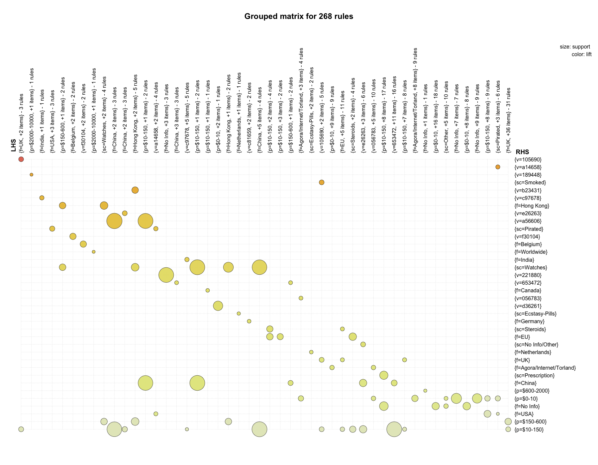
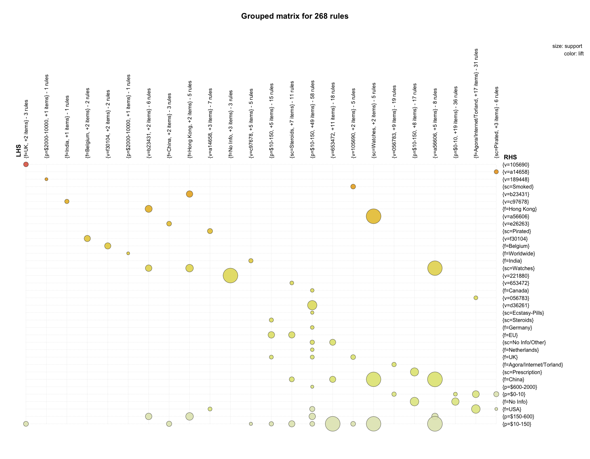

# Agora Associations 04-04

R script: [**_agora-associations-04-mining-04.R_**](R/arules/agora-associations-04-mining-04.R)


- [Variable Selection](#variable-selection)
- [Transaction Conversion](#transaction-conversion)
- [Item Frequency / Frequent Itemsets](#item-frequency)
- [Mining Association Rules](#mining-association-rules)
- [Grouped Matrices]()
- [Network Graphs]()


# Variable Selection

dataframe: **a4**

2317353 observations of 4 variables:

| name  | variable      | levels    |   notes                                       |
|-------|---------------|-----------|-----------------------------------------------|
| `p`   | price         | 6         | discretized into 6 bins                       |
| `f`   | from          | 85        | product origin location                       |
| `sc`  | subcategory   | 105       | subcategory as labeled on Agora               |
| `v`   | vendor    | 3183          | anonymized with SHA256 hashing algorithm      |

Price `p` ranged from $0-20,000 and was discretized manually into 6 bins: 

- $0-10
- $10-150
- $150-600
- $600-2000
- $2000-10000
- $10000-20000

While not in equal intervals, these bins reflect the distribution of prices on the market and take into account a large number of listings under 10- and 200- USD.

Although vendors did not use given names, there have been cases where even a vendor's online name could be used to identify them<sup>[1](#references-and-notes)</sup>. To avoid this implication, names were run through the function `anonymize`. This salted and then hashed the names using SHA256, and from there names were abbreviated for clarity. While likely not following the strictest security protocol, this level of anonymization felt suited for the application. In practical terms - all of this data is publicly available, so these measures were taken out of a careful respect for privacy.

```{r}
ag <- subset(ag, select = c("p", "from", "sc", "v3"))
colnames(ag) <- c("p", "f", "sc", "v")
head(ag)
             p       f                 sc      v
1 $10000-20000   China              Other e63948
2      $10-150 No Info             Guides 189622
3      $10-150 No Info             Guides 447418
4    $600-2000   China                RCs a00543
5      $10-150     USA Stimulants-Cocaine e99113
6      $10-150 No Info             Guides 189622
```

# Transaction Conversion


```{R}
a4 <- as(ag, "transactions")
```

```{R}
summary(a4)
transactions as itemMatrix in sparse format with
 2317353 rows (elements/itemsets/transactions) and
 3379 columns (items) and a density of 0.001183782 

most frequent items:
 p=$10-150 p=$150-600      f=USA  f=No Info    p=$0-10    (Other) 
   1086166     515111     497780     407122     371235    6391998 

element (itemset/transaction) length distribution:
sizes
      4 
2317353 

#   Min. 1st Qu.  Median    Mean 3rd Qu.    Max. 
       4       4       4       4       4       4 

includes extended item information - examples:
          labels variables       levels
1        p=$0-10         p        $0-10
2      p=$10-150         p      $10-150
3 p=$10000-20000         p $10000-20000

includes extended transaction information - examples:
  transactionID
1             1
2             2
3             3
```

# Item Frequency

``` {R}
# Item Frequency Plot ---------------------------------------------------------

par(mfrow = c(1, 1), mar = c(4, 12, 4, 4), family = "GillSans")
itemFrequencyPlot(a4, support = 0.0025, cex.names = 0.65, col = "white", horiz = T,
                  main = "Agora Marketplace: Frequent Items (support > 0.0025)")
```


quick observations at 0.005 minimum support:

- prices within $10-$150 show up more than twice as much as the next nearest item - which is prices in the $150-$600 range. It might be worth taking a look at the distribution of this subset. 
- the United States shows up nearly twice as much as the next location - the UK. 

Moving forward - wanted to see how different minimum supports affected item frequency, so scripted a loop to plot a sequence of different values.

```{R}
# Item Frequency Plot Loop ----------------------------------------------------

# define support values
sup <- seq(0.000, 0.1, by = 0.005)
sup

# plot loop
for (i in 1:length(sup)) {
  
  par(mfrow = c(1, 1), mar = c(4, 12, 4, 4), family = "GillSans")
  
  png(filename = paste("~/GitHub/agora-local-market/arules/ifp/ItemFreq", sup[i], ".png"),
      width = 1800, height = 1400, pointsize = 18, bg = "transparent")
  
  itemFrequencyPlot(a4, support = sup[i], cex.names = 0.8, col = "#FFFFFF00", horiz = T,
                    main = paste("Agora Marketplace: Frequent Items (support >", 
                                 sup[i], ")"))
  
  dev.off()
  
}
```


Observed at a minimum support of 0.025:

- cannabis shows up as frequently as listings in the price range $600-$2000; this price bin shows up half as much as the next bin ($150-$600), which shows up roughly half as much as the next bin ($10-150). $10-$150 listings are also the most likely to appear out of all items. 
- roughly the same relative frequency: a prescription drug listing, the UK, China, and the location Agora/Internet/Torland<sup>[3](#references-and-notes)</sup>.
- there are 3 vendors who have as many listings as the number of listings for Research Chemicals.
- two non-descript items, the category 'Other' and location 'EU' are just as likely to appear as one another.
- more affinities by relative frequency: Australia, the Netherlands, Benzodiazapines. Steroids, Germany, Cocaine, Ecstasy(MDMA), Ecstasy(Pills), Canada, listings from $2000-$10000. 


Relative frequency was the argument set for these plots; it'd be possible to do absolute, which makes me think I should plot distributions of each variable off the original dataframe.


# Frequent Itemsets

_arguments_ for `apriori`:

| parameter             |  value    | 
|-----------------------|-----------|
| target                |  frequent |
| minimum support       |  0.0025   |
| min rule length       |  2        |
| max rule length       |  5        |


_results_:

| parameter             |  value        |
|-----------------------|---------------|
| yield                 |  575 itemsets |
| itemset length 2      |  27           |
| itemset length 3      |  200          |
| itemset length 4      |  68           |
| minumum support       |  0.002523     |
| maximum support       |  0.122478     |


_most frequent items_:

| p=$10-150 | p=$150-600 | f=No Info | p=$0-10 | f=USA | (other) |
|-----------|------------|-----------|---------|-------|---------|
|      165  |      78    |    77     |    74   |    59 |   920   |


_the call_:

```{r}
a4items <- apriori(a4, parameter = list(target = "frequent",
                                        supp = 0.0025, minlen = 2, maxlen = 5))
```


```{r}
summary(a4items)
set of 575 itemsets

most frequent items:
 p=$10-150 p=$150-600  f=No Info    p=$0-10      f=USA    (Other) 
       165         78         77         74         59        920 

element (itemset/transaction) length distribution:sizes
  2   3   4 
377 173  25 

#    Min. 1st Qu.  Median    Mean 3rd Qu.    Max. 
    2.000   2.000   2.000   2.388   3.000   4.000 

summary of quality measures:
    support        
 # Min.   :0.002523  
 # 1st Qu.:0.003314  
 # Median :0.004777  
 # Mean   :0.007629  
 # 3rd Qu.:0.008004  
 # Max.   :0.122478  

includes transaction ID lists: FALSE 

mining info:
 data ntransactions support confidence
   a4       2317353  0.0025          1
```


Looking at the top of the itemset list; unsorted:

```{R}
inspect(head(a4items, 8))
  items                     support    
1 {f=USA,v=a74314}          0.002610306
2 {f=Netherlands,v=259334}  0.002663384
3 {p=$10-150,sc=Stashes}    0.002632745
4 {f=China,v=682306}        0.002677624
5 {f=Poland,v=553007}       0.002612895
6 {f=Sweden,v=690113}       0.002845488
7 {p=$10-150,sc=Containers} 0.002651732
8 {p=$0-10,v=d96493}        0.002805356
```

Lengths longer than 2 interest me more. 

```{R}
inspect(tail(a4items, 8))
    items                                                 support    
568 {p=$0-10,f=No Info,sc=eBooks,v=d36261}                0.003158345
569 {p=$0-10,f=Agora/Internet/Torland,sc=eBooks,v=056783} 0.005032897
570 {p=$0-10,f=No Info,sc=Guides,v=d36261}                0.007235842
571 {p=$0-10,f=Agora/Internet/Torland,sc=Guides,v=056783} 0.003633456
572 {p=$150-600,f=China,sc=RCs,v=653472}                  0.003118213
573 {p=$0-10,f=No Info,sc=Other,v=d36261}                 0.007578043
574 {p=$10-150,f=No Info,sc=Other,v=d36261}               0.002662952
575 {p=$0-10,f=Agora/Internet/Torland,sc=Other,v=056783}  0.005269806
```

Will any longer itemsets have a high support? Sort, search.

```{R}
a4items <- sort(a4items, by = "support", decreasing = T)
inspect(head(a4items, 12))
    items                              support   
377 {p=$10-150,f=USA}                  0.12247810
372 {p=$0-10,f=No Info}                0.07160325
375 {p=$10-150,f=No Info}              0.05945836
362 {p=$0-10,f=Agora/Internet/Torland} 0.05378421
361 {p=$10-150,f=UK}                   0.05254443
376 {p=$150-600,f=USA}                 0.05013004
356 {p=$10-150,sc=Prescription}        0.04810359
369 {p=$10-150,sc=Cannabis-Weed}       0.04644308
367 {f=USA,sc=Cannabis-Weed}           0.04106970
322 {p=$10-150,f=EU}                   0.03351367
353 {f=No Info,sc=Prescription}        0.03234639
306 {p=$10-150,sc=Steroids}            0.03210301
```

```{r}
inspect(a4items)[123:128,]
                           items     support
240        {p=$10-150,sc=Guides} 0.009098743
297  {f=Canada,sc=Cannabis-Weed} 0.009027110
128  {f=USA,sc=Cannabis-Edibles} 0.009023226
124           {p=$0-10,v=844130} 0.008994314
310      {p=$2000-10000,f=China} 0.008985683
429 {p=$0-10,f=No Info,v=844130} 0.008954613

inspect(a4items)[48:56,]
                               items    support
186               {p=$0-10,v=723840} 0.01568686
255                 {f=China,sc=RCs} 0.01568169
462     {p=$0-10,f=No Info,v=723840} 0.01566701
360                {p=$150-600,f=UK} 0.01565579
373                  {p=$0-10,f=USA} 0.01561868
339       {p=$150-600,f=Netherlands} 0.01510819
301               {f=EU,sc=Steroids} 0.01509006
328             {p=$10-150,sc=Other} 0.01450577
214 {f=USA,sc=Cannabis-Concentrates} 0.01436769
```


[back to top](#agora-associations-04-04)

# Mining Association Rules


## Parameters

`apriori` _algorithm arguments_:

| parameter             |  value    | 
|-----------------------|-----------|
| minimum support       |  0.0025   |
| minumum confidence    |  0.6      |
| min rule length       |  3        |
| max rule length       |  --       |

_results_:

| parameter             |  value      |
|-----------------------|-------------|
| yield                 |  395 rules  |
| rules length 2        |  27         |
| rules length 3        |  200        |
| rules length 4        |  68         |


## Function Call and Summary

```{r}

a3 <- subset(ag, select = c("p", "f", "sc", "v"))

a4rules <- apriori(a4, parameter = list(support = 0.0025, confidence = 0.6, minlen = 3))
```

Not wanted to have to prune too many redundant/obvious rules, I set the minumum rule length to 3. 


```{r}
summary(a4rules)
set of 268 rules

rule length distribution (lhs + rhs):sizes
  3   4 
200  68 

#    Min. 1st Qu.  Median    Mean 3rd Qu.    Max. 
    3.000   3.000   3.000   3.254   4.000   4.000 

summary of quality measures:
    support           confidence          lift        
 # Min.   :0.002524   Min.   :0.6019   Min.   :  1.284  
 # 1st Qu.:0.003275   1st Qu.:0.7763   1st Qu.:  4.447  
 # Median :0.004227   Median :0.9172   Median :  7.070  
 # Mean   :0.005841   Mean   :0.8736   Mean   : 20.823  
 # 3rd Qu.:0.006793   3rd Qu.:0.9923   3rd Qu.: 19.657  
 # Max.   :0.029967   Max.   :1.0000   Max.   :243.955  

mining info:
 data ntransactions support confidence
   a4       2317353  0.0025        0.6
```

Out of 268 rules generated:

- Just under 75% of the rules are of length 3; the rest 4. 
- Median confidence is sitting nicely at 0.9172, and appears there are positive correlations across the board as seen in a minimum lift of 1.248. 
- Support might be an issue - very low values observed here.


### Top and Bottom 10

_Measures of Quality_

Given a population of **N** transactions that contains itemsets **N<sub>X</sub>** and **N<sub>Y</sub>**, the rule **X ⇒ Y** can be measured by:

| measure     | formula                                                 |
|-------------|---------------------------------------------------------|
| support     | N<sub>X ∪ Y</sub> / N                                   | 
| confidence  | N<sub>X ∪ Y</sub> / N<sub>X</sub>                       | 
| lift        | N<sub>X ∪ Y</sub> * N / N<sub>X</sub> * N<sub>Y</sub>   |


A quick `inspect` of the top and bottom 10 rules. 

```{r}
arules::inspect(head(a4rules, 10))
   lhs                            rhs                support     confidence lift      
1  {f=USA,v=b28893}            => {p=$10-150}        0.002812260 0.9230878    1.969423
2  {p=$10-150,v=b28893}        => {f=USA}            0.002812260 0.9978564    4.645396
3  {sc=Ecstasy-Pills,v=807510} => {f=Netherlands}    0.002829090 0.9989334   17.666669
4  {f=Netherlands,v=807510}    => {sc=Ecstasy-Pills} 0.002829090 0.7924574   21.281765
5  {sc=Prescription,v=764212}  => {f=UK}             0.003340881 0.8977273   10.910283
6  {f=UK,v=764212}             => {sc=Prescription}  0.003340881 1.0000000   12.217300
7  {f=UK,v=702924}             => {p=$10-150}        0.003346491 0.8661901    1.848031
8  {p=$10-150,v=702924}        => {f=UK}             0.003346491 1.0000000   12.153227
9  {sc=Smoked,v=105690}        => {f=UK}             0.003910065 1.0000000   12.153227
10 {f=UK,v=105690}             => {sc=Smoked}        0.003910065 1.0000000  115.045078
```

Support could be higher all around, but it was decided to keep that value low to generate more rules. Lift appears to be doing well - although many of the rules with very high lift might be too obvious to warrant investigation. Or rather, they should be looked into to make sure indepedence of variables is satisfied. 

With some rules, there's a suspicion that that they are simply the values of the listings themselves. 

```{r}
arules::inspect(tail(a4rules, 10))
    lhs                                              rhs                        support     confidence lift     
259 {f=Agora/Internet/Torland,sc=Guides,v=056783} => {p=$0-10}                  0.003633456 1.0000000   6.242280
260 {p=$0-10,sc=Guides,v=056783}                  => {f=Agora/Internet/Torland} 0.003633456 1.0000000  12.028450
261 {p=$0-10,f=Agora/Internet/Torland,sc=Guides}  => {v=056783}                 0.003633456 0.6367693  21.249052
262 {p=$150-600,sc=RCs,v=653472}                  => {f=China}                  0.003118213 1.0000000  12.722433
263 {p=$150-600,f=China,sc=RCs}                   => {v=653472}                 0.003118213 0.6099949  21.814071
264 {p=$0-10,sc=Other,v=d36261}                   => {f=No Info}                0.007578043 0.9773486   5.563103
265 {f=No Info,sc=Other,v=d36261}                 => {p=$0-10}                  0.007578043 0.7366500   4.598376
266 {p=$10-150,sc=Other,v=d36261}                 => {f=No Info}                0.002662952 0.9049714   5.151130
267 {f=Agora/Internet/Torland,sc=Other,v=056783}  => {p=$0-10}                  0.005269806 1.0000000   6.242280
268 {p=$0-10,sc=Other,v=056783}                   => {f=Agora/Internet/Torland} 0.005269806 1.0000000  12.028450
```

[back to top](#agora-associations-04-04)

# Visualizations - Grouped Matrices


```{R}
# individual
plot(a4rules, method = "grouped", control = list(k = 48))
```

48 rules: 



```{R}
# loop
for (i in 1:10) {
  
  png(filename = paste("~/GitHub/agora-local-market/arules/groups/g1-",i,".png"),
      width = 1800, height = 1400, pointsize = 20, bg = "transparent")
  
  k = i * 12
  
  plot(a4rules, method = "grouped", control = list(k = k), 
       main = paste("k =", k))
  
  dev.off()
  
}
```

60 rules: 


24 rules:


# Network Graphs

Admittedly my favorite visualization for association rules - seeing rules as nodes with sizes based on support, confidence, and/or lift. 


[back to top](#agora-associations-04-04)

# References and Notes

<sup>1</sup> "Shedding Light on the Dark Web." The Economist. The Economist Newspaper, 2016. Web. 23 [Sept. 2016.](http://www.economist.com/news/international/21702176-drug-trade-moving-street-online-cryptomarkets-forced-compete)

<sup>2</sup> While likely not following the strictest security protocol, this level of anonymization felt suited for the application. In practical terms, all of this data is publicly available so these measures were done out of a careful respect for privacy.

<sup>3</sup> the virtual location of Agora/Internet/Torland specializes in books, ebooks, hacking, guides, services.


