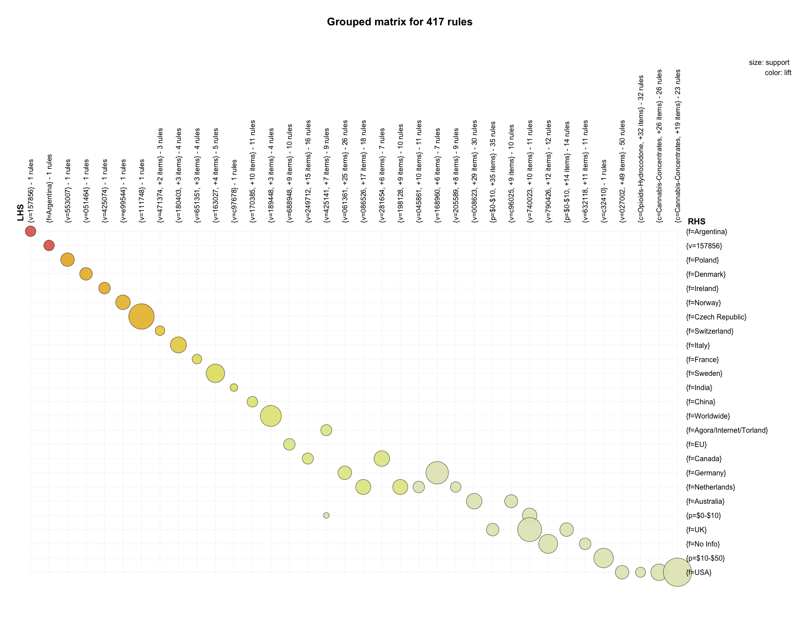
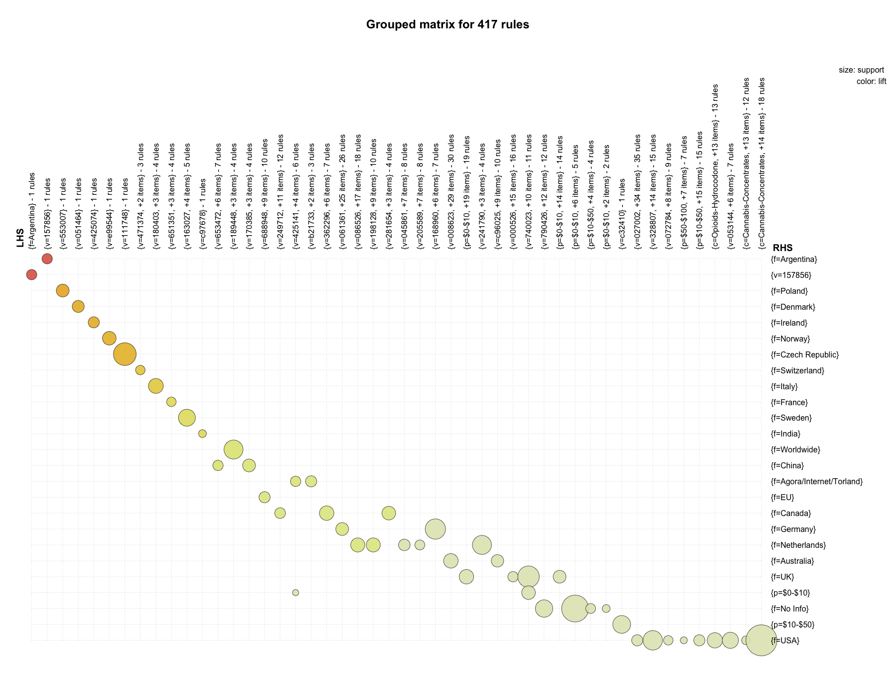
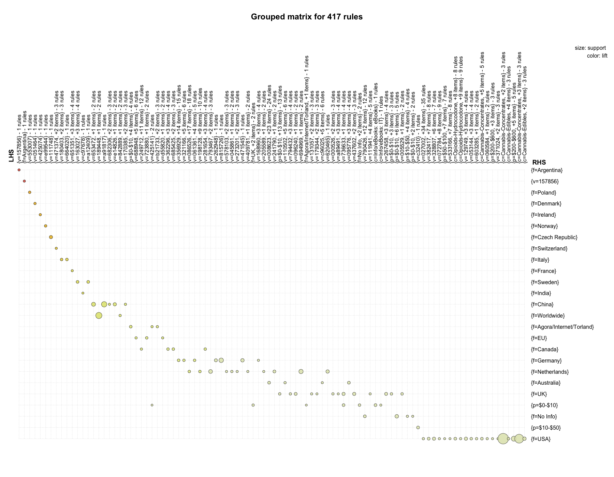
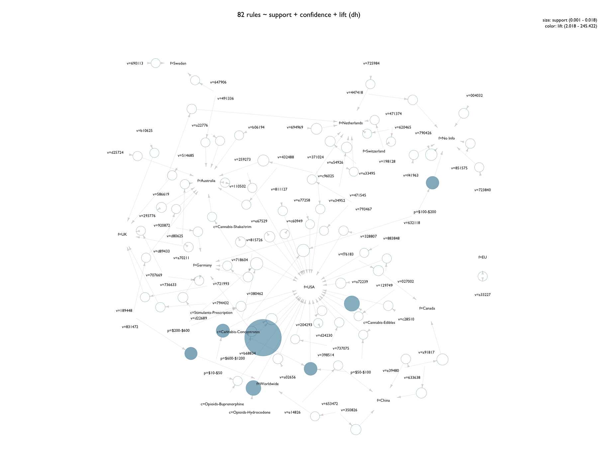
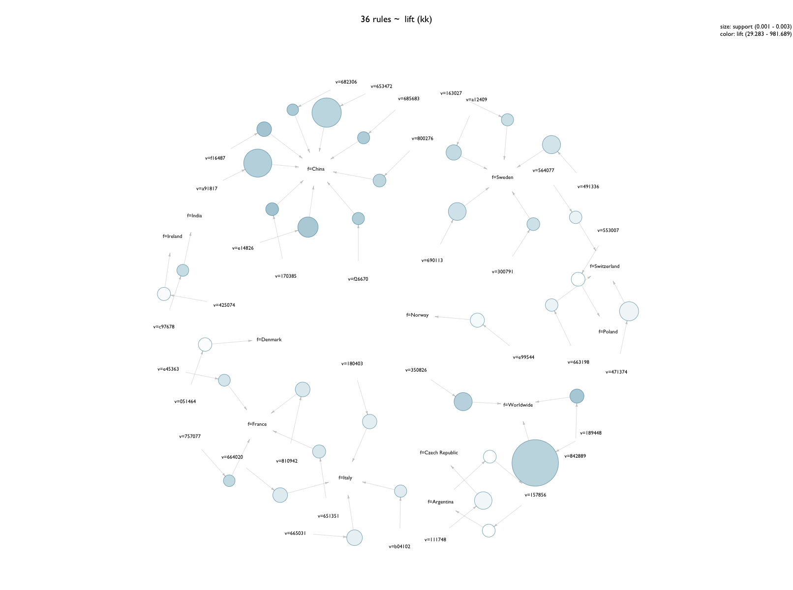

# Agora Associations 04-04

R script: [**_agora-associations-04-mining-04.R_**](R/arules/agora-associations-04-mining-04.R)


- [Variable Selection](#variable-selection)
- [Transaction Conversion](#transaction-conversion)
- [Item Frequency / Frequent Itemsets](#item-frequency)
- [Mining Association Rules](#mining-association-rules)
- [Vis: Grouped Matrices](#visualizations---grouped-matrices)
- [Vis: Network Graphs](#visualizations---network-graphs)


# Variable Selection

dataframe: **a4**

2317353 observations of 4 variables:

| name  | variable      | levels    |   notes                                       |
|-------|---------------|-----------|-----------------------------------------------|
| `p`   | price         | 10        | discretized into 10 bins                      |
| `f`   | from          | 85        | product origin location                       |
| `sc`  | subcategory   | 105       | subcategory as labeled on Agora               |
| `v`   | vendor        | 3183      | anonymized with SHA256 hashing algorithm      |

Price `p` ranged from $0-20,000 and was discretized manually into 10 bins: 

- $0-10
- $10-50
- $50-100
- $100-200
- $200-600
- $600-1200
- $1200-2000
- $2000-5000
- $5000-10000
- $10000-20000

While not in equal intervals, these bins reflect the distribution of prices on the market and take into account a large number of listings under 10- and 200- USD.

Although vendors did not use given names, there have been cases where even a vendor's online name could be used to identify them<sup>[1](#references-and-notes)</sup>. To avoid this implication, names were run through the function `anonymize`. This salted and then hashed the names using SHA256, and from there names were abbreviated for clarity. While likely not following the strictest security protocol, this level of anonymization felt suited for the application. In practical terms - all of this data is publicly available, so these measures were taken out of a careful respect for privacy.

```{r}
ag <- subset(ag, select = c("p", "from", "all.c", "v3"))
colnames(ag) <- c("p", "f", "c", "v")
head(ag)
               p       f                   c      v
1: $10000-$20000   China               Other e63948
2:       $10-$50 No Info Information: Guides 189622
3:       $10-$50 No Info Information: Guides 447418
4:   $1200-$2000   China                 RCs a00543
5:       $10-$50     USA  Stimulants-Cocaine e99113
6:       $10-$50 No Info Information: Guides 189622
```

# Transaction Conversion


```{R}
a4 <- as(ag, "transactions")
```

```{R}
summary(a4)
transactions as itemMatrix in sparse format with
 44176 rows (elements/itemsets/transactions) and
 3394 columns (items) and a density of 0.00117855 

most frequent items:
      f=USA   p=$10-$50  p=$50-$100 p=$100-$200 p=$200-$600     (Other) 
      13159        8486        7670        7225        6921      133243 

element (itemset/transaction) length distribution:
sizes
    4 
44176 

#   Min. 1st Qu.  Median    Mean 3rd Qu.    Max. 
       4       4       4       4       4       4 

includes extended item information - examples:
      labels variables   levels
1   p=$0-$10         p   $0-$10
2  p=$10-$50         p  $10-$50
3 p=$50-$100         p $50-$100

includes extended transaction information - examples:
  transactionID
1             1
2             2
3             3
```

So showing up most frequently are the location 'USA' and the four price bins under $600.

# Item Frequency

``` {R}
# Item Frequency Plot ---------------------------------------------------------

par(mfrow = c(1, 1), mar = c(4, 12, 4, 4), family = "GillSans")
itemFrequencyPlot(a4, support = 0.005, cex.names = 0.65, col = "white", horiz = T,
                  main = "Agora Marketplace: Frequent Items (support > 0.005)")
```


quick observations at 0.005 minimum support:

- prices within $10-$150 show up more than twice as much as the next nearest item - which is prices in the $150-$600 range. It might be worth taking a look at the distribution of this subset. 
- the United States shows up nearly twice as much as the next location - the UK. 

Moving forward - wanted to see how different minimum supports affected item frequency, so scripted a loop to plot a sequence of different values.

```{R}
# Item Frequency Plot Loop

# define support values
sup <- seq(0.000, 0.1, by = 0.005)
sup

# plot loop
for (i in 1:length(sup)) {
  
  par(mfrow = c(1, 1), mar = c(4, 12, 4, 4), family = "GillSans")
  
  png(filename = paste("~/GitHub/agora-local-market/arules/ifp/ItemFreq", sup[i], ".png"),
      width = 1800, height = 1400, pointsize = 18, bg = "transparent")
  
  itemFrequencyPlot(a4, support = sup[i], cex.names = 0.8, col = "#FFFFFF00", horiz = T,
                    main = paste("Agora Marketplace: Frequent Items (support >", 
                                 sup[i], ")"))
  
  dev.off()
  
}
```


Observed at a minimum support of 0.025:

- USA dominates all items.
- price bins overwhelm categories and locations as items. 

Items observed as occuring with roughly the same relative frequency:

- (~0.10): UK, Australia, listings at $0-$10, listings at $600-$1200.
- (~0.075): Cocaine, MDMA, Netherlands, Germany.
- (~0.05): Ecstacy in pill form, benzodiazepines, Cananda, EU, $2000-$5000, $1200-$2000
- (< 0.05): speed, meth, LSD, presription drugs, opioids, hash, cannabis concentrates, and the location Agora/Internet/Torland<sup>[2](#references-and-notes)</sup>.


Relative frequency was the argument set for these plots; it'd be possible to do absolute, which makes me think I should plot distributions of each variable off the original dataframe.


# Frequent Itemsets

_arguments_ for `apriori`:

| parameter             |  value    | 
|-----------------------|-----------|
| target                |  frequent |
| minimum support       |  0.0025   |
| min rule length       |  2        |
| max rule length       |  5        |


_results_:

| parameter             |  value        |
|-----------------------|---------------|
| yield                 |  300 itemsets |
| itemset length 2      |  268          |
| itemset length 3      |  32           |
| itemset length 4      |  0            |
| minumum support       |  0.002513     |
| maximum support       |  0.060915     |


_most frequent items_:

| f=USA  | p=$10-$50  | p=$50-$100 | p=$100-$200 | p=$200-$600 | (other) |
|--------|------------|------------|-------------|-------------|---------|
| 63     |      40    |    36      |    34       |    33       |   426   |


_the call_:

```{r}
a4items <- apriori(a4, parameter = list(target = "frequent",
                                        supp = 0.0025, minlen = 2, maxlen = 5))
```


```{r}
summary(a4items)
set of 300 itemsets

most frequent items:
      f=USA   p=$10-$50  p=$50-$100 p=$100-$200 p=$200-$600     (Other) 
         63          40          36          34          33         426 

element (itemset/transaction) length distribution:sizes
  2   3 
268  32 

#     Min. 1st Qu.  Median    Mean 3rd Qu.    Max. 
     2.000   2.000   2.000   2.107   2.000   3.000 

summary of quality measures:
    support        
# Min.   :0.002513  
# 1st Qu.:0.003277  
# Median :0.004969  
# Mean   :0.007367  
# 3rd Qu.:0.008404  
# Max.   :0.060915  

includes transaction ID lists: FALSE 

mining info:
 data ntransactions support confidence
   a4         44176  0.0025          1
```


Looking at the top of the itemset list; unsorted:

```{R}
inspect(head(a4items, 8))
  items                             support    
1 {f=No Info,v=790426}              0.002512677
2 {f=Worldwide,v=189448}            0.003078595
3 {f=No Info,v=632118}              0.003282325
4 {f=USA,c=Opioids-Hydrocodone}     0.004617892
5 {f=No Info,c=Information: Guides} 0.002671134
6 {p=$10-$50,c=Cannabis-Edibles}    0.002761681
7 {f=USA,c=Cannabis-Edibles}        0.004844259
8 {f=USA,c=Opioids-Fentanyl}        0.003938790
```

Cannabis-Edibles and Hydrocodone occur just about as frequently as each other, from the USA.

```{R}
inspect(tail(a4items, 8))
    items                                support    
293 {p=$10-$50,f=USA,c=Ecstasy-MDMA}     0.002965411
294 {p=$600-$1200,f=USA,c=Cannabis-Weed} 0.005613908
295 {p=$50-$100,f=UK,c=Cannabis-Weed}    0.002739044
296 {p=$10-$50,f=UK,c=Cannabis-Weed}     0.003055958
297 {p=$200-$600,f=USA,c=Cannabis-Weed}  0.007243752
298 {p=$100-$200,f=USA,c=Cannabis-Weed}  0.007198479
299 {p=$50-$100,f=USA,c=Cannabis-Weed}   0.006021369
300 {p=$10-$50,f=USA,c=Cannabis-Weed}    0.005613908
```

Will any longer itemsets have a high support? Sort, search.

```{R}
a4items <- sort(a4items, by = "support", decreasing = T)

inspect(head(a4items, 12))
    items                         support   
268 {p=$10-$50,f=USA}             0.06091543
267 {p=$50-$100,f=USA}            0.05403386
266 {p=$100-$200,f=USA}           0.05032144
265 {p=$200-$600,f=USA}           0.04676748
260 {f=USA,c=Cannabis-Weed}       0.04343988
244 {p=$600-$1200,f=USA}          0.02775263
239 {p=$0-$10,f=USA}              0.02322528
264 {p=$10-$50,f=No Info}         0.02254618
254 {p=$10-$50,f=UK}              0.02229717
257 {p=$100-$200,c=Cannabis-Weed} 0.02050887
258 {p=$50-$100,c=Cannabis-Weed}  0.01996559
256 {p=$200-$600,c=Cannabis-Weed} 0.01935440
```

- 6% of all transactions are from the USA and listing for between $10-$50. 
- 4% of all transactions are from the USA and are under the category "Cannabis-Weed". 
- 4% of all transactions are for Cannabis-Weed and cost between $50-200; another 2% are also for Weed but for $200-$600. Accorinding to the [THMQ index](https://gist.github.com/mozzarellaV8/d24012b98490a24135ce307f56dff716) published by High Times<sup>[3](#references-and-notes)</sup>, these would like be prices for a single ounce of marijuana. 
- 2% of all transactions are from the UK and costing between $10-$50. 

```{r}
inspect(a4items)[123:128,]
                              items     support
21          {f=USA,c=Opioids-Other} 0.005885549
176       {p=$2000-$5000,f=No Info} 0.005727092
90   {p=$10-$50,c=Stimulants-Speed} 0.005704455
107   {p=$100-$200,c=Cannabis-Hash} 0.005704455
191  {p=$1200-$2000,c=Ecstasy-MDMA} 0.005659181
89  {p=$50-$100,c=Stimulants-Speed} 0.005613908

inspect(a4items)[48:56,]
                                  items    support
223          {p=$50-$100,f=Netherlands} 0.01125045
227        {f=Australia,c=Ecstasy-MDMA} 0.01086563
232         {p=$50-$100,c=Ecstasy-MDMA} 0.01072981
203             {p=$100-$200,f=Germany} 0.01061662
217      {f=Netherlands,c=Ecstasy-MDMA} 0.01054871
221         {p=$200-$600,f=Netherlands} 0.01048080
44    {f=USA,c=Stimulants-Prescription} 0.01043553
222         {p=$100-$200,f=Netherlands} 0.01039026
111 {p=$0-$10,f=Agora/Internet/Torland} 0.01034498
```

[back to top](#AgAssociationRules-04-04u.md)

# Mining Association Rules


## Parameters

`apriori` _algorithm arguments_:

| parameter             |  value    | 
|-----------------------|-----------|
| minimum support       |  0.0005   |
| minumum confidence    |  0.6      |
| min rule length       |  3        |
| max rule length       |  --       |

_results_:

| parameter             |  value      |
|-----------------------|-------------|
| yield                 |  417 rules  |
| rules length 2        |  386        |
| rules length 3        |  31         |
| rules length 4        |  0          |


## Function Call and Summary

```{r}

a3 <- subset(ag, select = c("p", "f", "sc", "v"))

a4rules <- apriori(a4, parameter = list(support = 0.0025, confidence = 0.6, minlen = 3))
```

Not wanted to have to prune too many redundant/obvious rules, I set the minumum rule length to 3. 


```{r}
summary(a4rules)
set of 417 rules

rule length distribution (lhs + rhs):sizes
  2   3 
386  31 

  #   Min. 1st Qu.  Median    Mean 3rd Qu.    Max. 
     2.000   2.000   2.000   2.074   2.000   3.000 

summary of quality measures:
    support            confidence          lift        
    Min.   :0.0005206   Min.   :0.6000   Min.   :  2.018  
 #  1st Qu.:0.0005886   1st Qu.:0.8043   1st Qu.:  3.357  
    Median :0.0007017   Median :0.9310   Median :  9.821  
    Mean   :0.0008885   Mean   :0.8884   Mean   : 24.901  
 #  3rd Qu.:0.0008828   3rd Qu.:1.0000   3rd Qu.: 14.676  
    Max.   :0.0181094   Max.   :1.0000   Max.   :981.689  

mining info:
 data ntransactions support confidence
   a4         44176  0.0005        0.6
```

Out of 417 rules generated:

- 93% of rules of length 2; 
- Median confidence is sitting nicely at 0.9310, and appears there are positive correlations across the board as seen in a minimum lift of 2.018. 
- The max lift is skewing the distribution of lift values; the mean of 24.901 is well higher than the 3rd quartile of 14.676.
- Support might be an issue - very low values observed here. On the other hand, there are so many listings that it might make sense such sparsity is observed.


### Top and Bottom 10

_Measures of Quality_

Given a population of **N** transactions that contains itemsets **N<sub>X</sub>** and **N<sub>Y</sub>**, the rule **X ⇒ Y** can be measured by:

| measure     | formula                                                 |
|-------------|---------------------------------------------------------|
| support     | N<sub>X ∪ Y</sub> / N                                   | 
| confidence  | N<sub>X ∪ Y</sub> / N<sub>X</sub>                       | 
| lift        | N<sub>X ∪ Y</sub> * N / N<sub>X</sub> * N<sub>Y</sub>   |

Sorting by support and checking the top rules mined:

```{r}
a4rules <- sort(a4items, by = "support", decreasing = T)
arules::inspect(head(a4rules, 10))
    lhs                                      rhs           support     confidence lift     
386 {c=Cannabis-Concentrates}             => {f=USA}       0.018109381 0.6677796   2.241799
385 {c=Cannabis-Edibles}                  => {f=USA}       0.004844259 0.6011236   2.018028
384 {c=Opioids-Hydrocodone}               => {f=USA}       0.004617892 0.8259109   2.772661
417 {p=$10-$50,c=Cannabis-Concentrates}   => {f=USA}       0.003644513 0.6708333   2.252051
416 {p=$50-$100,c=Cannabis-Concentrates}  => {f=USA}       0.003418146 0.6265560   2.103407
383 {v=632118}                            => {f=No Info}   0.003282325 0.7923497   6.551159
381 {v=189448}                            => {f=Worldwide} 0.003078595 0.9927007  43.290767
415 {p=$100-$200,c=Cannabis-Concentrates} => {f=USA}       0.003010685 0.6244131   2.096214
414 {p=$200-$600,c=Cannabis-Concentrates} => {f=USA}       0.002988048 0.6346154   2.130464
378 {v=790426}                            => {f=No Info}   0.002512677 0.9406780   7.777539
```

Dominated by the USA on the rhs; Cannabis concentrates under $600 all over the USA. 

- Coming across Hydrocodone, there's an 82% chance it originates from the United States. Cannabis concentrates also are linked with the United States with a 67% probability. Cannabis edibles spread out further than that USA with a 60% probability. 

- With Cannabis-Concentrates in the price randge of $10-$50, there's a 67% chance they originate from the USA.

- there's a 99% chance that if the vendor is 189448, he or she is from Worldwide; which is basically near certainty on the information the most vague information possible in the data.


```{r}
arules::inspect(tail(a4rules, 10))
    lhs                                    rhs                        support      confidence lift     
85  {v=425141}                          => {p=$0-$10}                 0.0005206447 0.8214286   9.617659
95  {v=995595}                          => {f=USA}                    0.0005206447 0.7931034   2.662523
140 {v=293369}                          => {f=Germany}                0.0005206447 0.7187500  10.979080
163 {v=570526}                          => {f=USA}                    0.0005206447 0.6969697   2.339793
177 {v=726347}                          => {f=USA}                    0.0005206447 0.6969697   2.339793
217 {v=c40969}                          => {f=Agora/Internet/Torland} 0.0005206447 0.6216216  17.682393
387 {f=Agora/Internet/Torland,v=425141} => {p=$0-$10}                 0.0005206447 0.8214286   9.617659
388 {p=$0-$10,v=425141}                 => {f=Agora/Internet/Torland} 0.0005206447 1.0000000  28.445589
399 {p=$0-$10,v=632118}                 => {f=No Info}                0.0005206447 0.6052632   5.004324
407 {p=$200-$600,c=Cannabis-Edibles}    => {f=USA}                    0.0005206447 0.6571429   2.206090
```

- 65% probability that if an item is listed under 'Cannabis-Edibles' and falls in the price range from $200-$600, it will be from the USA.
- 82% probability that if vendor 425141 is selling something, it will cost less than $10 and be available for delivery online.

Overall with this particular grouping of variables and discretized bins for prices: a lot of vendors appear within the rules. It'll take more time to draw conclusions from this, but perhaps some visualizations can help identify rules that offer more on location, category, and price.

[back to top](#agora-associations-04-04)

# Visualizations - Grouped Matrices


```{R}
# individual
plot(a4rules, method = "grouped", control = list(k = 36))
```

36 rules: 



What initially stands out looking at a grouped matrix of 36 is the trend for rules to follow a pattern of {vendor} => {location}. While locations are welcome on the rhs to get 'portraits' of what a country might offer, strict {vendor} => {location} might be too specific to be interesting. Despite that, a few prices and categories come through on the lhs that might be interesting:

- in the lowest price bin of $0-$10 as antecedent, there are a total of 49 rules that result in UK as consequent. Originally the expectation was that items in this price range would be deliverables online e.g. eBooks, information, or pirated software. 

- Hyrdrocodone and Cannabis-Concentrates are antecendent for 81 rules which result in rhs of USA. Will have to see if the other items in the lhs are redundacies creating more rules or are leading to more relationships.

```{R}
# loop
for (i in 1:10) {
  
  png(filename = paste("~/GitHub/agora-local-market/arules/groups/g1-",i,".png"),
      width = 1800, height = 1400, pointsize = 20, bg = "transparent")
  
  k = i * 12
  
  plot(a4rules, method = "grouped", control = list(k = k), 
       main = paste("k =", k))
  
  dev.off()
  
}
```
48 rule grouping: 


Again, reinforcement of the trend for {vendor} => {location} rulesets observed in the 36 rule matrix. The observations on {$0-$10} => {UK},  
{Hyrdocodone} => {USA}, and {Cannabis-Concentrates} => continue to hold as well. 

96 rule grouping:


Looking at 96 rules, much of what was observed earlier continues to hold. 

- Info/eBooks: eBooks and Info/eBooks: IT appear in antecedents with prices between $0-$10 as consequent - as stated earlier, to be expected.
- Cannabis class opens up to include Cannabis-Edibles, and again USA is the consequent (6 rules)
- Vendors continue to make up most of the LHS - taking counts, Netherlands has 9 vendors in LHS, Germany: 7, China 5, and Sweden: 2.
- {Vendor => UK}: 13
- {Vendor => USA}: 10
- in the antecedent of rhs {$0-$10}: UK, Agora/Internet/Torland, No Info (location), Info/eBooks:eBooks, and Info/eBooks: IT - affinities across location and category by price.

# Visualizations - Network Graphs

Network graphs were plotted from rules, which were sorted by the 3 quality measures in different quantities.

- sort by support, confidence, and lift
- sort by lift
- sort by support and confidence

For better or worse, this selection/treatment of variables yielded many vendors - making it a bit difficult to see how classes of category, location, and price relate.

82 rules by support, confidence, and lift. Layout DH, more vendors than desired.



```{r}
# plot by Support, Confidence, and Lift
r1 <- head(sort(a4rules, by = c("support", "confidence", "lift")), 82)
p1 <- plot(r1, method = "graph", 
           main = "82 rules ~ support + confidence + lift (dh)", 
           edge.color = "#00000025",
           vertex.frame.color = "#00688B85",
           vertex.color = pdpal(100),
           vertex.label.color = "grey8", 
           vertex.label.cex = 0.68, layout = layout_with_dh,
           vertex.label.dist = 0)
```



Graph of 36 rules sorted by lift alone, plotted using using Kamada & Kawai force-directed layout. It's possible to discern cliques beginning to form around locations, but these types of relationships are a bit too specific to be interesting. While it'd be possible to subset for specific classes, it might be better to revise variable selection and transformation. The minimum support to generate these rules was already quite low, and the dominance of vendor antecedents is less than encouraging.

On to a5...after revising the features selected.


[back to top](#agora-associations-04-04)

# References and Notes

<sup>1</sup> "Shedding Light on the Dark Web." The Economist. The Economist Newspaper, 2016. Web. 23 [Sept. 2016.](http://www.economist.com/news/international/21702176-drug-trade-moving-street-online-cryptomarkets-forced-compete)

<sup>2</sup> the virtual location of Agora/Internet/Torland specializes in books, ebooks, hacking, guides, services.

<sup>3</sup> [Trans High Market Quotations](http://hightimes.com/?s=thmq) published monthly by High Times; data available online goes back to March 2014.


