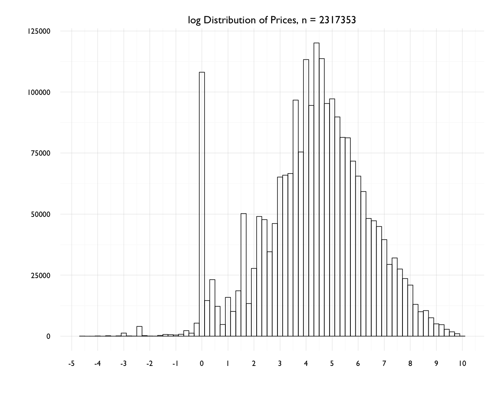

# Agora Associations 03

outputs from the file `agora-associations-03.R`

# Preparation

## Subset and Categorize

```{r}
ag <- subset(a, a$usd <= 20000) # 2319949
```

## Combine Subcategories

```{r}
ag$subcat <- as.character(ag$subcat)
ag$subsubcat <- as.character(ag$subsubcat)
ag$subcat[is.na(ag$subcat)] <- ""
ag$subsubcat[is.na(ag$subsubcat)] <- ""

ag$sc <- paste(ag$subcat, ag$subsubcat, sep = ", ")
levels(as.factor(ag$sc))
ag$sc <- gsub("\\b,\\s$", "", ag$sc)

levels(as.factor(ag$sc))
ag$sc <- factor(ag$sc) # 106 levels
```

## Discretize Prices

Initially I'd been using `discretize` from the `arules` library to do this. I decided to discretize manually for the last round of rule mining, given new domain info (and maybe bc I kept running into a bug at this point in the RMarkdown file, refusing to knit `discretize` for some reason).

Using discretize there was choice of whether to bin values by equal intervals or cluster. To help decide, examined and plotted distributions of prices. 

```{R}
# discretize prices - but into cluster or interval?
ag$usd <- round(ag$usd, 2)
summary(ag$usd)
#  Min.  1st Qu.   Median     Mean  3rd Qu.     Max. 
# 0.00    24.28    84.97    426.40   290.20 20000.00

quantile(ag$usd)
#   0%      25%      50%      75%     100% 
# 0.00    24.28    84.97   290.19 20000.00 
```

I'll venture that most of the values are towards the left...

```{r}
par(mfrow = c(2, 2), mar = c(6, 6, 6, 6), family = "GillSans")

hist(ag$usd, breaks = 100, main = "n < $20,000", 
     xlab = "", ylab = "Frequency")
hist(ag$usd, breaks = 100, xlim = c(0, 5000), 
     main = "n < $5,000", xlab = "", ylab = "")
hist(ag$usd, breaks = 1000, xlim = c(0, 1000), 
     main = "n < $1,000", xlab = "price in USD", ylab = "Frequency")
hist(ag$usd, breaks = 10000, xlim = c(0, 200),
     main = "n < $200", xlab = "price in USD", ylab = "")
```


As suspected. One more curiousity - although the summary above shows a mean price of $426.40, the feeling is that outliers on high end are pulling that value up - a mean above the 3rd quartile seems to indicate something...

```{R}
# heavy on the left/long tail - quick check of the log()
ag$log.usd <- log(ag$usd)

par(mfrow = c(1, 1), mar = c(6, 6, 6, 4), las = 1, family = "GillSans")
hist(ag$log.usd, main = "log(usd) Distribution of Prices, n = 2316650",
     breaks = 100, xlab = "", ylab = "")
axis(1, at = seq(-5, 10, 1))

summary(ag$log.usd)
#  Min. 1st Qu.  Median    Mean 3rd Qu.    Max. 
# -Inf   3.190   4.442    -Inf   5.671   9.903 

exp(c(4, 4.25, 4.5, 4.75, 5))
# 54.59815  70.10541  90.01713 115.58428 148.41316
```


Visually it appears the 'mean' of the log distribution of prices falls around 4.5 - of course, visually, that might change depending on the number of breaks/binwidth. But assuming that's case, prices can be observed in a range from about $60-$100 near the mean. This is judging from exponentiating 4.25 and 4.75 out. The spike at at/near zero seems to indicate a number of $1 listings. From exploratory plots, this spike is likely the result of eBook listings.

**_aside_**: Depending on the variable scale, it can be annoying to manually label axes in base graphics; but maybe more annoying is when I spend too much time tweaking ggplot2 parameters to get a result that I don't consider an improvement. **_smh_**



```{R}

ggplot(ag, aes(x = log.usd)) + 
  geom_histogram(binwidth = 0.25, color = "black", alpha = 0, size = 0.5) +
  scale_x_continuous(breaks = seq(-5, 10, 1)) +
  theme_minimal(base_size = 14, base_family = "GillSans") +
  theme(axis.text.y = element_text(size = 12),
        axis.text.x = element_text(size = 12),
        panel.grid.major = element_line(color = "gray82"),
        plot.margin = unit(c(1, 1, 1, 1), "cm")) +
  labs(title = "log Distribution of Prices, n = 2316650",
       x = "", y = "")

# Warning message:
# Removed 703 rows containing non-finite values (stat_bin)
# so: n = ...
nrow(ag) - 703

```

Eventually I decided to bin the prices myself (after using `cluster` in `discretize` on a previous mining session). I plotted the distribution of the manually binned prices, fill opacity set to relative frequency (x2).


```{R}
# manually
ag$p <- ag$usd
ag$p <- ifelse(ag$p <= 10.00, "$0-10", 
               ifelse(ag$p > 10 & ag$p <= 150.00, "$10-150",
                      ifelse(ag$p > 150 & ag$p <= 600.00, "$150-600",
                             ifelse(ag$p > 600 & ag$p <= 2000.00, "$600-2000",
                                    ifelse(ag$p > 2000 & ag$p <= 10000, "$2000-10000",
                                           ifelse(ag$p > 10000, "$10000-20000", NA))))))


ag$p <- factor(ag$p)  # 6 levels

summary(ag$p)
#  $0-10      $10-150 $10000-20000     $150-600  $2000-10000    $600-2000 
# 371235      1086166         7393       515111       106747       230701 

371235/nrow(ag)   # 0.1601979
1086166/nrow(ag)  # 0.4687098
7393/nrow(ag)     # 0.003190278
515111/nrow(ag)   # 0.2222842
106747/nrow(ag)   # 0.04606419
230701/nrow(ag)   # 0.09955367

ggplot(ag, aes(reorder(p), color = "black", fill = p)) + geom_bar() +
  scale_fill_manual(values = c("#EE2C2C32", "#EE2C2C94", "#EE2C2C02", 
                               "#EE2C2C44", "#EE2C2C10", "#EE2C2C20"),
                    guide = F) +
  theme_minimal(base_size = 16, base_family = "GillSans") +
  theme(plot.margin = unit(c(2, 2, 2, 2), "cm"),
        axis.text.y = element_text(size = 14.75),
        axis.text.x = element_text(size = 14.75),
        legend.position = "none") +
  labs(title = "Distribution of Discretized Prices", 
       x = "", y = "", colour = "", fill = "")
```       

## Anonymize Vendors

```{R}
ag$v2 <- ag$vendor
ag$v2 <- anonymize(ag$v2, .algo = "sha256", .seed = 144, 
                   .chars = letters[seq(from = 1, to = 26)])

nchar(ag$v2[234]) # 64
ag$v3 <- abbreviate(ag$v2, minlength = 6, strict = F, method = "left.kept")
levels(as.factor(ag$v3))

ag$v3 <- factor(ag$v3)
summary(ag$v3)
```

# As Transactions

- price
- location
- category
- subcategory (pasted subcat and subsubcat)
- vendor (anonymized SHA256 and abbreviated)

### Transactions - Full

```{r}
summary(a2)
transactions as itemMatrix in sparse format with
 2317353 rows (elements/itemsets/transactions) and
 3395 columns (items) and a density of 0.001472754 

most frequent items:
   c=Drugs  p=$10-150 p=$150-600      f=USA  f=No Info    (Other) 
   1605481    1086166     515111     497780     407122    7475105 

element (itemset/transaction) length distribution:
sizes
      5 
2317353 

   Min. 1st Qu.  Median    Mean 3rd Qu.    Max. 
      5       5       5       5       5       5 

includes extended item information - examples:
          labels variables       levels
1        p=$0-10         p        $0-10
2      p=$10-150         p      $10-150
3 p=$10000-20000         p $10000-20000

includes extended transaction information - examples:
  transactionID
1             1
2             2
3             3
```


### Transactions - Unique


```{R}
transactions as itemMatrix in sparse format with
 30956 rows (elements/itemsets/transactions) and
 3395 columns (items) and a density of 0.001472754 

most frequent items:
    c=Drugs   p=$10-150       f=USA  p=$150-600 p=$600-2000     (Other) 
      25866       12000        9167        7904        4588       95255 

element (itemset/transaction) length distribution:
sizes
    5 
30956 

   Min. 1st Qu.  Median    Mean 3rd Qu.    Max. 
      5       5       5       5       5       5 

includes extended item information - examples:
          labels variables       levels
1        p=$0-10         p        $0-10
2      p=$10-150         p      $10-150
3 p=$10000-20000         p $10000-20000

includes extended transaction information - examples:
  transactionID
1             1
2             2
3             3
```


# Frequent Itemsets

```{R}
a2items <- apriori(a2, parameter = list(target = "frequent",
                                        supp = 0.0025, minlen = 2, maxlen = 5))

summary(a2items)
set of 738 itemsets

most frequent items:
    c=Drugs   p=$10-150       f=USA  p=$150-600 p=$600-2000     (Other) 
        337         163         140         118          70        1055 

element (itemset/transaction) length distribution:sizes
  2   3   4 
382 305  51 

   Min. 1st Qu.  Median    Mean 3rd Qu.    Max. 
  2.000   2.000   2.000   2.551   3.000   4.000 

summary of quality measures:
    support        
 Min.   :0.002520  
 1st Qu.:0.003327  
 Median :0.004975  
 Mean   :0.010439  
 3rd Qu.:0.009303  
 Max.   :0.323136  

includes transaction ID lists: FALSE 

mining info:
 data ntransactions support confidence
   a2         30956  0.0025          1
```

# Mine Association Rules

```{r}
a2rules <- apriori(a2, parameter = list(support = 0.0025, confidence = 0.6,
                                        minlen = 3, maxlen = 5))
```

Decided on minsup 0.0025, minconf 0.6, minlen 3.

```{r}
summary(a2rules)
set of 298 rules

rule length distribution (lhs + rhs):sizes
  3   4 
245  53 

   Min. 1st Qu.  Median    Mean 3rd Qu.    Max. 
  3.000   3.000   3.000   3.178   3.000   4.000 

summary of quality measures:
    support           confidence          lift        
 Min.   :0.002520   Min.   :0.6028   Min.   : 0.7288  
 1st Qu.:0.003295   1st Qu.:1.0000   1st Qu.: 1.1968  
 Median :0.004797   Median :1.0000   Median : 1.1968  
 Mean   :0.007822   Mean   :0.9575   Mean   : 5.0688  
 3rd Qu.:0.008439   3rd Qu.:1.0000   3rd Qu.: 1.1968  
 Max.   :0.110156   Max.   :1.0000   Max.   :89.7731  

mining info:
 data ntransactions support confidence
   a2         30956  0.0025        0.6

```

Inspect the top (and bottom, and some middle) rules:

```{r}

arules::inspect(head(a2rules, 20))
   lhs                                      rhs                support     confidence lift     
1  {f=Worldwide,v=a26103}                => {c=Drugs}          0.002778137 0.9885057   1.183027
2  {c=Drugs,v=a26103}                    => {f=Worldwide}      0.002778137 0.9885057  39.484108
3  {p=$10-150,sc=Opioids, Buprenorphine} => {c=Drugs}          0.002745833 1.0000000   1.196783
4  {c=Drugs,sc=Opioids, Buprenorphine}   => {p=$10-150}        0.002745833 0.6028369   1.555118
5  {f=USA,sc=Opioids, Morphine}          => {c=Drugs}          0.002648921 1.0000000   1.196783
6  {p=$10-150,sc=Opioids, Morphine}      => {c=Drugs}          0.002519705 1.0000000   1.196783
7  {f=USA,sc=Opioids, Hydrocodone}       => {c=Drugs}          0.005136323 1.0000000   1.196783
8  {c=Drugs,sc=Opioids, Hydrocodone}     => {f=USA}            0.005136323 0.8071066   2.725515
9  {p=$10-150,sc=Opioids, Hydrocodone}   => {c=Drugs}          0.002552009 1.0000000   1.196783
10 {p=$0-10,sc=eBooks}                   => {c=Information}    0.002519705 0.6842105  56.783971
11 {f=No Info,sc=Accounts}               => {c=Data}           0.002810441 1.0000000  72.496487
12 {p=$10-150,sc=Accounts}               => {c=Data}           0.003133480 1.0000000  72.496487
13 {f=Agora/Internet/Torland,sc=Guides}  => {c=Information}    0.002875048 1.0000000  82.991957
14 {p=$0-10,sc=Guides}                   => {c=Information}    0.002939656 1.0000000  82.991957
15 {f=No Info,sc=Guides}                 => {c=Information}    0.003068872 1.0000000  82.991957
16 {f=No Info,c=Information}             => {sc=Guides}        0.003068872 0.6375839  87.332066
17 {p=$10-150,sc=Guides}                 => {c=Information}    0.003133480 1.0000000  82.991957
18 {p=$10-150,c=Information}             => {sc=Guides}        0.003133480 0.6554054  89.773140
19 {f=USA,c=Listings}                    => {sc=No Info/Other} 0.002745833 1.0000000  21.617318
20 {p=$10-150,c=Listings}                => {sc=No Info/Other} 0.002875048 1.0000000  21.617318

arules::inspect(tail(a2rules, 20))
    lhs                                           rhs       support     confidence lift    
279 {p=$600-2000,f=USA,sc=Stimulants, Cocaine} => {c=Drugs} 0.003262695 1          1.196783
280 {p=$150-600,f=USA,sc=Stimulants, Cocaine}  => {c=Drugs} 0.004845587 1          1.196783
281 {p=$10-150,f=USA,sc=Stimulants, Cocaine}   => {c=Drugs} 0.006040832 1          1.196783
282 {p=$10-150,f=UK,sc=Ecstasy, MDMA}          => {c=Drugs} 0.002584313 1          1.196783
283 {p=$150-600,f=Australia,sc=Ecstasy, MDMA}  => {c=Drugs} 0.003553431 1          1.196783
284 {p=$10-150,f=Australia,sc=Ecstasy, MDMA}   => {c=Drugs} 0.003198088 1          1.196783
285 {p=$600-2000,f=USA,sc=Ecstasy, MDMA}       => {c=Drugs} 0.003133480 1          1.196783
286 {p=$150-600,f=USA,sc=Ecstasy, MDMA}        => {c=Drugs} 0.004554852 1          1.196783
287 {p=$10-150,f=USA,sc=Ecstasy, MDMA}         => {c=Drugs} 0.006040832 1          1.196783
288 {p=$2000-10000,f=USA,sc=Cannabis, Weed}    => {c=Drugs} 0.005362450 1          1.196783
289 {p=$150-600,f=UK,sc=Cannabis, Weed}        => {c=Drugs} 0.003488823 1          1.196783
290 {p=$10-150,f=UK,sc=Cannabis, Weed}         => {c=Drugs} 0.004716372 1          1.196783
291 {p=$10-150,f=Australia,sc=Cannabis, Weed}  => {c=Drugs} 0.002778137 1          1.196783
292 {p=$0-10,f=USA,sc=Cannabis, Weed}          => {c=Drugs} 0.003488823 1          1.196783
293 {p=$600-2000,f=No Info,sc=Cannabis, Weed}  => {c=Drugs} 0.002648921 1          1.196783
294 {p=$150-600,f=No Info,sc=Cannabis, Weed}   => {c=Drugs} 0.003908774 1          1.196783
295 {p=$10-150,f=No Info,sc=Cannabis, Weed}    => {c=Drugs} 0.003714950 1          1.196783
296 {p=$600-2000,f=USA,sc=Cannabis, Weed}      => {c=Drugs} 0.008463626 1          1.196783
297 {p=$150-600,f=USA,sc=Cannabis, Weed}       => {c=Drugs} 0.011532498 1          1.196783
298 {p=$10-150,f=USA,sc=Cannabis, Weed}        => {c=Drugs} 0.011435586 1          1.196783

arules::inspect(a2rules)[101:111, ]
                                    lhs          rhs     support confidence     lift
101      {p=$0-10,sc=Stimulants, Speed} => {c=Drugs} 0.002745833          1 1.196783
102  {p=$600-2000,sc=Stimulants, Speed} => {c=Drugs} 0.004554852          1 1.196783
103   {p=$150-600,sc=Stimulants, Speed} => {c=Drugs} 0.008043675          1 1.196783
104    {p=$10-150,sc=Stimulants, Speed} => {c=Drugs} 0.010951027          1 1.196783
105 {p=$2000-10000,sc=Stimulants, Meth} => {c=Drugs} 0.003133480          1 1.196783
106          {f=UK,sc=Stimulants, Meth} => {c=Drugs} 0.002681225          1 1.196783
107   {f=Australia,sc=Stimulants, Meth} => {c=Drugs} 0.008302106          1 1.196783
108   {p=$600-2000,sc=Stimulants, Meth} => {c=Drugs} 0.005911616          1 1.196783
109    {p=$150-600,sc=Stimulants, Meth} => {c=Drugs} 0.008528234          1 1.196783
110         {f=USA,sc=Stimulants, Meth} => {c=Drugs} 0.008689753          1 1.196783
111     {p=$10-150,sc=Stimulants, Meth} => {c=Drugs} 0.009884998          1 1.196783

```

Some quick new questions and thoughts:

- What kind of Speed costs less than $10?
- What kind of Speed costs more than $600? (or how much Speed)
- Hydrocodone is likely to come from the USA and cost between 10-150 dollars.
- the top rule is interesting; graphs and plots do not show many vendors - 'a26103 is likely to sell drugs and ship worldwide'.


# Grouped Matrix Plot

Initially I was plotting these individually and changing the list parameter `k` each time. Eventually I wrote a loop, and then would inspect the outputs in Adobe Bridge or Finder.


```{r}
# individual
plot(a2rules, method = "grouped", control = list(k = 36))

# loop
for (i in 1:10) {
  
  png(filename = paste("~/GitHub/agora-local-market/arules/rule-groups/g1-",i,".jpeg"),
      width = 1800, height = 1400, pointsize = 20, bg = "transparent")
  
  k = i * 12
  
  plot(a2rules, method = "grouped", control = list(k = k))
  
  dev.off()
  
}

```

# Network Graphs


3 quality measure subsets were used for networks graphs:

- Support, Confidence, and Lift
- Lift
- Support and Confidence

Given the vast possibilities for numbers of rules, I'd generally plot the first 1:80 in a loop. 

Again, would sort through the graphs in Finder to, 'chronologically' to see what might be interesting. One unexpected benefit to this method was being able to see hierarchically which rules were strongest. The strongest rules would plot first by this sorting, and more rules of less strength would get added to graphs down the loop. 

From there, I might plot a few individual graphs with over ~100 rules. This was to see a how a really dense network might cluster or form relationships. In this document I'll just show graphing for _Support, Confidence, and Lift_ because its the same code for the other groupings, with the `by` argument in the `sort` method changed. 


```{r}
# get layouts
grep("^layout_", ls("package:igraph"), value = T)[-1]

# define a palette
pdpal <- colorRampPalette(c("#BFEFFF85", "#FFFFFF75", "#00688B85"), alpha = 0.85)
pdpal(100)

# 80 graphs by Support, Confidence, and Lift 

for (i in 1:80) {
  
  log <- head(sort(a2rules, by = c("support", "confidence", "lift")), i)
  
  png(filename = paste("~/GitHub/agora-local-market/arules/igraphs/r1-SCL-",i,".png"),
      width = 1800, height = 1400, pointsize = 18, bg = "transparent")
  
  par(family = "GillSans")
  set.seed(144)
  plot(log, method = "graph", 
       main = paste(i, "rules ~ support + confidence + lift (dh)"),
       edge.color = "#00000025",
       vertex.frame.color = "#00688B85",
       vertex.color = pdpal(100),
       vertex.label.color = "grey8", 
       vertex.label.cex = 1, layout = layout_with_dh,
       vertex.label.dist = 0)
  
  dev.off()
}

# individual plot by Support, Confidence, and Lift
r1 <- head(sort(a2rules, by = c("support", "confidence", "lift")), 144)
p1 <- plot(r1, method = "graph", 
           main = "144 rules ~ support + confidence + lift (dh)", 
           edge.color = "#00000025",
           vertex.frame.color = "#00688B85",
           vertex.color = pdpal(100),
           vertex.label.color = "grey8", 
           vertex.label.cex = 0.68, layout = layout_with_dh,
           vertex.label.dist = 0)

```


