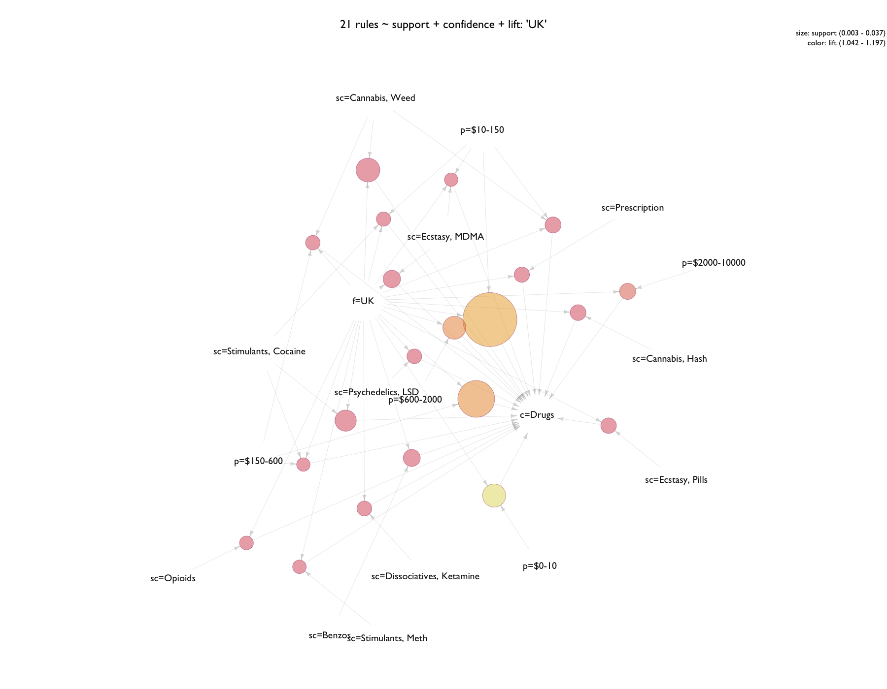

# Agora Association Rules

- _outputs from the file `agora-associations-03.R`_
- basic info on [Association Rule Mining](AssociationBasics.md)

Contents:

- [Preparation](#preparation)
- [Discretize Prices](#discretize-prices)
- [Anonymize Vendors](#anonymize-vendor-names)
- [Transaction Conversion](#transaction-conversion)
- [Frequent Itemsets](#frequent-itemsets)
- [Mine Association Rules](#mine-association-rules)
- [Grouped Matrix Plots](#grouped-matrix-plot)
- [Network Graphs](#network-graphs)
- [Subset Locations](#subset-locations)
- [References](#references)

```{R}

library(arules)
library(arulesViz)
library(data.table)
library(igraph)
library(geomnet)
library(ggplot2)
library(anonymizer)

a <- fread("~/GitHub/agora-data/agora-01b.csv", stringsAsFactors = T)
```

Even though association rule mining is often written about in terms of finding novel itemsets and rules, I'm going to be focusing more on seeing what traverses this market network, what relationships might exist, and looking at probabilities for different classes occurring as a means to advise in selecting features. 

While the market is large, you might say the products on offer fall into 'niche' categories. I think of looking for novel itemsets/rules here as being akin to doing so at a supermarket but limiting yourself to only the produce section. Basically, I'm not hoping to find out something akin to sales of Pop-Tarts spiking before hurricanes<sup>[1](#references)</sup> - and nevermind about diapers and beer. There's less of a chance for "surprises" when the range of items doesn't span Amazon's entire catalog. 

That said - finding rules that traverse the network should still prove informative and interesting.

# Preparation

## Subset and Categorize

```{r}
ag <- subset(a, a$usd <= 20000) # 2319949
```

Why subset for prices under $20,000? 

Often on Agora there will be products listed at exorbitant prices.

While on the surface they may resemble scams, it's been observed that these prices are here for vendors to keep their listings active while waiting for their supply to be restocked<sup>[2](#references)</sup>,<sup><sup>[3](#references)</sup>. The prices are set high to discourage transactions, but keep their listings active to maintain their market presence and 'advertise' for the near-future when supply is replenished. While there is some gray area where 'placeholders' will mingle amongst potentially legitimate listings, the number of these listings is quite small compared to the population and can be easily subsetted and examined were it an issue. 

An example of this 'mingling': sorting by price might show a $45,000 gram of cannabis, next to a $47,000 listing for a kilogram of cocaine. 

In some ways, this can be seen as a 'waitlist' for certain products. As opposed to buying a rare or one-of-a-kind item, to maintain a placeholder listing suggests at the very least a perceived demand for the product listed and renewable supply...more on this in another document.


## Combine Subcategories


```{r}
# convert NA to blank
ag$subcat <- as.character(ag$subcat)
ag$subsubcat <- as.character(ag$subsubcat)
ag$subcat[is.na(ag$subcat)] <- ""
ag$subsubcat[is.na(ag$subsubcat)] <- ""

# combine subcategory and sub-subcategory
ag$sc <- paste(ag$subcat, ag$subsubcat, sep = ", ")
levels(as.factor(ag$sc))
ag$sc <- gsub("\\b,\\s$", "", ag$sc)

# convert to factor
levels(as.factor(ag$sc))
ag$sc <- factor(ag$sc) # 106 levels
```

From the HTML, generally 3 categories could be extracted from each listing. These would range from high-level description (e.g. '**Drugs**') to finer-grain sub- and sub-subcategories (e.g. '**Cannabis**', '**Concentrates**') further down the menu. Each is it's own variable in the data, but they're inextricably linked by the listing itself.

For the purposes of association rule mining, I decided to aggregate sub- and sub-subcategories into one variable so as to avoid numerous superflous itemsets and rules. It also provides a nicer description when plotted and still comes out to right number of levels as a factor. A look at the top:

```{R}

levels(ag$sc)
  [1] "Accessories"                "Accounts"                  
  [3] "Advertising"                "Aliens/UFOs"               
  [5] "Ammunition"                 "Anonymity"                 
  [7] "Barbiturates"               "Barbiturates, Barbiturates"
  [9] "Benzos"                     "Cannabis"                  
 [11] "Cannabis, Concentrates"     "Cannabis, Edibles"         
 [13] "Cannabis, Hash"             "Cannabis, Seeds"           
 [15] "Cannabis, Shake/trim"       "Cannabis, Synthetics"      
 [17] "Cannabis, Weed"             "Clothing"                  
 [19] "Containers"                 "Disassociatives"           
 [21] "Disassociatives, GBL"       "Disassociatives, GHB"      
 [23] "Disassociatives, Ketamine"  "Disassociatives, MXE"      
 [25] "Disassociatives, Other"     "Dissociatives, GBL"        
 [27] "Dissociatives, GHB"         "Dissociatives, Ketamine"   
 [29] "Dissociatives, MXE"         "Dissociatives, Other"      
 [31] "Dissociatives, PCP"         "Doomsday"                  
 [33] "eBooks"                     "Economy"                   
 [35] "Ecstasy"                    "Ecstasy, Ecstasy"          
 [37] "Ecstasy, MDA"               "Ecstasy, MDMA"
 ...

```

# Discretize Prices

Initially I'd been using `discretize` from the `arules` library to do this. I decided to discretize manually for the last round of rule mining, given new domain info (and maybe bc I kept running into a bug at this point in the RMarkdown file, refusing to knit `discretize` for some reason).

Using `discretize` previously involved a choice of whether to bin values by equal intervals or cluster. To inform that decision - examined and plotted distributions of prices. 

```{R}
# discretize prices - but into cluster or interval?
ag$usd <- round(ag$usd, 2)

summary(ag$usd)
#  Min.  1st Qu.   Median     Mean  3rd Qu.     Max. 
# 0.00    24.28    84.97    426.40   290.20 20000.00

quantile(ag$usd)
#   0%      25%      50%      75%     100% 
# 0.00    24.28    84.97   290.19 20000.00 
```

I'll venture that most of the values are towards the left...

```{r}
par(mfrow = c(2, 2), mar = c(6, 6, 6, 6), family = "GillSans")

hist(ag$usd, breaks = 100, main = "n < $20,000", 
     xlab = "", ylab = "Frequency")
hist(ag$usd, breaks = 100, xlim = c(0, 5000), 
     main = "n < $5,000", xlab = "", ylab = "")
hist(ag$usd, breaks = 1000, xlim = c(0, 1000), 
     main = "n < $1,000", xlab = "price in USD", ylab = "Frequency")
hist(ag$usd, breaks = 10000, xlim = c(0, 200),
     main = "n < $200", xlab = "price in USD", ylab = "")
```


As suspected. One more curiousity - although the summary above shows a mean price of $426.40, the feeling is that outliers on high end are pulling that value up - a mean above the 3rd quartile seems to indicate something...

```{R}
# heavy on the left/long tail - quick check of the log()
ag$log.usd <- log(ag$usd)

par(mfrow = c(1, 1), mar = c(6, 6, 6, 4), las = 1, family = "GillSans")
hist(ag$log.usd, main = "log(usd) Distribution of Prices, n = 2316650",
     breaks = 100, xlab = "", ylab = "")
axis(1, at = seq(-5, 10, 1))

summary(ag$log.usd)
#  Min. 1st Qu.  Median    Mean 3rd Qu.    Max. 
# -Inf   3.190   4.442    -Inf   5.671   9.903 

exp(c(4, 4.25, 4.5, 4.75, 5))
# 54.59815  70.10541  90.01713 115.58428 148.41316
```


Visually it appears the 'mean' of the log distribution of prices falls around 4.5 - of course, visually, that might change depending on the number of breaks/binwidth. But assuming that's case, prices can be observed in a range from about $60-$100 near the mean. This is judging from exponentiating 4.25 and 4.75 out. The spike at at/near zero seems to indicate a number of $1 listings. From exploratory plots, this spike is likely the result of eBook listings.

Eventually I decided to bin the prices myself (after using `cluster` in `discretize` on a previous mining session). The bins were mostly following the results of discretizing by cluster, but accounting for the inflated price frequency near zero. 

```{R}
# manually discretize
ag$p <- ag$usd
ag$p <- ifelse(ag$p <= 10.00, "$0-10", 
               ifelse(ag$p > 10 & ag$p <= 150.00, "$10-150",
                      ifelse(ag$p > 150 & ag$p <= 600.00, "$150-600",
                             ifelse(ag$p > 600 & ag$p <= 2000.00, "$600-2000",
                                    ifelse(ag$p > 2000 & ag$p <= 10000, "$2000-10000",
                                           ifelse(ag$p > 10000, "$10000-20000", NA))))))


ag$p <- factor(ag$p)  # 6 levels
```


```{r}
ggplot(ag, aes(reorder(p), color = "black", fill = p)) + geom_bar() +
  scale_fill_manual(values = c("#EE2C2C32", "#EE2C2C94", "#EE2C2C02", 
                               "#EE2C2C44", "#EE2C2C10", "#EE2C2C20"),
                    guide = F) +
  theme_minimal(base_size = 16, base_family = "GillSans") +
  theme(plot.margin = unit(c(2, 2, 2, 2), "cm"),
        axis.text.y = element_text(size = 14.75),
        axis.text.x = element_text(size = 14.75),
        legend.position = "none") +
  labs(title = "Distribution of Discretized Prices", 
       x = "", y = "", colour = "", fill = "")
```      

Above is a histogram of the manually binned prices, fill opacity set to relative frequency (x2) by some quick calculations:

``` {r}
summary(ag$p)
#  $0-10      $10-150 $10000-20000     $150-600  $2000-10000    $600-2000 
# 371235      1086166         7393       515111       106747       230701 

371235/nrow(ag)   # 0.1601979
1086166/nrow(ag)  # 0.4687098
7393/nrow(ag)     # 0.003190278
515111/nrow(ag)   # 0.2222842
106747/nrow(ag)   # 0.04606419
230701/nrow(ag)   # 0.09955367
```

# Anonymize Vendor Names

I'm no expert or even novice at cryptography; but decided it was worth the extra measure of anonymizing vendor names before using them as variables in mining. Even though vendor names provided were all nicknames, as seen in the case of one vendor<sup>[4]((#references)</sup> even with just a handle a real identity could be found out. 

```{R}
ag$v2 <- ag$vendor
ag$v2 <- anonymize(ag$v2, .algo = "sha256", .seed = 144, 
                   .chars = letters[seq(from = 1, to = 26)])

nchar(ag$v2[234]) # 64
ag$v3 <- abbreviate(ag$v2, minlength = 6, strict = F, method = "left.kept")
levels(as.factor(ag$v3))

ag$v3 <- factor(ag$v3)
summary(ag$v3)
```
From reading the manual pages, `anonymize` salts then hashes a vector with a few choices for algorithms. `SHA256` felt the appropriate hashing algorithm, and in what might be an insecure method I abbreviated the output to 6 characters afterwards. 

In practical terms though, anyone caring to download the dataset could easily find the vendor names. Anonymization, in this case, is done less for security and mostly out of respect for privacy. 

# Transaction Conversion

- price
- location
- category
- subcategory (pasted subcat and subsubcat)
- vendor (hashed SHA256 and abbreviated)


```{R}
transactions as itemMatrix in sparse format with
 30956 rows (elements/itemsets/transactions) and
 3395 columns (items) and a density of 0.001472754 

most frequent items:
    c=Drugs   p=$10-150       f=USA  p=$150-600 p=$600-2000     (Other) 
      25866       12000        9167        7904        4588       95255 

element (itemset/transaction) length distribution:
sizes
    5 
30956 

#   Min. 1st Qu.  Median    Mean 3rd Qu.    Max. 
#      5       5       5       5       5       5 

includes extended item information - examples:
          labels variables       levels
1        p=$0-10         p        $0-10
2      p=$10-150         p      $10-150
3 p=$10000-20000         p $10000-20000

includes extended transaction information - examples:
  transactionID
1             1
2             2
3             3
```

Item Frequency Plots:

```{R}
# Item Frequency Plot ---------------------------------------------------------

par(mfrow = c(1, 1), mar = c(4, 12, 4, 4), family = "GillSans")
itemFrequencyPlot(a2, support = 0.025, cex.names = 0.8, col = "white", horiz = T,
                  main = "Agora Marketplace: Frequent Items (support > 0.025)")
```


After multiple mining sessions, I'd begun to find it faster to use `for()` loops to create multiple plots quickly with different parameters. Certainly feels much more efficient than manually changing argument values or repeating too many code chunks. 

```{R}

# Item Frequency Plot Loop ----------------------------------------------------

# define support intervals
sup <- seq(0.000, 0.1, by = 0.005)
sup
sup[[12]]

# plot loop
for (i in 1:length(sup)) {
  
  par(mfrow = c(1, 1), mar = c(4, 12, 4, 4), family = "GillSans")
  
  png(filename = paste("~/GitHub/agora-local-market/arules/ifp/ItemFreq", sup[i], ".png"),
      width = 1800, height = 1400, pointsize = 18, bg = "transparent")
  
  itemFrequencyPlot(a2, support = sup[i], cex.names = 0.8, col = "white", horiz = T,
                    main = paste("Agora Marketplace: Frequent Items (support >", 
                                 sup[i], ")"))
  
  dev.off()
  
}
```


Eventually I settled on a minumum support of 0.0025 - half the threshold of the plot above. As a minimum support it might seem low, but would allow for a large range of itemsets and rules to be mined. 

# Frequent Itemsets

- minimum support: 0.0025
- minumum length: 2

```{R}
a2items <- apriori(a2, parameter = list(target = "frequent",
                                        supp = 0.0025, minlen = 2, maxlen = 5))

summary(a2items)
set of 738 itemsets

most frequent items:
    c=Drugs   p=$10-150       f=USA  p=$150-600 p=$600-2000     (Other) 
        337         163         140         118          70        1055 

element (itemset/transaction) length distribution:sizes
  2   3   4 
382 305  51 

#   Min. 1st Qu.  Median    Mean 3rd Qu.    Max. 
#  2.000   2.000   2.000   2.551   3.000   4.000 

# summary of quality measures:
#     support        
#  Min.   :0.002520  
#  1st Qu.:0.003327  
#  Median :0.004975  
#  Mean   :0.010439  
#  3rd Qu.:0.009303  
#  Max.   :0.323136  

includes transaction ID lists: FALSE 

mining info:
 data ntransactions support confidence
   a2         30956  0.0025          1
```

Yielding 738 itemsets, with decent distribution among itemset lengths.

# Mine Association Rules

- minimum support: 0.0025
- minimum confidence: 0.6
- minumum length: 3

Minimum length could be reduced to 2 on another run for more rules.

```{r}
a2rules <- apriori(a2, parameter = list(support = 0.0025, confidence = 0.6,
                                        minlen = 3, maxlen = 5))
```

Decided on minsup 0.0025, minconf 0.6, minlen 3.

```{r}
summary(a2rules)
set of 298 rules

rule length distribution (lhs + rhs):sizes
  3   4 
245  53 

#   Min. 1st Qu.  Median    Mean 3rd Qu.    Max. 
#  3.000   3.000   3.000   3.178   3.000   4.000 

# summary of quality measures:
#     support           confidence          lift        
#  Min.   :0.002520   Min.   :0.6028   Min.   : 0.7288  
#  1st Qu.:0.003295   1st Qu.:1.0000   1st Qu.: 1.1968  
#  Median :0.004797   Median :1.0000   Median : 1.1968  
#  Mean   :0.007822   Mean   :0.9575   Mean   : 5.0688  
#  3rd Qu.:0.008439   3rd Qu.:1.0000   3rd Qu.: 1.1968  
#  Max.   :0.110156   Max.   :1.0000   Max.   :89.7731  

mining info:
 data ntransactions support confidence
   a2         30956  0.0025        0.6

```

Inspect the top (and bottom, and some middle) rules:

```{r}

arules::inspect(head(a2rules, 20))
   lhs                                      rhs                support     confidence lift     
1  {f=Worldwide,v=a26103}                => {c=Drugs}          0.002778137 0.9885057   1.183027
2  {c=Drugs,v=a26103}                    => {f=Worldwide}      0.002778137 0.9885057  39.484108
3  {p=$10-150,sc=Opioids, Buprenorphine} => {c=Drugs}          0.002745833 1.0000000   1.196783
4  {c=Drugs,sc=Opioids, Buprenorphine}   => {p=$10-150}        0.002745833 0.6028369   1.555118
5  {f=USA,sc=Opioids, Morphine}          => {c=Drugs}          0.002648921 1.0000000   1.196783
6  {p=$10-150,sc=Opioids, Morphine}      => {c=Drugs}          0.002519705 1.0000000   1.196783
7  {f=USA,sc=Opioids, Hydrocodone}       => {c=Drugs}          0.005136323 1.0000000   1.196783
8  {c=Drugs,sc=Opioids, Hydrocodone}     => {f=USA}            0.005136323 0.8071066   2.725515
9  {p=$10-150,sc=Opioids, Hydrocodone}   => {c=Drugs}          0.002552009 1.0000000   1.196783
10 {p=$0-10,sc=eBooks}                   => {c=Information}    0.002519705 0.6842105  56.783971
11 {f=No Info,sc=Accounts}               => {c=Data}           0.002810441 1.0000000  72.496487
12 {p=$10-150,sc=Accounts}               => {c=Data}           0.003133480 1.0000000  72.496487
13 {f=Agora/Internet/Torland,sc=Guides}  => {c=Information}    0.002875048 1.0000000  82.991957
14 {p=$0-10,sc=Guides}                   => {c=Information}    0.002939656 1.0000000  82.991957
15 {f=No Info,sc=Guides}                 => {c=Information}    0.003068872 1.0000000  82.991957
16 {f=No Info,c=Information}             => {sc=Guides}        0.003068872 0.6375839  87.332066
17 {p=$10-150,sc=Guides}                 => {c=Information}    0.003133480 1.0000000  82.991957
18 {p=$10-150,c=Information}             => {sc=Guides}        0.003133480 0.6554054  89.773140
19 {f=USA,c=Listings}                    => {sc=No Info/Other} 0.002745833 1.0000000  21.617318
20 {p=$10-150,c=Listings}                => {sc=No Info/Other} 0.002875048 1.0000000  21.617318

arules::inspect(tail(a2rules, 20))
    lhs                                           rhs       support     confidence lift    
279 {p=$600-2000,f=USA,sc=Stimulants, Cocaine} => {c=Drugs} 0.003262695 1          1.196783
280 {p=$150-600,f=USA,sc=Stimulants, Cocaine}  => {c=Drugs} 0.004845587 1          1.196783
281 {p=$10-150,f=USA,sc=Stimulants, Cocaine}   => {c=Drugs} 0.006040832 1          1.196783
282 {p=$10-150,f=UK,sc=Ecstasy, MDMA}          => {c=Drugs} 0.002584313 1          1.196783
283 {p=$150-600,f=Australia,sc=Ecstasy, MDMA}  => {c=Drugs} 0.003553431 1          1.196783
284 {p=$10-150,f=Australia,sc=Ecstasy, MDMA}   => {c=Drugs} 0.003198088 1          1.196783
285 {p=$600-2000,f=USA,sc=Ecstasy, MDMA}       => {c=Drugs} 0.003133480 1          1.196783
286 {p=$150-600,f=USA,sc=Ecstasy, MDMA}        => {c=Drugs} 0.004554852 1          1.196783
287 {p=$10-150,f=USA,sc=Ecstasy, MDMA}         => {c=Drugs} 0.006040832 1          1.196783
288 {p=$2000-10000,f=USA,sc=Cannabis, Weed}    => {c=Drugs} 0.005362450 1          1.196783
289 {p=$150-600,f=UK,sc=Cannabis, Weed}        => {c=Drugs} 0.003488823 1          1.196783
290 {p=$10-150,f=UK,sc=Cannabis, Weed}         => {c=Drugs} 0.004716372 1          1.196783
291 {p=$10-150,f=Australia,sc=Cannabis, Weed}  => {c=Drugs} 0.002778137 1          1.196783
292 {p=$0-10,f=USA,sc=Cannabis, Weed}          => {c=Drugs} 0.003488823 1          1.196783
293 {p=$600-2000,f=No Info,sc=Cannabis, Weed}  => {c=Drugs} 0.002648921 1          1.196783
294 {p=$150-600,f=No Info,sc=Cannabis, Weed}   => {c=Drugs} 0.003908774 1          1.196783
295 {p=$10-150,f=No Info,sc=Cannabis, Weed}    => {c=Drugs} 0.003714950 1          1.196783
296 {p=$600-2000,f=USA,sc=Cannabis, Weed}      => {c=Drugs} 0.008463626 1          1.196783
297 {p=$150-600,f=USA,sc=Cannabis, Weed}       => {c=Drugs} 0.011532498 1          1.196783
298 {p=$10-150,f=USA,sc=Cannabis, Weed}        => {c=Drugs} 0.011435586 1          1.196783

arules::inspect(a2rules)[101:111, ]
                                    lhs          rhs     support confidence     lift
101      {p=$0-10,sc=Stimulants, Speed} => {c=Drugs} 0.002745833          1 1.196783
102  {p=$600-2000,sc=Stimulants, Speed} => {c=Drugs} 0.004554852          1 1.196783
103   {p=$150-600,sc=Stimulants, Speed} => {c=Drugs} 0.008043675          1 1.196783
104    {p=$10-150,sc=Stimulants, Speed} => {c=Drugs} 0.010951027          1 1.196783
105 {p=$2000-10000,sc=Stimulants, Meth} => {c=Drugs} 0.003133480          1 1.196783
106          {f=UK,sc=Stimulants, Meth} => {c=Drugs} 0.002681225          1 1.196783
107   {f=Australia,sc=Stimulants, Meth} => {c=Drugs} 0.008302106          1 1.196783
108   {p=$600-2000,sc=Stimulants, Meth} => {c=Drugs} 0.005911616          1 1.196783
109    {p=$150-600,sc=Stimulants, Meth} => {c=Drugs} 0.008528234          1 1.196783
110         {f=USA,sc=Stimulants, Meth} => {c=Drugs} 0.008689753          1 1.196783
111     {p=$10-150,sc=Stimulants, Meth} => {c=Drugs} 0.009884998          1 1.196783

```

Some quick new questions and thoughts:

- What kind of Speed costs less than $10?
- What kind of Speed costs more than $600? (or how much Speed)
- Hydrocodone is likely to come from the USA and cost between 10-150 dollars.
- the top rule is interesting; graphs and plots do not show many vendors - 'a26103 is likely to sell drugs and ship worldwide'.

# Grouped Matrix Plot

Initially I was plotting these individually and changing the list parameter `k` each time. Eventually I wrote a loop, and then would inspect the outputs in Adobe Bridge or Finder.


```{r}
# individual
plot(a2rules, method = "grouped", control = list(k = 36))

# loop
for (i in 1:10) {
  
  png(filename = paste("~/GitHub/agora-local-market/arules/rule-groups/g1-",i,".jpeg"),
      width = 1800, height = 1400, pointsize = 20, bg = "transparent")
  
  k = i * 12
  
  plot(a2rules, method = "grouped", control = list(k = k))
  
  dev.off()
  
}

```

# Network Graphs

Grouped Matrices were nice for getting a something of a high level overview of the `lhs` and `rhs` of the ruleset. Seeing pairings of `lhs` and `rhs` with high values for quality measures is good; but often the strongest rulesets in terms of quality measures would be obvious. To find less expected rulesets that form relationships nonetheless, looking across a network proved helpful.

3 quality measure subsets were used for networks graphs:

- Support, Confidence, and Lift
- Lift
- Support and Confidence


```{r}
# get layouts
grep("^layout_", ls("package:igraph"), value = T)[-1]

# define a palette
pdpal <- colorRampPalette(c("#BFEFFF85", "#FFFFFF75", "#00688B85"), alpha = 0.85)
pdpal(100)
```

Layout: I'd eventually settled on an older (1996) algorithm for undirected graph layout: DH, by Davidson and Harel<sup>[5](#references)</sup>. The algorithm itself beyond my ability to explain fully; but what I do understand is that it is flexible enough to not rely on the "spring method" of force-directed graph algorithms<sup>[6](#references)</sup>. 

Mostly though - through trial and error - I found it visually clear in representing this particular ruleset. 

The most popular that I've seen currently in searches has to be Fruchterman-Reingold<sup>[7](#references)</sup><sup>,</sup><sup>[8](#references)</sup>. `sfdp` also came up for large networks, which I believe could be implemented with the `DiagrammeR` packaage.

(I realize 'my Google searches' is not a reliable metric.)

```{R}

# graph by support, confidence, lift
r1 <- head(sort(a2rules, by = c("support", "confidence", "lift")), 78)
p1 <- plot(r1, method = "graph", 
           main = "78 rules ~ support + confidence + lift (dh)", 
           edge.color = "#00000025",
           vertex.frame.color="#00000025",
           vertex.color = pdpal(100),
           vertex.label.color = "grey8", 
           vertex.label.cex = 0.74, layout = layout_with_dh,
           vertex.label.dist = 0)

# graph by lift
r2 <- head(sort(a2rules, by = "lift"), 64)
p2 <- plot(r2, method = "graph", 
           main = "64 rules ~  lift (dh)", 
           edge.color = "#00000025",
           vertex.frame.color="#00000025",
           vertex.label.color = "grey2", 
           vertex.color = pdpal(100),
           vertex.label.cex = 0.68, layout = layout_with_dh,
           vertex.label.dist = 0)

```

Given the vast possibilities for numbers of rules, I'd generally plot the first 1:80 in a loop. 

Again, would sort through the graphs in Finder to, 'chronologically' to see what might be interesting. One unexpected benefit to this method was being able to see hierarchically which rules were strongest. The strongest rules would plot first by this sorting, and more rules of less strength would get added to graphs down the loop. 

From there, I might plot a few individual graphs with over ~100 rules. This was to see a how a really dense network might cluster or form relationships. In this document I'll just show graphing for _Support, Confidence, and Lift_ because it's the same code for the other groupings, with the `by` argument in the `sort` method changed. 


```{R}
# 80 graphs by Support, Confidence, and Lift 

for (i in 1:80) {
  
  log <- head(sort(a2rules, by = c("support", "confidence", "lift")), i)
  
  png(filename = paste("~/GitHub/agora-local-market/arules/igraphs/r1-SCL-",i,".png"),
      width = 1800, height = 1400, pointsize = 18, bg = "transparent")
  
  par(family = "GillSans")
  set.seed(144)
  plot(log, method = "graph", 
       main = paste(i, "rules ~ support + confidence + lift (dh)"),
       edge.color = "#00000025",
       vertex.frame.color = "#00688B85",
       vertex.color = pdpal(100),
       vertex.label.color = "grey8", 
       vertex.label.cex = 1, layout = layout_with_dh,
       vertex.label.dist = 0)
  
  dev.off()
}
```


It wouldn't be appropriate to say 'cluster', but it's interesting to note which nodes have multiple edges - such 'c=Drugs' and 'p=$10-150'. Of course this reinforces exploratory discoveries of price and category distributions.


# Subset Locations

observations:

- in both the USA and UK, Cannabis is the first drug to appear. It will run through all price classes before another drug appears in the graph.

in order of appearance across the network:

- US: 1. Cannabis, Weed 2. Benzos  3. Cocaine 4. MDMA 5. Cannabis, Concetrates 6. Prescription 7. Opiods 8. Stimulants-Prescription 9. OxyCodone 10. Meth 11. Heroin 12. LSD (@ 22 rules graphed)

- UK: 1. Cannabis, Weed 2. Cocaine 3. MDMA 3. 4. Benzos 5. Cannabis, Hash 6. Ecstacy, Pills 7. Prescription 8. Ketamine 9. LSD 10. Opiods 11. Meth (@ 21 rules graphed)


The probability of the United States being involved was higher than anywhere else by quite a margin. 73 rules in either the `lhs` or `rhs` that included USA. The next location closest to that amount of was the UK-- with just 21 appearances total.

```{R}
# Subset by Location ----------------------------------------------------------

# define palette
pdpal2 <- colorRampPalette(c("#FFE4C485", "#FFFFFF75", "#CD107685"), alpha = 0.85)

# subset: USA
f.usa <- subset(a2rules, rhs %in% "f=USA" | lhs %in% "f=USA")

for (i in 35:73) {
  
  tmp <- head(sort(f.usa, by = c("support", "confidence", "lift")), i)
  
  png(filename = paste("~/GitHub/agora-local-market/arules/location/f1-usa-",i,".png"),
      width = 1800, height = 1400, pointsize = 17, bg = "transparent")
  
  par(family = "GillSans")
  
  set.seed(64)
  plot(tmp, method = "graph", 
       main = paste(i, "rules ~ support + confidence + lift: 'USA'"),
       edge.color = "#00000025",
       vertex.frame.color = "#00688B85",
       vertex.color = pdpal2(100),
       vertex.label.color = "grey8", 
       vertex.label.cex = 1, layout = layout_with_dh,
       vertex.label.dist = 0)
  
  dev.off()
}
```



Total rules generated that had `UK` in either the lhs or rhs totalled 21. 

```{R}
# subset: UK
f.uk <- subset(a2rules, rhs %in% "f=UK" | lhs %in% "f=UK")
f2 <- plot(f.uk, method = "graph",
           main = "21 rules ~ support + confidence + lift: 'UK'",
           edge.color = "#00000025",
           vertex.frame.color = "#8B0A5085",
           vertex.color = pdpal2(100),
           vertex.label.color = "grey8", 
           vertex.label.cex = 1, layout = layout_with_dh,
           vertex.label.dist = 0)

for (i in 1:21) {
  
  tmp <- head(sort(f.uk, by = c("support", "confidence", "lift")), i)
  
  png(filename = paste("~/GitHub/agora-local-market/arules/location/f2-uk-",i,".png"),
      width = 1800, height = 1400, pointsize = 20, bg = "transparent")
  
  par(family = "GillSans")
  
  set.seed(12)
  plot(tmp, method = "graph",
       main = paste(i, "rules ~ support + confidence + lift: 'UK'"),
       edge.color = "#00000025",
       vertex.frame.color = "#8B0A5085",
       vertex.label.color = "grey8", 
       vertex.label.cex = 1, layout = layout_with_dh,
       vertex.label.dist = 0)
  
  dev.off()
}
```

- to do: subset by price
- select classes to calculate probabilities


# References

_in progress_

<sup>1</sup> Borne, Dr. Kirk. "Association Rule Mining – Not Your Typical Data Science Algorithm | MapR." Association Rule Mining – Not Your Typical Data Science Algorithm | MapR. N.p., 2014. Web. 25 [Sept. 2016](https://www.mapr.com/blog/association-rule-mining-not-your-typical-data-science-algorithm).

<sup>2</sup> "Shedding Light on the Dark Web." The Economist. The Economist Newspaper, 2016. Web. 23 [Sept. 2016.](http://www.economist.com/news/international/21702176-drug-trade-moving-street-online-cryptomarkets-forced-compete)

<sup>3</sup> Demant, Munksgaard, & Houborg 2016, “Personal use, social supply or redistribution? cryptomarket demand on Silk Road 2 and Agora” [August 2016](http://www.gwern.net/docs/sr/2016-demant.pdf)

<sup>4</sup> Economist, op. cit.

<sup>5</sup> "R Igraph Manual Pages." Igraph R Manual Pages. N.p., n.d. Web. 25 [Sept. 2016.](http://igraph.org/r/doc/layout_with_dh.html)

<sup>6</sup> Ron Davidson, David Harel: Drawing Graphs Nicely Using Simulated Annealing. ACM Transactions on Graphics 15(4), pp. 301-331, 1996. [Sept 2016](http://www.wisdom.weizmann.ac.il/~harel/SCANNED.PAPERS/DrawingGraphsNicely.pdf)

<sup>7</sup> Gephi. "Gephi/gephi." GitHub. N.p., n.d. Web. 25 [Sept. 2016.](https://github.com/gephi/gephi/wiki/Fruchterman-Reingold)

<sup>8</sup> Fruchterman, Thomas M. J., and Edward M. Reingold. "Graph Drawing by Force-directed Placement." Softw: Pract. Exper. Software: Practice and Experience 21.11 (1991): 1129-164. Web. [Sept 2016](http://reingold.co/force-directed.pdf).

- Hahsler, Michael, Bettina Grün, and Kurt Hornik. "Arules - A Computational Environment for Mining Association Rules and Frequent Item Sets." Journal of Statistical Software J. Stat. Soft. 14.15 (2005): n. pag. [Web](https://www.google.com/url?sa=t&rct=j&q=&esrc=s&source=web&cd=1&ved=0ahUKEwjG1oDFxqrPAhUE64MKHW0yA30QFggmMAA&url=https%3A%2F%2Fwww.jstatsoft.org%2Farticle%2Fview%2Fv014i15%2Fv14i15.pdf&usg=AFQjCNG3aCjcy7O3mvHx2byove-2DTLTRw&sig2=fhgTMeA9DKm16v575FdbWg).

-  Tan, Pang-Ning; Michael, Steinbach; Kumar, Vipin (2005). "Chapter 6. Association Analysis: Basic Concepts and Algorithms" (PDF). Introduction to Data Mining. Addison-Wesley. ISBN 0-321-32136-7. [Sept 2016](https://www-users.cs.umn.edu/~kumar/dmbook/ch6.pdf)


