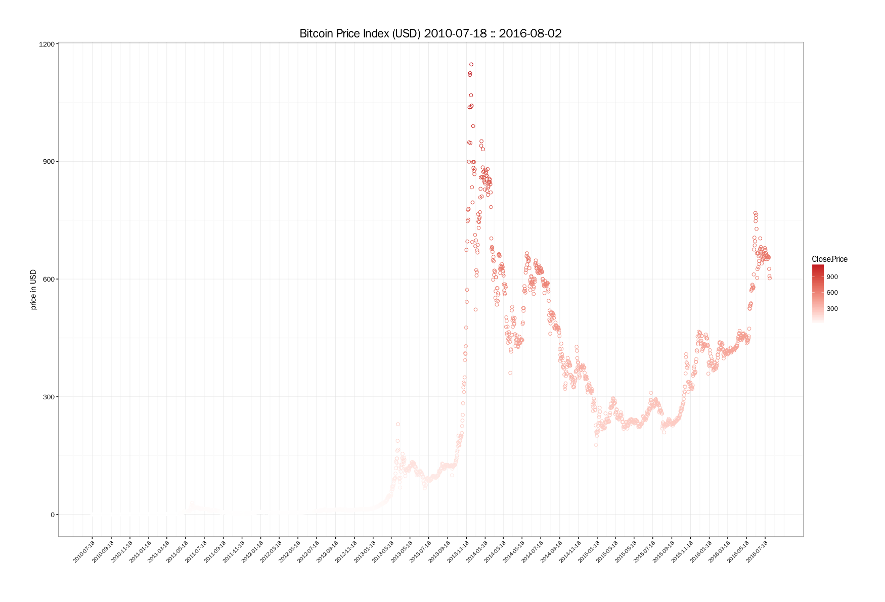
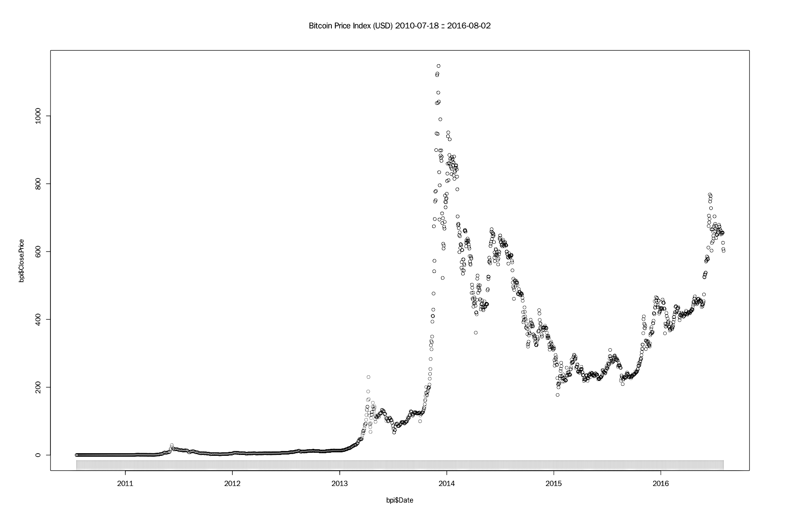
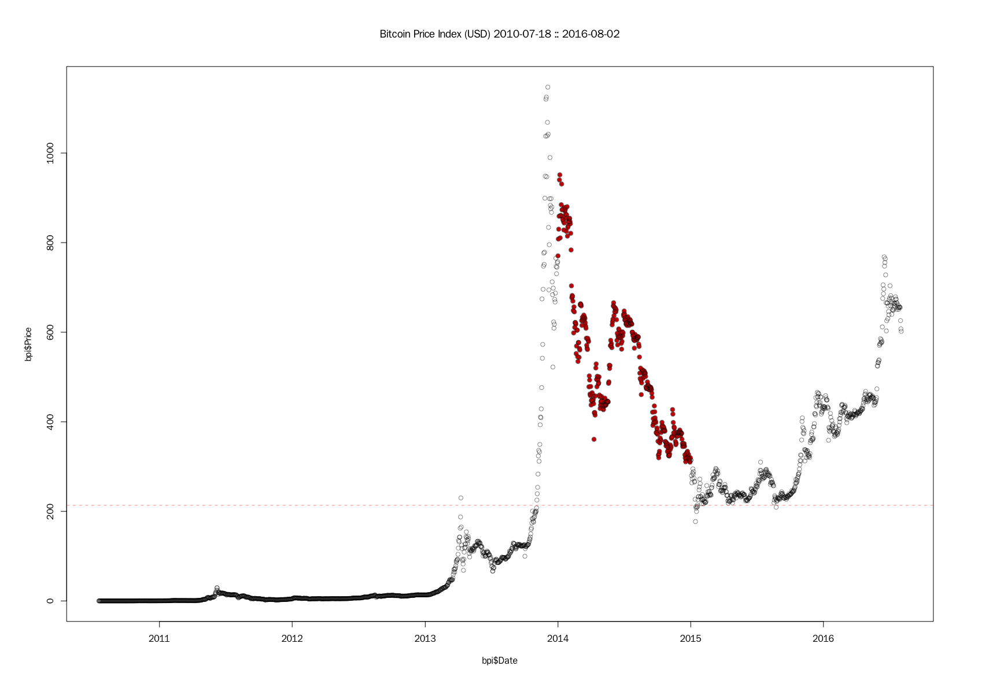
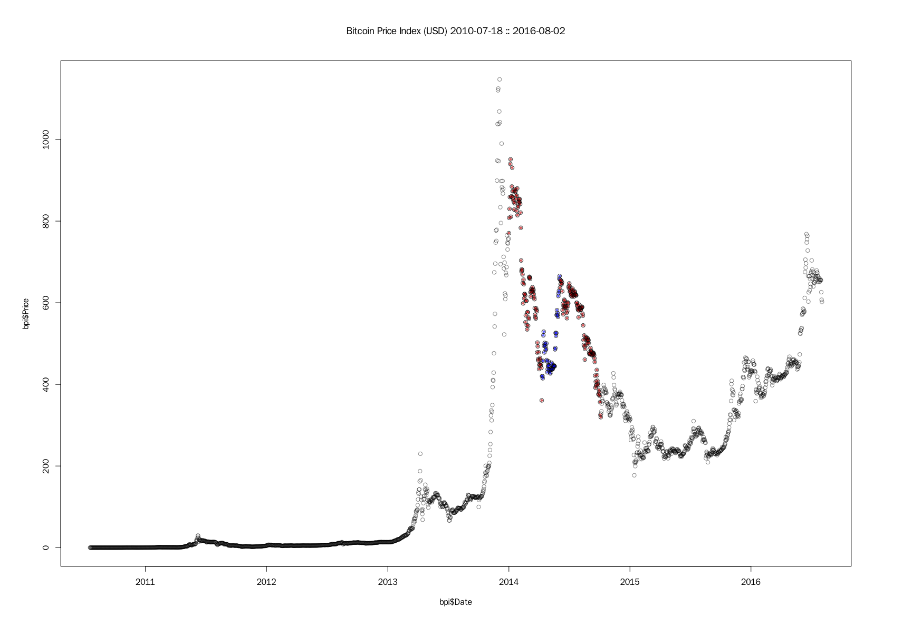
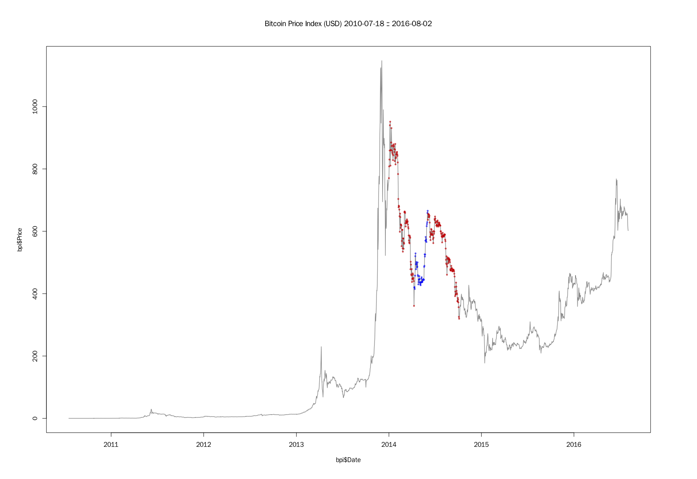
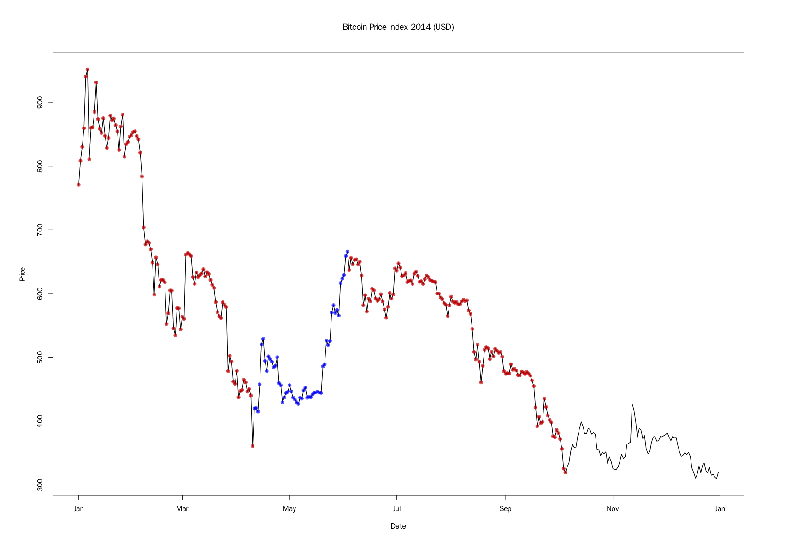
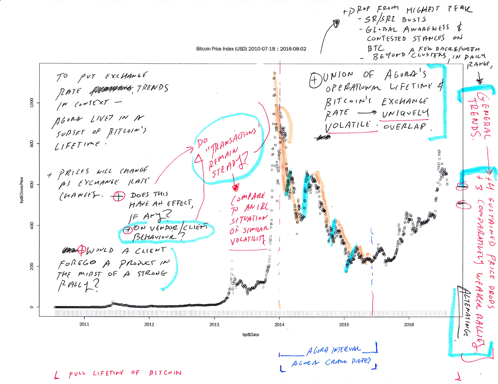
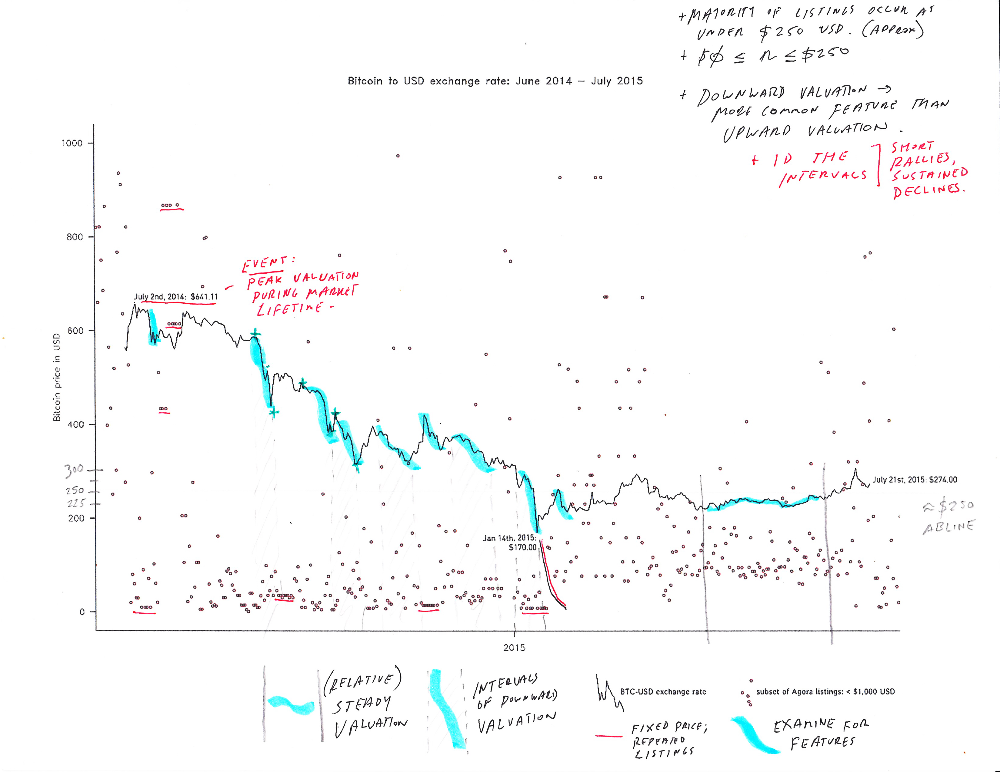

# Bitcoin Price History ∪ Agora's Lifetime

_(unedited observations on Agora's Operational Lifetime and Bitcoin Exchange History_


# _{Agora Operational Lifetime} ∈ {Bitcoin Price History}_

The union of Agora's operational span and Bitcoin's price history provides a uniquely volatile financial, political, and legal climate. While I am not an econmomist, nor politcally active, and likely not on the right side of the law from time to time - I can still see there's something interesting about this slice of time here.



To put exchange rate trends in context - Agora lives in a subset of Bitcoin's lifetime. Bitcoin list prices will change (fact-check) as the Bitcoin-USD exchange rate changes. Does this have an effect on vendor or client behaviour on anonymous marketplaces? Would a client forego their order in the midst of a strong rally? 


Bitcoin from birth, with Agora bracketed.


``` {r}
# Bitcoin Lifetime with trends ------------------------------------------------

# plot entire Bitcoin lifetime
par(mar = c(6, 6, 6, 6), family = "FranklinGothicSSK")
plot(bpi$Date, bpi$Price, col = "#00000075",
     main = "Bitcoin Price Index (USD) 2010-07-18 :: 2016-08-02")
abline(a = 526.9241, b = 0, lty = 2, col = "#FF000075")
rug(bpi$Date, ticksize = 0.025, lwd = 0.1, col = "#000000")
```


``` {r}
# Subset Agora data date range
bpiAg <- bpi[bpi$Date >= "2014-01-01" & bpi$Date <= "2014-12-31", ]
plot(bpiAg, main = "Bitcoin Price Index 2014 (USD)")
abline(a = 526.9241, b = 0, lty = 2, col = "#FF000075")
```

Finding dates corresponding to the min/max/mean price values.

``` {r}
summary(bpiAg)
bpiAg[bpiAg$Price == min(bpiAg$Price), ]
# 1627 2014-12-30 309.87

bpiAg[bpiAg$Price == max(bpiAg$Price), ]
# 1269 2014-01-06 951.39

bpiAg[bpiAg$Price == mean(bpiAg$Price), ]
mean(bpiAg$Price)
# [1] 526.9241
```

## 1st interval - Downward Trend

Identifying start and endpoints of upward and downpard price trends. The year starts as Bitcoin begins is descent from all time peak at $1147.00 on Dec 4th, 2013. Before the next upward rally there's a sustained drop in value that bottoms out at $360.80 on April 30th, 2014 - 100 day downturn.

- 1st event / 1st downturn interval: 2014-01-01 - 2014-04-10
- Price Range during interval: $770.44 - $360.80

``` {r}
# subset Agora up/down trend intervals
bpiAg04 <- bpiAg[bpiAg$Date >= "2014-04-01" & bpiAg$Date <= "2014-04-30", ]
summary(bpiAg04$Price)
#    Min. 1st Qu.  Median    Mean 3rd Qu.    Max. 
#   360.8   441.2   456.9   460.2   486.3   529.2
```

``` {r}
bpiAg04 <- bpiAg[bpiAg$Date >= "2014-04-01" & bpiAg$Date <= "2014-04-30", ]
summary(bpiAg04$Price)
#    Min. 1st Qu.  Median    Mean 3rd Qu.    Max. 
#   360.8   441.2   456.9   460.2   486.3   529.2

bpiAg04[bpiAg04$Price == 360.84, ]
#            Date  Price
# 1363 2014-04-10 360.84

dt01 <- bpiAg[bpiAg$Date >="2014-01-01" & bpiAg$Date <= "2014-04-10", ]
dim(dt01)
# 100   2
# 100 day downward trend in pricing.

# start date
dt01[1, ]
#            Date  Price
# 1264 2014-01-01 770.44

# end date
dt01[100, ]
#            Date  Price
# 1363 2014-04-10 360.84

summary(dt01)
#       Date                Price      
# Min.   :2014-01-01   Min.   :360.8  
# 1st Qu.:2014-01-25   1st Qu.:575.2  
# Median :2014-02-19   Median :635.9  
# Mean   :2014-02-19   Mean   :678.8  
# 3rd Qu.:2014-03-16   3rd Qu.:842.4  
# Max.   :2014-04-10   Max.   :951.4
```

## 2nd interval - upward rally

From the original plot we say a relatively short (41 days), but sustained rally in price. BTC price climbs from $360.84 to $665.73 in this interval.

- 2nd event/1st rally interval: 2014-04-11 through 2014-06-03
- Price rang: $420.0-6 - $665.73

Identifying the date range:

``` {r}
# identity peak value from range
rally01 <- bpiAg[bpiAg$Date >= "2014-04-11" & bpiAg$Price >= 600, ]
summary(rally01)
#          Date                Price      
# Min.   :2014-05-30   Min.   :600.0  
# 1st Qu.:2014-06-09   1st Qu.:618.8  
# Median :2014-07-04   Median :627.6  
# Mean   :2014-06-28   Mean   :629.2  
# 3rd Qu.:2014-07-14   3rd Qu.:639.4  
# Max.   :2014-07-24   Max.   :665.7

rally01[rally01$Price == 665.73, ]
#            Date  Price
# 1417 2014-06-03 665.73
```

For plotting, revising the dates for downturn interval:

``` {r}
# revise downturn interval dates
dt02.1 <- bpiAg[bpiAg$Date >="2014-06-04" & bpiAg$Date <= "2014-10-05", ] 
summary(dt02.1)
#       Date                Price      
# Min.   :2014-06-04   Min.   :319.6  
# 1st Qu.:2014-07-04   1st Qu.:477.4  
# Median :2014-08-04   Median :581.6  
# Mean   :2014-08-04   Mean   :541.4  
# 3rd Qu.:2014-09-04   3rd Qu.:615.1  
# Max.   :2014-10-05   Max.   :656.1
```

## 3rd interval - downturn

This sustained downturn first bottoms out on October 5th, 2014 - and then proceeds to fluctuate for the through the end of the year into the next rally in 2015. The year end close-price is actually only 6 cents higher than the price observed on October 5th. 

Regardless, for now we'll define this third interval as the dates from June 4th, 2014 through October 5th, 2014. 

``` {r}
dt02 <- bpiAg[bpiAg$Date >="2014-06-04" & bpiAg$Date <= "2014-12-01", ] 
summary(dt02)
# Date                Price      
# Min.   :2014-06-04   Min.   :319.6  
# 1st Qu.:2014-07-19   1st Qu.:377.1  
# Median :2014-09-02   Median :479.5  
# Mean   :2014-09-02   Mean   :485.7  
# 3rd Qu.:2014-10-17   3rd Qu.:591.0  
# Max.   :2014-12-01   Max.   :656.1 
```

Year end vs. October 5th:
``` {r}
bpi[bpi$Date == "2014-10-05", ]
# 2014-10-05 319.64
bpi[bpi$Date == "2014-12-31", ]
# 2014-12-31 319.7
```

## 4rd event - rally

There's two distinct valleys before the next sustained upward trend - more frequent price fluctuations over the the course of the month of October. Decicion to be made when the upward rally actually begins--

# Plots w/ Intervals

``` {r}
# plot entire Bitcoin lifetime with Agora -------------------------------------
summary(bpi$Price)
# Min. 1st Qu.  Median    Mean 3rd Qu.    Max. 
# 0.05    5.90  119.10  213.50  386.20 1147.00
quantile(bpi$Price)
# distribution of price values
# 0%      25%      50%      75%     100% 
# 0.050    5.900  119.125  386.210 1147.250

# colors:
# rally = #0000FF
# downturn =  #CD0000
# Agora = #CD0000

# intervals:
# dt01 = 2014-01-01 - 2014-04-10
# rally01 = 2014-04-11 - 2014-06-03
# dt02.1 = 2014-06-04 - 2014-10-5
```


``` {r}
# all dates in Agora data range -----------------------------------------------
plot(bpi$Date, bpi$Price, col = "#00000075",
     main = "Bitcoin Price Index (USD) 2010-07-18 :: 2016-08-02")
points(bpiAg$Date, bpiAg$Price, col = "#CD0000", pch = 19, cex = 0.8)
points(bpiAg$Date, bpiAg$Price, col = "#00000050", pch = 1, cex = 1.1)
```



``` {r}
# upward/downward price trends ------------------------------------------------
plot(bpi$Date, bpi$Price, col = "#00000075",
     main = "Bitcoin Price Index (USD) 2010-07-18 :: 2016-08-02")
# abline(a = 1147.00, b = 0, lty = 2, col = "#CD0000")
# abline(a = 360.84, b = 0, lty = 2, col = "#CD0000")
points(dt01$Date, dt01$Price, col = "#CD000090", pch = 19, cex = 0.5)
points(dt01$Date, dt01$Price, col = "#00000075", pch = 1, cex = 1)

# abline(a = 420.06, b = 0, lty = 3, col = "#0000FF")
# abline(a = 665.73, b = 0, lty = 3, col = "#0000FF")
points(rally01$Date, rally01$Price, col = "#0000FF85", pch = 19, cex = 0.5)
points(rally01$Date, rally01$Price, col = "#00000075", pch = 1, cex = 1)

points(dt02.1$Date, dt02.1$Price, col = "#CD000090", pch = 19, cex = 0.5)
points(dt02.1$Date, dt02.1$Price, col = "#00000075", pch = 1, cex = 1)
```




``` {r}
# line plot - btc lifetime with Agora +/- intervals ---------------------------
plot(bpi$Date, bpi$Price, col = "#00000075", type = "l", lwd = 1.4,
     main = "Bitcoin Price Index (USD) 2010-07-18 :: 2016-08-02")
points(dt01$Date, dt01$Price, col = "#CD000090", pch = 19, cex = 0.5)
points(rally01$Date, rally01$Price, col = "#0000FF85", pch = 19, cex = 0.5)
points(dt02.1$Date, dt02.1$Price, col = "#CD000090", pch = 19, cex = 0.5)
```



``` {r}
# line plot - agora lifetime with +/- intervals -------------------------------
plot(bpiAg, type = "l", lwd = 1.4, main = "Bitcoin Price Index 2014 (USD)")
points(dt01$Date, dt01$Price, col = "#CD000090", pch = 19, cex = 1)
points(rally01$Date, rally01$Price, col = "#0000FF85", pch = 19, cex = 1)
points(dt02.1$Date, dt02.1$Price, col = "#CD000090", pch = 19, cex = 1)
```



# Notes 

Why look at these intervals? What led to thinking so? Drawing on plots. 



