# Exploratory


## dj's questions:

**_What do you want me to take away?_** Anonymous marketplaces are places of business.

**_What do you want me to do?_** Be able to order from black markets with confidence.

**_How do you want me to feel?_** Safe, assured, maybe _relaxed_. 

## variables of interest

- **date**: date the page was created - as found in metadata.

- **vendor**: vendor's username - as pulled from html.

- **product**: product listing - usually a name (_Master Kush_, _Tramadol_, _Chanel Watch_), quantity (_100mg_, _1/4 oz_, and some 'selling points' e.g. _'REAGENT TESTED'_, _'MOST POTENT'_, '_free shipping_'

- **price**: price in Bitcoin

- **usd**: price in US dollars

- **rate**: exhange rate of BTC-USD, for that date

- **cat**: product category, as extracted from html

- **subcat**: product subcategory, as extracted from html

- **subsubcat**: product sub-subcategory, as extracted from html

- **feedback** client feedback left for vendor (e.g. "_5/5 5/5, A+++ Vendor 2 days ago anon_"); scale of 0-5 possible, as well as no feedback at all; as extracted from html

- **from**: location product ships from

- **to**: location product ships to

Taking a random sample of 100 listings to include here:

``` {r}
s <- sample(1:1018109, 100, replace = FALSE, prob = NULL)
sAg <- p14[s, ]

write.csv(sAg, file = "data/random-sample100.csv", row.names = F)
```

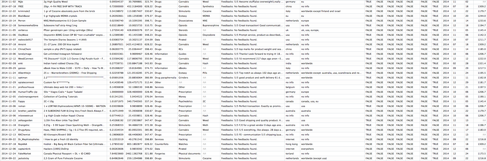


## what's in the data?

Exploratory Plots of Categories, going from high level to fine grain. As the list prices increase, there are less drugs on offer and less places they're coming from.

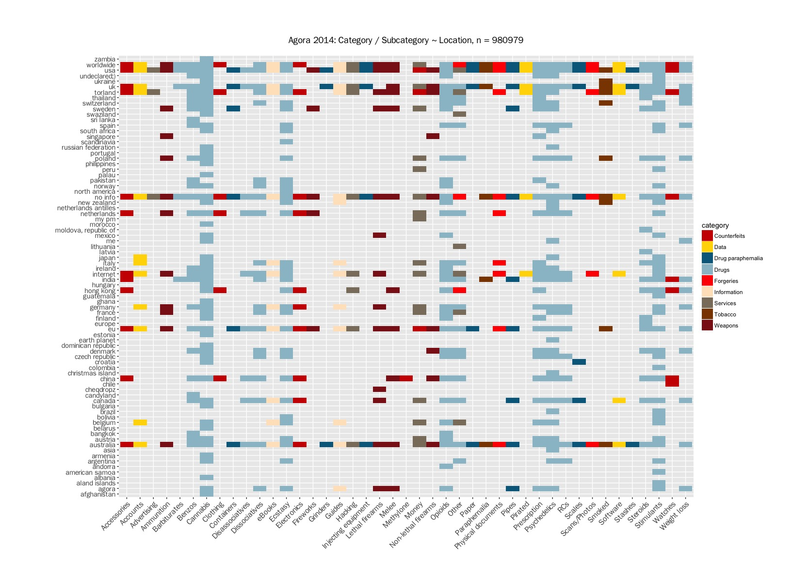

_Why set a price cutoff at $1000?_

$1000 can generally be thought of as an upper bound for the amount a person is willing to spend on drugs for personal and social use (cite: Demant, Muksgaard, and Houbourg 2016). Much of the price listings from the market data fall within this range.

``` {r}
p4 <- subset(p14, p14$usd <= 1000) # 905805

p4p <- ggplot(p4, aes(subsubcat, from, fill = usd)) + geom_tile() +
  labs(title = "Agora 2014: Drug ~ Location / Price (USD < 1,000), n = 905805", 
       y = "", x = "", fill = "Price (USD)") +
  theme(plot.title = element_text(family= "FranklinGothicSSK", face = "bold", size = 14,
                                  margin = margin(0, 0, 20, 0))) + 
  theme(axis.text.x = element_text(family = "FranklinGothicSSK", size = 12.5,
                                   angle = 45, hjust = 1)) +
  theme(axis.text.y = element_text(family = "FranklinGothicSSK", size = 11)) +
  theme(plot.margin = unit(c(2, 2, 1, 2.5), "cm"))

p4p + scale_fill_gradient2(low = "deepskyblue4", mid = "bisque1",
                           high = "firebrick3", midpoint = 500)
```                           

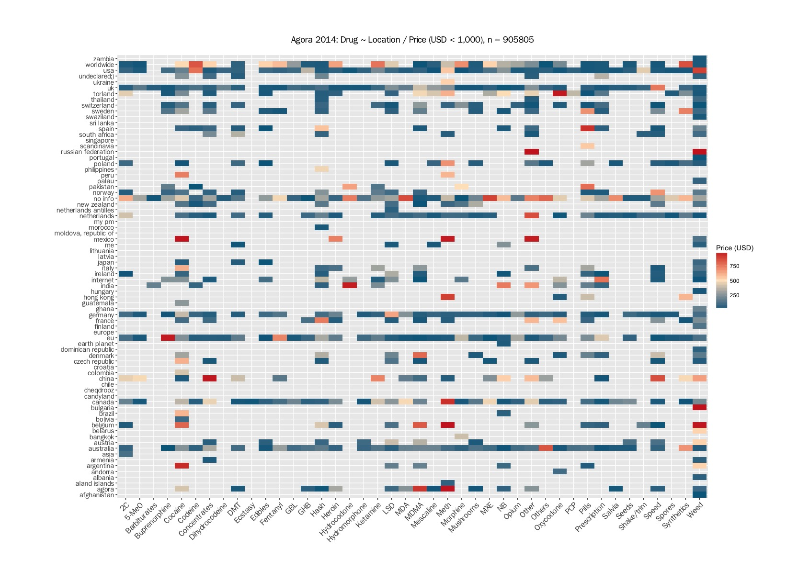

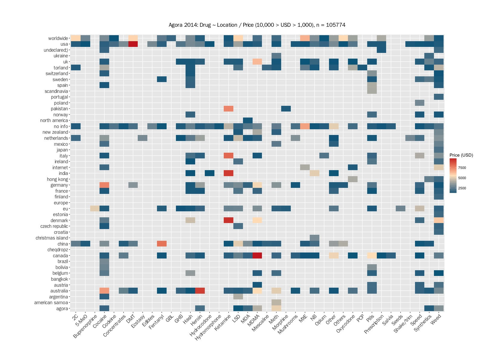

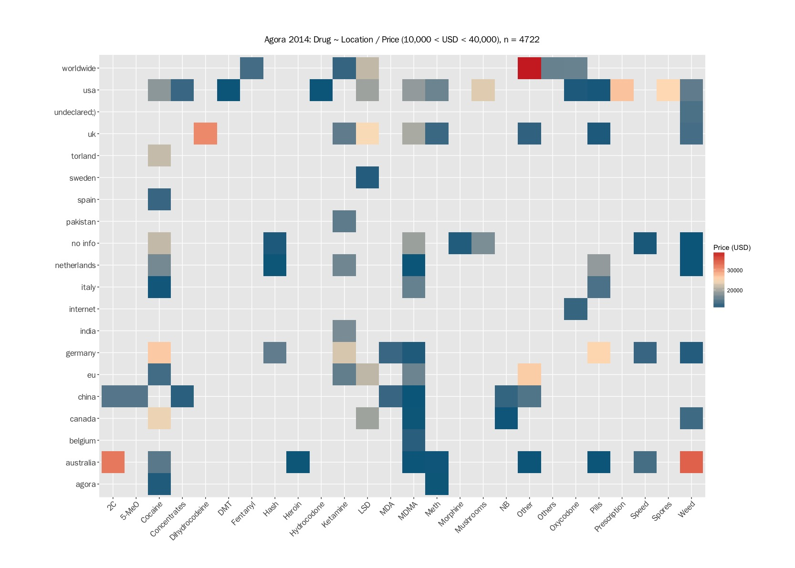

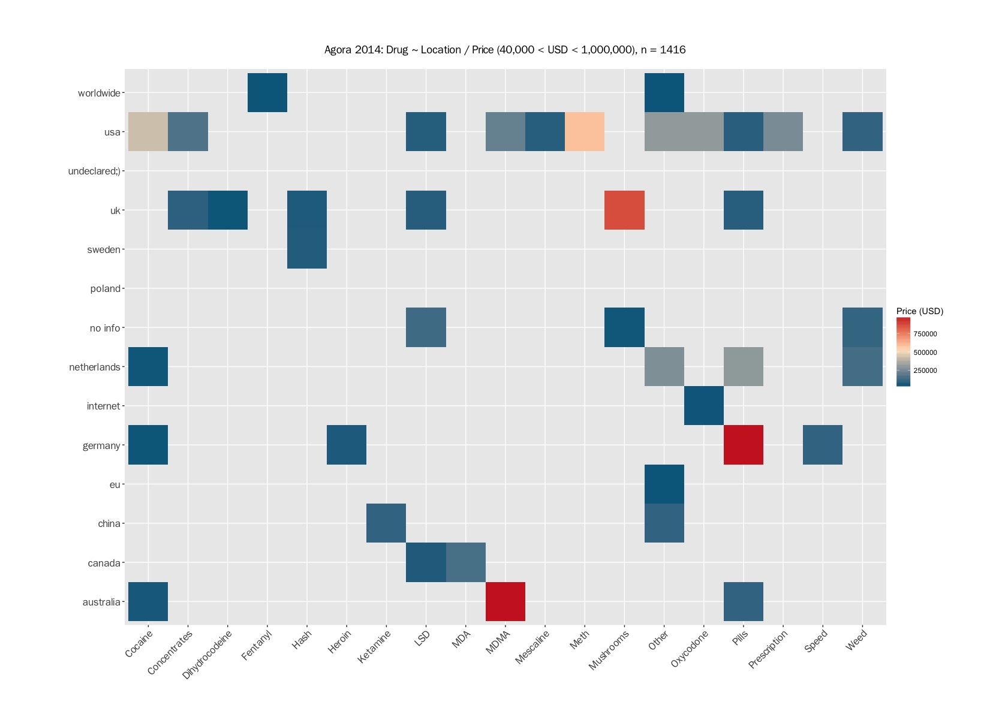

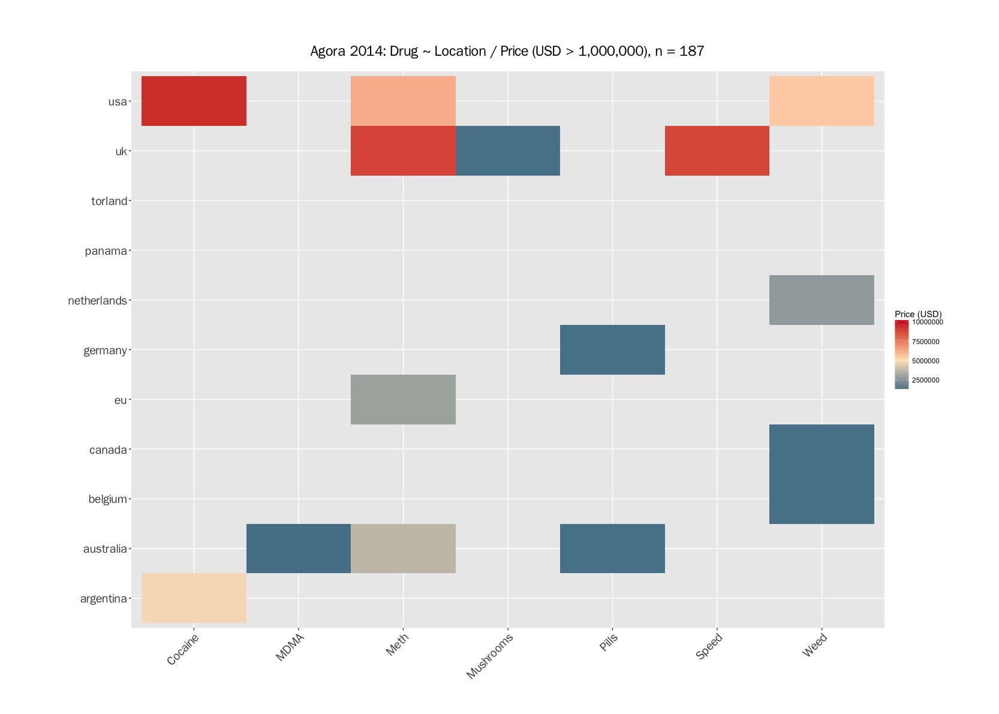

Densities of feedback values:

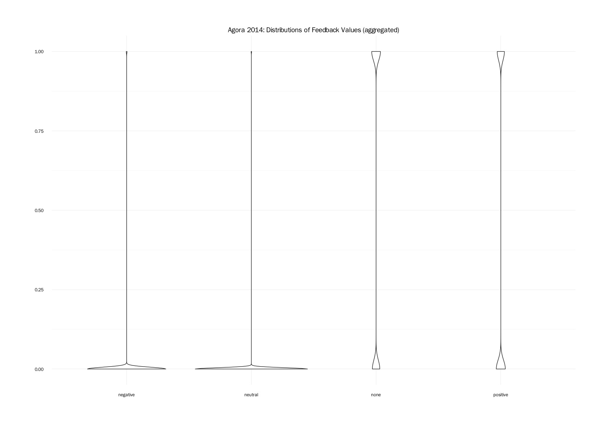

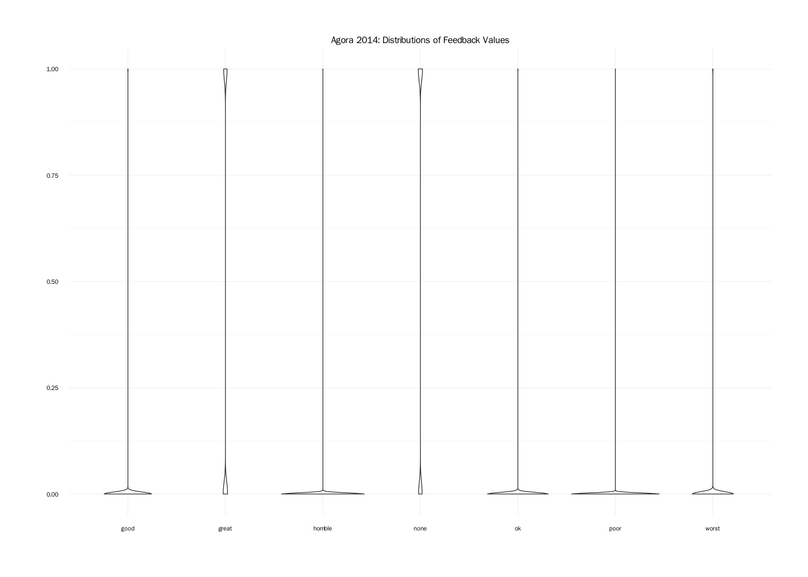

``` {r}
feedback$positive <- ifelse(feedback$great == T | feedback$good == T, 1, 0)
feedback$neutral <- ifelse(feedback$ok == T | feedback$poor == T, 1, 0)
feedback$negative <- ifelse(feedback$horrible == T | feedback$worst == T, 1, 0)

fb <- subset(feedback, select = c("positive", "neutral", "negative", "none"))
fb$none <- ifelse(fb$none == T, 1, 0)
```

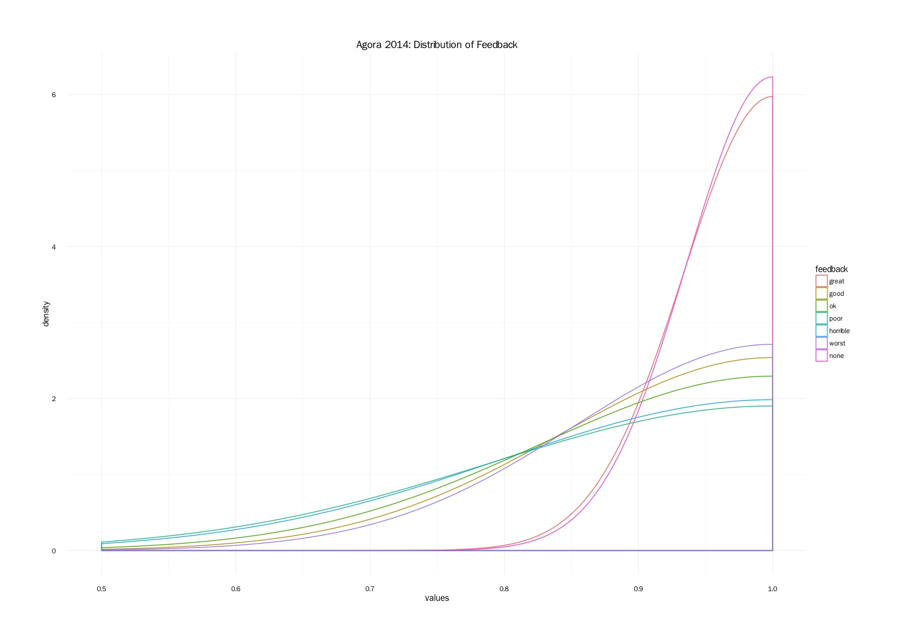

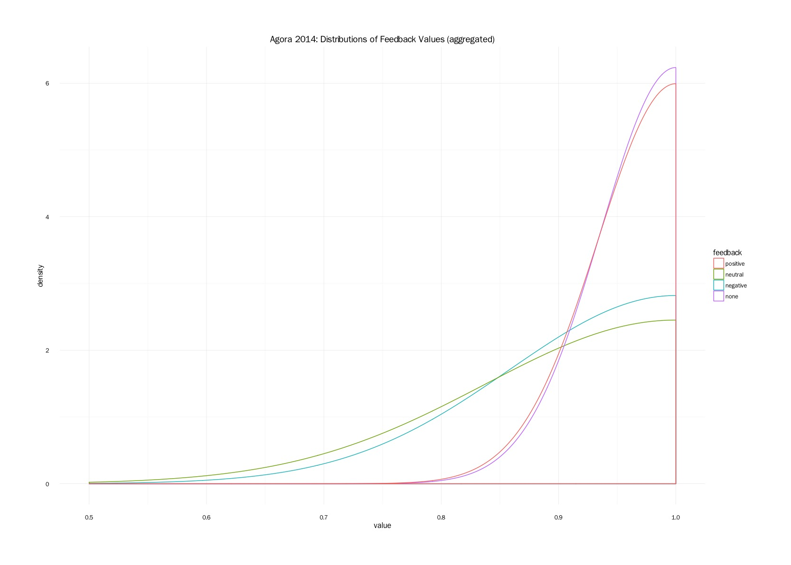