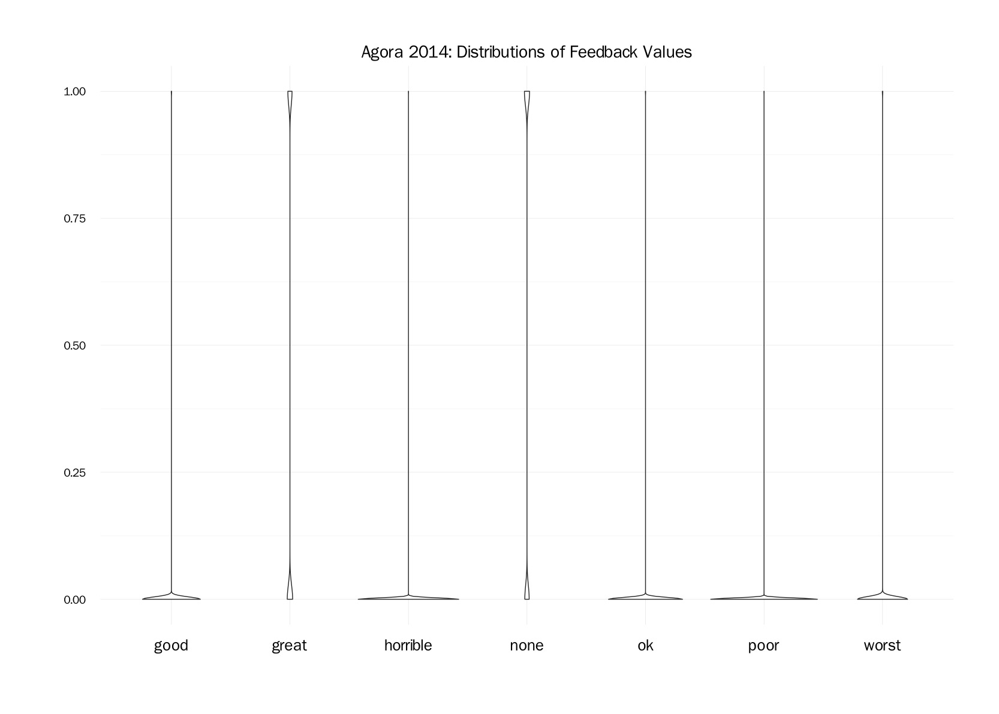
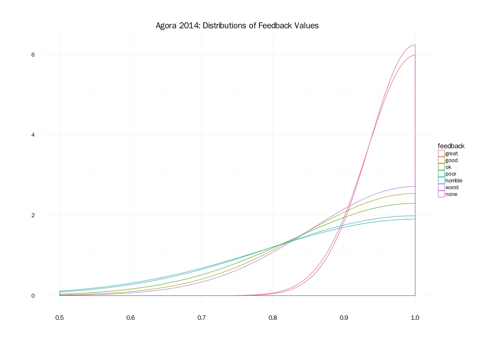
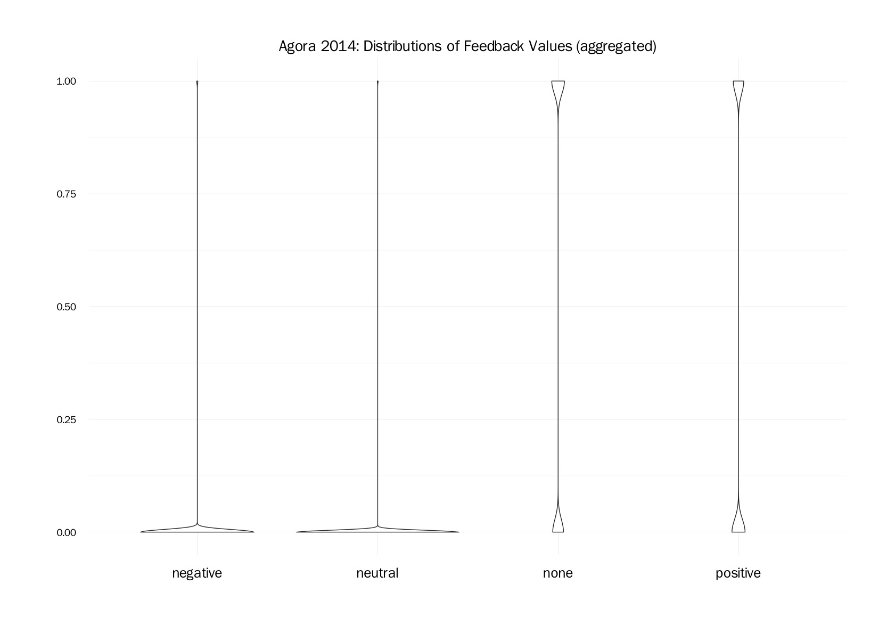
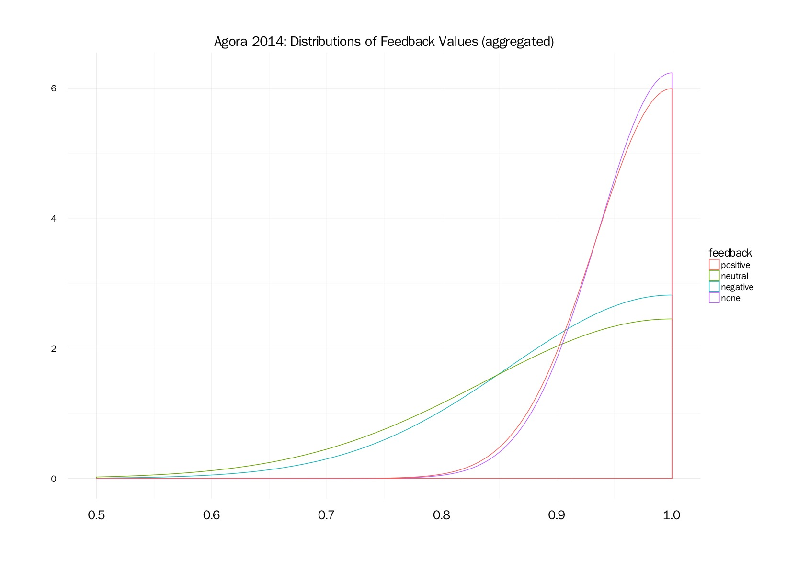
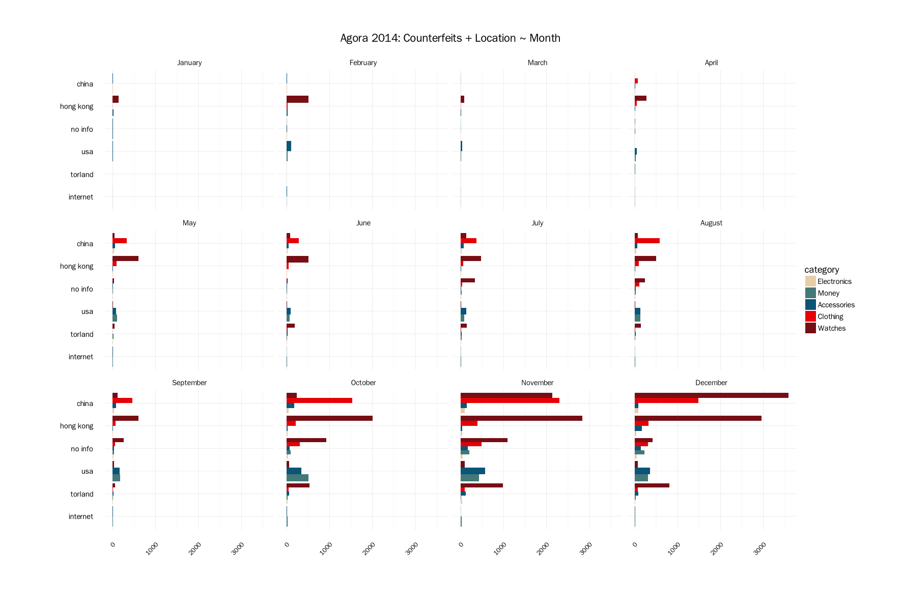
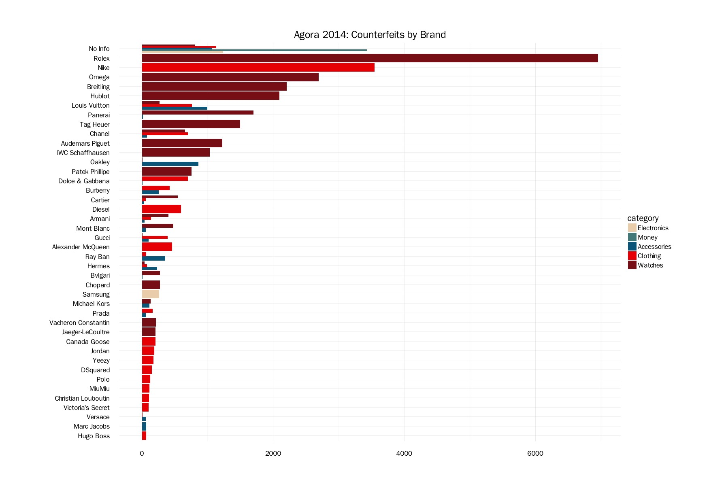

# Exploratory...

_...domain writing, question refinement, plots, & data analysis_

- [Agora and Anonymous Marketplaces](#agora-and-anonymous-marketplaces)
- [dj's questions](#djs-questions)
- [what's in the data?](#whats-in-the-data)

Categories and Variables:
- [variables of interest](#variables-of-interest)
- [Feedback](#feedback) - feedback field; convert to histograms(counts)
- [Counterfeits](#counterfeits) - high level category

## Agora and Anonymous Marketplaces

Agora was chosen as a market to analyze because of it's immense popularity and high usage. Additionally (and subjectively), the conditions of Agora's shutdown were unique to me in that the admins voluntarily shut it down after a [paper was published in August 2015](https://www.usenix.org/system/files/conference/usenixsecurity15/sec15-paper-kwon.pdf) that exposed vulnerabilities that could de-anonymize Tor users. 

This is in contrast to other markets of similar scale. The largest examples are Silk Road's demise at the hands of law enforcement; darknet markets [Evolution](https://www.deepdotweb.com/2015/03/18/evolution-marketplace-exit-scam-biggest-exist-scam-ever/) and [Sheep](https://www.deepdotweb.com/2013/11/30/sheep-marketplace-scammed-over-40000000-in-the-biggets-darknet-scam-ever/) turning out to be massive exit-scams.

It's a stretch to say (and impossible to prove) that Agora's administrators were completely altruisitic in their voluntary shutdown; but such protections of themselves and their clients might suggest that conducting business professionally was a priority above others. 

## dj's questions

**_What do you want me to take away?_** Anonymous marketplaces are places of business.

**_What do you want me to do?_** Be able to order from black markets with confidence.

**_How do you want me to feel?_** Safe, assured, maybe _relaxed_. 


## What's in the data?

Exploratory Plots of Categories, going from high level to fine grain. As the list prices increase, there are less drugs on offer and less places they're coming from.


_Why set a price cutoff at $1000?_

$1000 can generally be thought of as an upper bound for the amount a person is willing to spend on drugs for personal and social use (Demant, Muksgaard, and Houbourg 2016). Much of the price listings from the market data fall within this range.

``` {r}
p4 <- subset(p14, p14$usd <= 1000) # 905805

p4p <- ggplot(p4, aes(subsubcat, from, fill = usd)) + geom_tile() +
  labs(title = "Agora 2014: Drug ~ Location / Price (USD < 1,000), n = 905805", 
       y = "", x = "", fill = "Price (USD)") +
  theme(plot.title = element_text(family= "FranklinGothicSSK", face = "bold", size = 14,
                                  margin = margin(0, 0, 20, 0))) + 
  theme(axis.text.x = element_text(family = "FranklinGothicSSK", size = 12.5,
                                   angle = 45, hjust = 1)) +
  theme(axis.text.y = element_text(family = "FranklinGothicSSK", size = 11)) +
  theme(plot.margin = unit(c(2, 2, 1, 2.5), "cm"))

p4p + scale_fill_gradient2(low = "deepskyblue4", mid = "bisque1",
                           high = "firebrick3", midpoint = 500)
```                           


_If that's the case, then why set a price cutoff above $1000?_

Above $1000, there's a mix of 'placeholder' listings vendors will put up while they are out of stock - to maintain a presence on the market. The prices are deliberately set higher than is reasonable to discourage someone actually buying. But in addition, above $1000 there are 'legitimate' listings for products in higher ('intent-to-distribute') quantities.


## Variables of Interest

1. **date**: date the page was created - as found in metadata.

2. **vendor**: vendor's username - as pulled from html.

3. **product**: product listing - usually containing:
  * name (_Master Kush_, _Tramadol_, _Chanel Watch_)
  * quantity (_100mg_, _1/4 oz_)
  * 'selling points' e.g. _'Reagent tested'_, _'MOST POTENT'_, '_free shipping_'

4. **price**: price in Bitcoin

5. **usd**: price in US dollars

6. **rate**: exhange rate of BTC-USD, for that date

7. **cat**: product category, as extracted from html

8. **subcat**: product subcategory, as extracted from html

9. **subsubcat**: product sub-subcategory, as extracted from html

10. **feedback** client feedback left for vendor 
  * e.g. "_5/5, A+++ Vendor 2 days ago anon_"
  * scale of 0-5 possible, as well as no feedback at all
  * as extracted from html

11. **from**: location product ships from

12. **to**: location product ships to

## Feedback





aggregate some of these responses to see:

``` {r}
feedback$positive <- ifelse(feedback$great == T | feedback$good == T, 1, 0)
feedback$neutral <- ifelse(feedback$ok == T | feedback$poor == T, 1, 0)
feedback$negative <- ifelse(feedback$horrible == T | feedback$worst == T, 1, 0)

fb <- subset(feedback, select = c("positive", "neutral", "negative", "none"))
fb$none <- ifelse(fb$none == T, 1, 0)
```





## Counterfeits

Counterfeits on offer, by location by month for 2014. Subset of the top 6 most active locations.



Counterfeits by brand:



