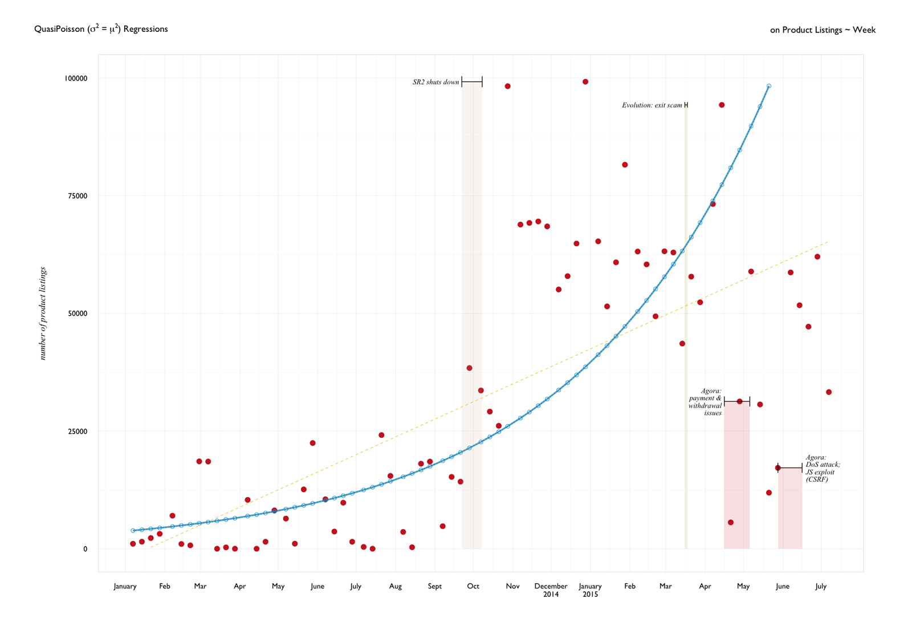
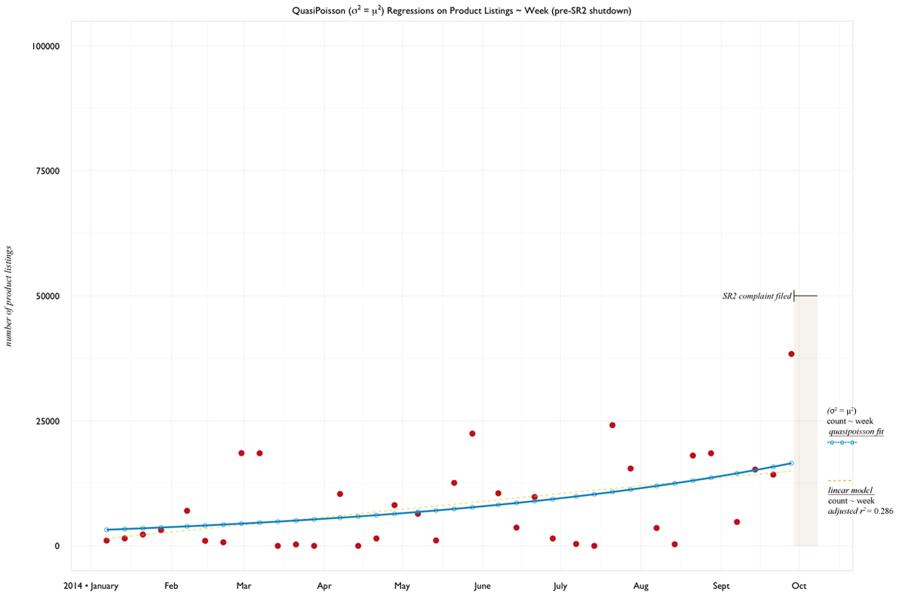
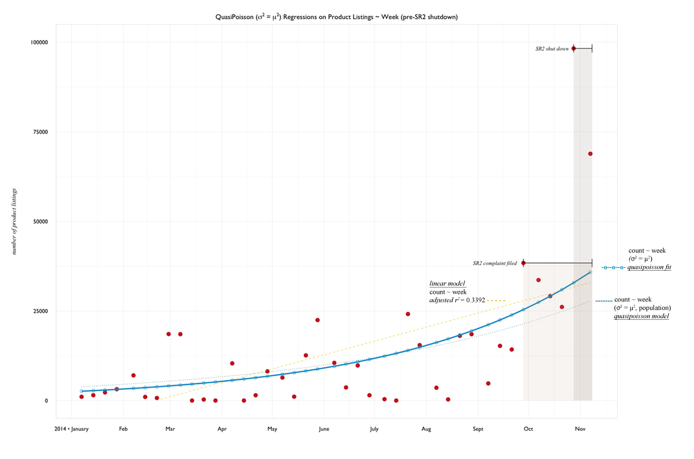
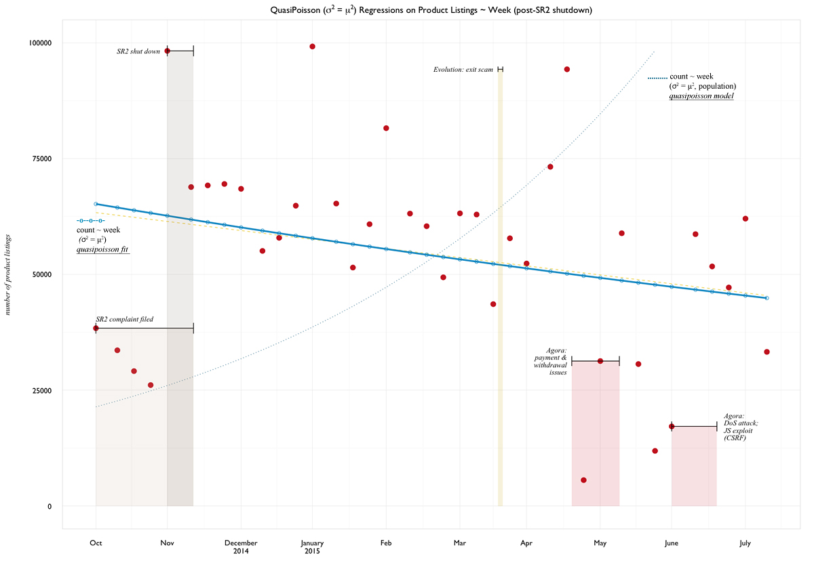

# Reliably Unstable: Agora Market Growth

The initial questions had been asked: 

- **How large is this market?** and if left unchecked, 
- **How large could it be?** 

Monthly counts of product listings were taken as a measure of market size, and using Poisson Regression a simple answer was obtained. 

In working to validate the model, it was observed that listing counts clustered into "tiers" over time. Was this the result of Agora Market developing a growing user base, as a startup might in it's early years?  

Given domain information, it could be hypothesized that count data were affected by activity in other markets of similar scale - namely, other markets shutting down. 

At the start of 2014, Agora was one of 3 major darknet markets for vendors to choose from<sup>[1](#references)</sup>. The other markets were Silk Road 2 and Evolution. Within the timeframe the data covers, both SR2 and Evolution shut down. 

- [QuasiPoisson Regression](#quasipoisson-regression)
- [External Market Influences](#external-market-influences)
- [References](#references)

# QuasiPoisson Regression

Facing under- and over-dispersion issues in my initial Poisson model on the population of counts, I received a few suggestions from my mentor. Between the suggestions of Generalized Boosted Modeling and Piecewise Regression - Piecewise regression felt the most suited. 

Additionally, I recalled that competing darknet market Silk Road 2 shut down in early October 2014. This domain information could correlate to the overdispersion, and observed clustering of count data.

The original quasipoisson regression on the population of weekly count data, a touch underdispersed but later causing problems when additional independent variables were added or used to predict:

```{r}
qmw02 <- glm(count ~ week, data = wk, 
             family = quasi(link = "log", variance = "mu^2"))

summary(qmw02)
#                 Estimate  Std. Error  t value           Pr(>|t|)
#  (Intercept) -96.0231972  10.3609211  -9.268 0.00000000000007527 ***
#  week          0.0064864   0.0006337  10.236 0.00000000000000128 ***
#
# (Dispersion parameter for quasi family taken to be 0.8623852)
#
#     Null deviance: 175.35  on 72  degrees of freedom
# Residual deviance: 125.06  on 71  degrees of freedom
# AIC: NA
# Number of Fisher Scoring iterations: 13
```

When a poisson regression was fit to monthly counts, the observed and fitted points appeared much smoother - likely a result of the wider time interval and aggregation of counts. 

Below in red are the observed weekly counts; the blue points and line represent the quasipoisson fit from the code above. The yellow dash is a linear regression fit with the same variables for comparison. 

Annotations were made to the time intervals based on domain research. The main events of interest are the shutdown of Silk Road 2 in October 2014 and the disappearance of Evolution, mid-March 2015.




# Piecewise Poisson

With a piecewise regression, the goal will be to examine how shutdowns of other markets affects listing counts on Agora Market.

Looking at the counts with domain information, 3 "tiers" were observed:

- T1: 0-25,000
- T2: 40,000-75,000
- T3: 75,000 and above

In T1 we have 3 major markets in effect: Agora, Evolution, and Silk Road 2. T2 arises after SR2's shutdown, leaving just Agora and Evolution. T3 is a tier only observed recently after the shutdowns of SR2 and Evolution. It could be inferred that these spikes in listing counts were the result of vendors coming to Agora in the iterim of a shutdown. 

A look at the interval before Silk Road 2 was seized:




Now including the time frame within which a formal complaint was lodged against SR2, and ultimately seized:



A slight upturn in the predictive curve of the Poisson fit; the linear model even seems slightly happier with an improved _adjusted r<sup>2</sup>_ going up to 0.34 from 0.29. 

Of course, this is almost certainly the result of furthest two points on the right - which also happen to the furthest north in the plot too. [_to do_: test outlier significance in this interval]. 

Why segment an interval to include these outlier points?

- external factors of significance were at play and could not be ignored
- it's another step in the piecewise regression; effects are meant to be observed

What happens on the other side of November 2014?



Starting an interval that _directly_ follows the previous - we now have a Poisson fit that nearly completely covers the corresponding linear model. Gently sloping downward, it's a contrast to the initial quasipoisson fit on the population. 

Perhaps it was too extreme an interval to look at immediately following the pre-SR2 shutdown periods? Extending the interval backwards to accomodate listing counts before the SR2 seizure:


Again the Poisson fit lies nearly directly atop the linear; and now with a slope near zero. Stability? Null effects? A look at the function call also has my initial reactions within comments:

```{R}
# poisson model 
pSR.q01 <- glm(count ~ week, data = weekly03,
               family = quasi(link = "log", variance = "mu^2"))

summary(pSR.q01)
#                Estimate  Std. Error t value Pr(>|t|)
#   (Intercept)  8.3587833 13.5919852   0.615    0.542
#   week         0.0001509  0.0008252   0.183    0.856

# (Dispersion parameter for quasi family taken to be 0.2239512)

#     Null deviance: 14.214  on 40  degrees of freedom
# Residual deviance: 14.209  on 39  degrees of freedom
# AIC: NA

# quite underdispersed (0.23) and null and model deviance are essentially equal.
# Could this be the NULL model??

# linear model comparison
pSR.lm01 <- lm(count ~ week, data = weekly03)
summary(pSR.lm01)
# Multiple R-squared:  0.0005229,	Adjusted R-squared:  -0.0251

# wow, that's the worst fit i've ever done.
```
Beyond being a model that might have zero predictive power or use...it's a fit found within that data.


And finally looking at the interval that is completely past the Silk Road 2 seizure:


A similar downward trend, and little to no explanatory power.

```{r}
pSR.q02 <- glm(count ~ week, data = weekly04,
               family = quasi(link = "log", variance = "mu^2"))

summary(pSR.q02)
#                Estimate  Std. Error t value Pr(>|t|)
#   (Intercept) 53.7923855 14.5202643   3.705 0.000824 ***
#   week        -0.0025986  0.0008799  -2.953 0.005953 ** 

# (Dispersion parameter for quasi family taken to be 0.1320363)

#     Null deviance: 7.5085  on 32  degrees of freedom
# Residual deviance: 6.3789  on 31  degrees of freedom
# AIC: NA
```


# External Market Influences

Looking at Silk Road 2 and Evolution, and how their shutdowns affected the number of listings on Agora. 

Imagine a global market or network suddenly shutting down. For example, what if Amazon.com suddenly ceased operations over the course of a week? What would traffic on Alibaba/Taobao, eBay, or Rakuten look like? Or, what would Twitter or Instagram traffic look like if Facebook suddenly shut down?<sup>2</sup>

As an abstraction, this is essentially the sort of condition that darknet market Agora faced when rival markets Silk Road 2 and Evolution shut down. How did this affect the size of the market?


## before the Silk Road 2 shutdown

Given the overdispersion issues in the quasi/poisson regression models on weekly count population, I decided to investigate what appeared to be a divide in values from 2014 to 2015. Recalling that Silk Road 2 shut down in early October 2014, I started here.

Why should this be significant? At any given time, several darknet markets may exist. But in practical terms, there generally have been only 2-4 major markets (high usage rate) at play simultaneously. Markets have a tendency to gain traction as usage goes up - trust is established, word of mouth and reliable feedback spread.

It can be seen during the interval of SR2's shutdown (~2014-09-29 through 2014-11-10) that the number of product listings on Agora more than doubles, when it previously never had. The interval of the SR2 shutdown is set wide to account for spread of this knowledge - from the filing of a formal complaint on Septembner 29th, 2014<sup>3</sup>, to circulation of the news of the actual seizures that took place November 5-6th, 2014<sup>4</sup><sup>,</sup><sup>5</sup>. The November dates are reported to be the culmination of Operation Onymous. 


## after SR2


# References

<sup>1</sup> The case is actually that there were _many_ more than 3 darknet markets at any given time. But most were not large enough to warrant attention. For this analysis, consideration of 3 markets defined as major would suffice. Support for this can be found by searching [deepdotweb](http://deepdotweb.com) or consulting the appropriate [reddit](http://reddit.com/r/darknetmarkets) forums.

<sup>2</sup>_While not a perfect comparison with the situation faced by Agora, the point I'm trying to make is that if a major resource suddenly disappeared, what effect would that have?_

<sup>3</sup>United States of America vs. Blake Benthall a/k/a "Defcon", [justice.gov](https://www.justice.gov/sites/default/files/usao-sdny/legacy/2015/03/25/Benthall,%20Blake%20Complaint.pdf)

<sup>4</sup>DeepDotWeb. "Silk Road 2 Seized! (Multiple Markets Seized)." Deep Dot Web. N.p., 2014. Web. [25 Sept. 2016](https://www.deepdotweb.com/2014/11/06/silk-road-2-seized/).

<sup>5</sup> Mattise, Nathan. "FBI Arrests Blake “Defcon” Benthall, Alleged Operator of Silk Road 2.0 [Updated]." Ars Technica. N.p., 2014. Web. [25 Sept. 2016](http://arstechnica.com/tech-policy/2014/11/fbi-arrests-blake-defcon-benthall-alleged-operator-of-silk-road-2-0/).


