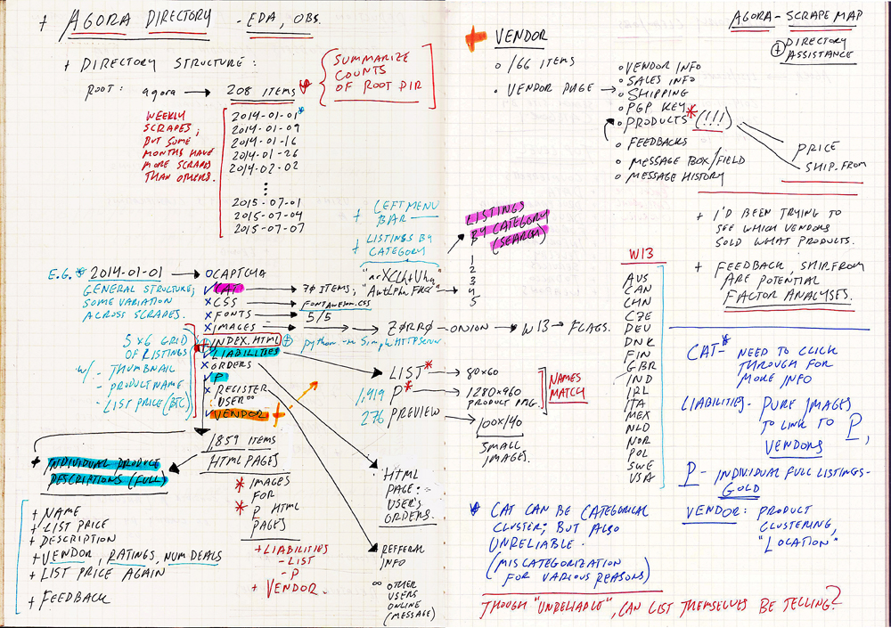
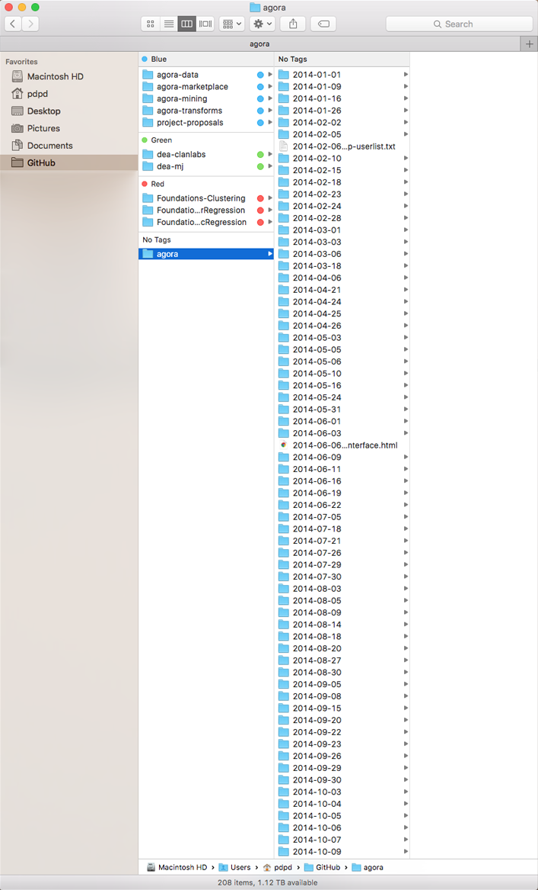
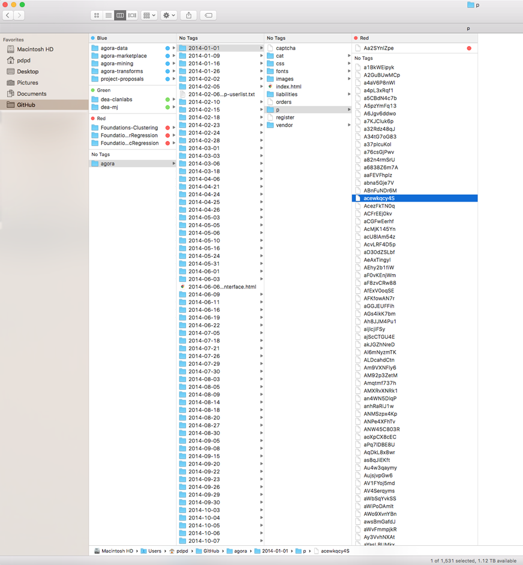
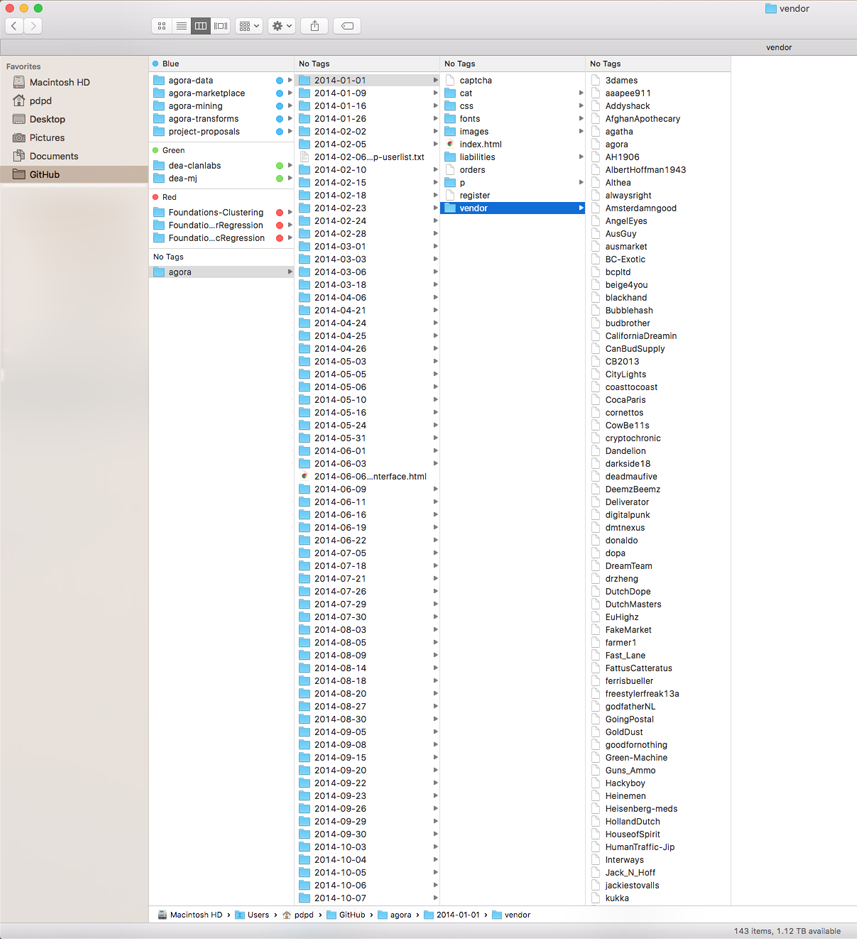
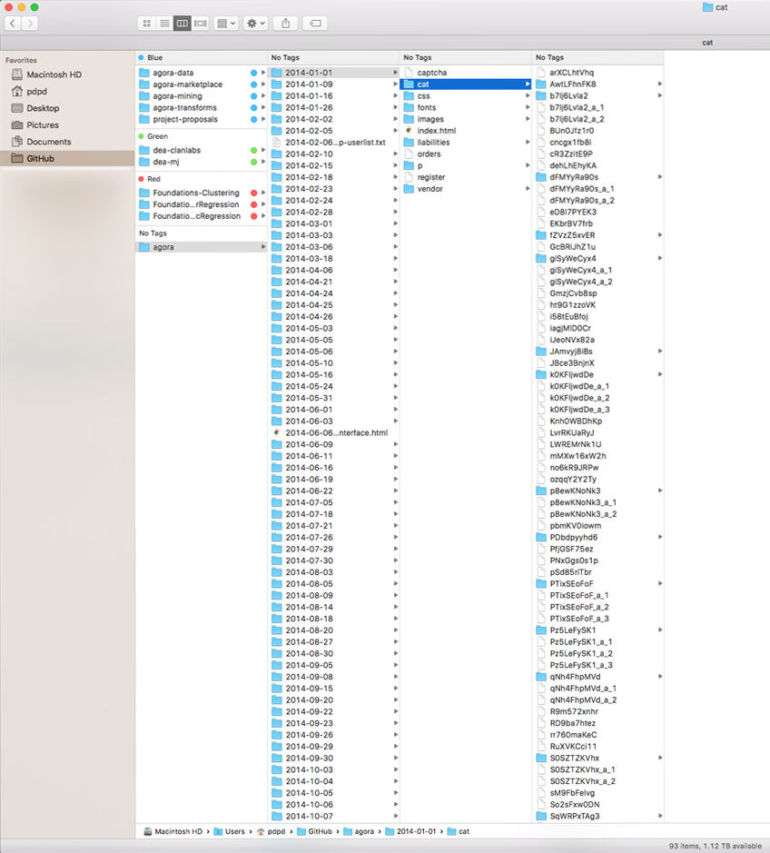

# Agora - Directory/HTML structure

What follows below are notes on the structure of the harvest. For each day the market was crawled, there were all the elements of the webpage within that directory (e.g. `index.html`, `css` directory, `fonts` directory, and such).

To view the pages locally, I used `simpleHTTPServer` in Python. 

Handwritten notes and images were a way to deal with the unstructured nature and scale of the data, and below are the directories from each day's harvest that would be relevant for analysis. 

- [relevant tags](#relevant-tags)
- [directory structure](#directory-structure)
- [crawl counts](#crawl-counts) - tables of page counts by crawl date.

# Relevant Tags

For extraction using `rvest`: 

### **'p' directory:**

- product title via page title: **"title"**
- product title via header: **"#single-product h1"**
- product description: **"#single-product"**
- vendor name: **"a.gen-user-link"**
- vendor rating: **".gen-user-ratings"**
- ship_from: **".product-page-ships"**
- ship_to: div class= **".product-page-ships"**
- list price: **".product-page-price"**
- vendor feedback: **".embedded-feedback-list"**

### **'vendor' directory:**

- vendor bio: **".vendorbio-description"**
- vendor pgp public key: **".pgptoken"**
- feedback: **".embedded-feedback-list"**
- product list (as a table): **"table.products-list"**
- product list : **"#product-list"**

_children of div id Product List:_

- Product Name: **"#product-list a"**
- Product Description preview: **".description-preview"**
- Price in BTC: **"#product-list td"**
- Ship_From location: **".column-name~ td+ td"**
- Ship\_To location: **"td"** or **".column-name~ td+ td"**

### **'cat' directory:**

- Category on Page- **".topnav-element"**
- Subcategory List - **".leftmenu-subelements a"**
- Main Categories - **".leftmenu-element a"**
- Category Product List Table - **"table.products-list"**
- Listing Headers - **".products-list-header"**
- Product Name - **".column-name a"**
- Product Description (preview) - **".description-preview"**
- Price - **".products-list td"**
- Shipping info - **".column-name~ td+ td"** **"//td[((count(preceding-sibling::*) + 1) = 4)]"** (xpath)
- Vendor - **"a.gen-user-link"**
- Vendor Rating - **".gen-user-ratings"**

## Directory Structure

Data was originally compiled by indpendent researcher Gwern and is [available here](gwern.net/Black-market archives).

The main directory, with weekly and sometimes more frequent crawls. 208 total.

The `p` directory, which contains individual product listings. The number of pages in directory varies by day, as it corresponds to the listings that were made available for that day. This will likely be the main directory working data will be extracted from. From the pages in `p`, we have information on:

	- name of product
	- description of product
	- list price
	- vendor name
	- ship from
	- ship to
	- vendor feedback

The `vendor` directory, which acts as a vendor's 'storefront' with a description of their wares and process - and also a table of all their listings for that particular day. This directory might be useful, if not exhaustive, for aggregating vendors by product.

The `cat` directory, which contains pages grouped by category. These categories are found on the left sidebar of the webpages. Examples of categories include `Chemicals`, `Counterfeits`, `Data`, and `Drugs`. These categories drill down into more specific categories such as `Weed`, `MDMA`, `Books`, and such. Other research has suggested that these categories might not be the most reliable for classification due to vendors cross-posting specific products. 

This directory would also vary in number of listings on a day to day basis, and there are also subfolders for categories that had many listings and thus many pages.

# Crawl Counts

Counts of pages per relevant directory: product & vendor pages by date. The **'p directory'** column sometimes contains 2 values - the first is number of pages directly from the harvest, and the second being number of pages after removing files with no information (e.g. login-credential pages vs. listing pages).

- date: date of crawl
- p directory: number of product listing pages
- vendor directory: number of vendor pages

date | p directory | vendor directory
---- | :---------: | ---------------:
2014-01-01 | 1539 1082 | 119
2014-01-09 | 1859 | 166
2014-01-16 | 2533 | 195
2014-01-26 | 3051 | 235
2014-02-02 | 3526 | 273
2014-02-05 | 3618 | 285
2014-02-10 | 3035 | 258
2014-02-15 | 1251 | 139
2014-02-18 | 2935 | 335
2014-02-23 | 7287 | 585
2014-02-24 | 3793 | 408
2014-02-28 | 7899 | 671
2014-03-01 | 5088 | 507
2014-03-03 | 7251 | 637
2014-03-06 | 5466 | 527
2014-03-18 | 289 | 74
2014-04-06 | 10729 | 797
2014-04-21 | 1495 | 444
2014-04-24 | 3847 | 444
2014-04-25 | 379 | 46
2014-04-26 | 4252 | 357
2014-05-03 | 2360 | 266
2014-05-05 | 1357 | 148
2014-05-06 | 2738 | 289
2014-05-10 | 1088 | 124
2014-05-16 | 12771 | 861
2014-05-24 | 12570 | 848
2014-05-31 | 10157 | 594
2014-06-01 | 9811 | 678
2014-06-03 | 719 | 129
2014-06-09 | 85 | 1
2014-06-11 | 3987 | 375
2014-06-16 | 1979 | 182
2014-06-19 | 8029 | 575
2014-06-22 | 1476| 58
2014-07-05 | 381 | 51
2014-07-18 | 9835 | 672
2014-07-21 | 14389 | 841
2014-07-26 | 9674 | 705
2014-07-29 | 5786 | 325
2014-07-30 | 154 | 31
2014-08-03 | 3831 | 387
2014-08-05 | 8 | NA
2014-08-09 | 317 | 21
2014-08-14 | 15516 | 951
2014-08-18 | 380 | 60
2014-08-20 | 2262 | 167
2014-08-27 | 13437 | 825
2014-08-30 | 5305 | 323
2014-09-05 | 4817 | 407
2014-09-08 | 405 | 41
2014-09-15 | 14545 | 822
2014-09-20 | 14862 | 695
2014-09-22 | 19757 | 1035
2014-09-23 | 1480 | NA
2014-09-26 | 4432 | 374
2014-09-29 | 13513 | 797
2014-09-30 | 4358 | 128
2014-10-03 | 350 | 47
2014-10-04 | 12994 | 621
2014-10-05 | 774 | 95
2014-10-06 | 17644 | 960
2014-10-07 | 4276 | 61
2014-10-09 | 17746 | 928
2014-10-10 | 2194 | NA
2014-10-12 | 6022 | 365
2014-10-14 | 9897 | 409
2014-10-16 | 1 | NA
2014-10-17 | 7260 | 571
2014-10-19 | 13312 | 688
2014-10-20 | 9323 | 409
2014-10-22 | 17588 | 1073
2014-10-23 | 6301 | 295
2014-10-25 | 21471 | 1088
2014-10-27 | 15161 | 880
2014-10-29 | 19097 | 1077
2014-10-31 | 21019 | 1087
2014-11-01 | 16643 | 977
2014-11-03 | 21339 | 1055
2014-11-06 | 18030 | 900
2014-11-07 | 17020 | 866
2014-11-08 | 15567 | 806
2014-11-10 | 18262 | 905
2014-11-11 | 6503 | 485
2014-11-13 | 19277 | 938
2014-11-14 | 8869 | 529
2014-11-15 | 14184 | 720
2014-11-16 | 19661 | 933
2014-11-18 | 20227 | 954
2014-11-19 | 7250 | 461
2014-11-21 | 7762 | 437
2014-11-22 | 19469 | 947
2014-11-23 | 11021 | 594
2014-11-24 | 15806 | 807
2014-11-25 | 7890 | 474
2014-11-27 | 2459 | 63
2014-11-28 | 2359 | 65
2014-12-01 | 17767 | 747
2014-12-03 | 21769 | 930
2014-12-04 | 1710 | 92
2014-12-06 | 16833 | 819
2014-12-07 | 11679 | 433
2014-12-10 | 21556 | 912
2014-12-12 | 20544 | 820
2014-12-15 | 22413 | 911
2014-12-17 | 21347 | 837
2014-12-18 | 10040 | 358
2014-12-20 | 19999 | 874
2014-12-21 | 10779 | 503
2014-12-23 | 21636 | 863
2014-12-24 | 14404 | 666
2014-12-26 | 12398 | 561
2014-12-28 | 20412 | 793
2014-12-30 | 18665 | 785

date | p directory | vendor directory
---- | :---------: | ---------------:
2015-01-01 | 18963 | 748
2015-01-02 | 18188 | 727
2015-01-04 | 19509 | 750
2015-01-06 | 18136 | 772
2015-01-07 | 1179 | 129
2015-01-08 | 18868 | 884
2015-01-09 | 16153 | 808
2015-01-10 | 6353 | 422
2015-01-15 | 21369 | 905
2015-01-16 | 9467 | 596
2015-01-18 | 20472 | 781
2015-01-21 | 21615 | 920
2015-01-23 | 20947 | 480
2015-01-24 | 16534 | 11
2015-01-26 | 22451 | 915 
2015-01-28 | 14831 | 774
2015-01-29 | 20753 | 937
2015-02-01 | 22252 | 946
2015-02-02 | 15954 | 824
2015-02-03 | 14817 | 775
2015-02-05 | 13925 | 653
2015-02-09 | 22924 | 914
2015-02-11 | 16777 | 806
2015-02-13 | 20305 | 856
2015-02-16 | 21920 | 893
2015-02-17 | 13228 | 679
2015-02-19 | 17837 | 839
2015-02-21 | 12697 | 420
2015-02-24 | 21658 | 887
2015-02-26 | 19449 | 881
2015-02-28 | 20372 | 886
2015-03-03 | 23618 | 910
2015-03-05 | 14668 | 695
2015-03-07 | 24948 | 924
2015-03-10 | 24970 | 925
2015-03-13 | 24982 | 910
2015-03-15 | 24530 | 895
2015-03-16 | 11907 | 577
2015-03-19 | 23555 | 883
2015-03-22 | 24103 | 995
2015-03-25 | 8882 | 587
2015-03-27 | 6138 | 426
2015-03-29 | 17880 | 856
2015-03-30 | 16925 | 845
2015-04-02 | 24803 | 939
2015-04-03 | 18220 | 883
2015-04-04 | 3586 | 312
2015-04-07 | 21885 | 1003
2015-04-09 | 26163 | 885
2015-04-10 | 16734 | 695
2015-04-12 | 26938 | 1052
2015-04-13 | 25499 | 1028
2015-04-14 | 11257 | 514
2015-04-20 | 5603 | 182
2015-04-22 | 4474 | 275
2015-04-23 | 8453 | 487
2015-04-25 | 13138 | 618
2015-04-27 | 12970 | 543
2015-04-30 | 7684 | 391
2015-05-03 | 14488 | 677
2015-05-04 | 15886 | 698
2015-05-05 | 10119 | 586
2015-05-06 | 13250 | 560
2015-05-10 | 22654 | 963
2015-05-11 | 3768 | 344
2015-05-13 | 11977 | 590
2015-05-15 | 8100 | 629
2015-05-16 | 1430 | 125
2015-05-17 | 3290 | 177
2015-05-21 | 5236 | 468
2015-05-28 | 2933 | 171
2015-05-29 | 3017 | 178
2015-05-31 | 9509 | 429
2015-06-01 | 9260 | 561
2015-06-02 | 7554 | 526
2015-06-04 | 20995 | 868
2015-06-07 | 24191 | 992
2015-06-11 | 24710 | 987
2015-06-12 | 8238 | 533
2015-06-13 | 9707 | 582
2015-06-15 | 17179 | 727
2015-06-20 | 27654 | 1046
2015-06-22 | 15691 | 647
2015-06-26 | 24950 | 1016
2015-06-28 | 17175 | 823
2015-06-30 | 19714 | 849
2015-07-01 | 538 | 98
2015-07-04 | 11124 | 648
2015-07-07 | 22775 | 933
