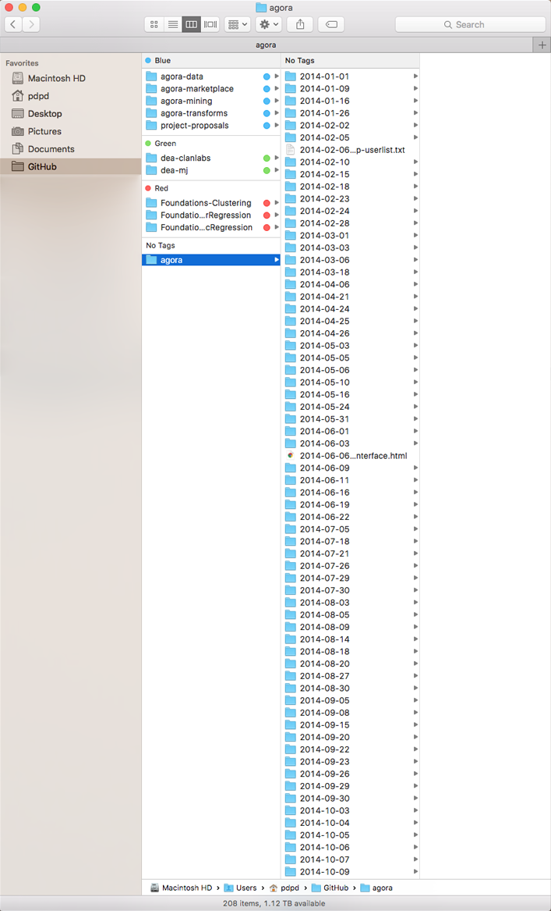
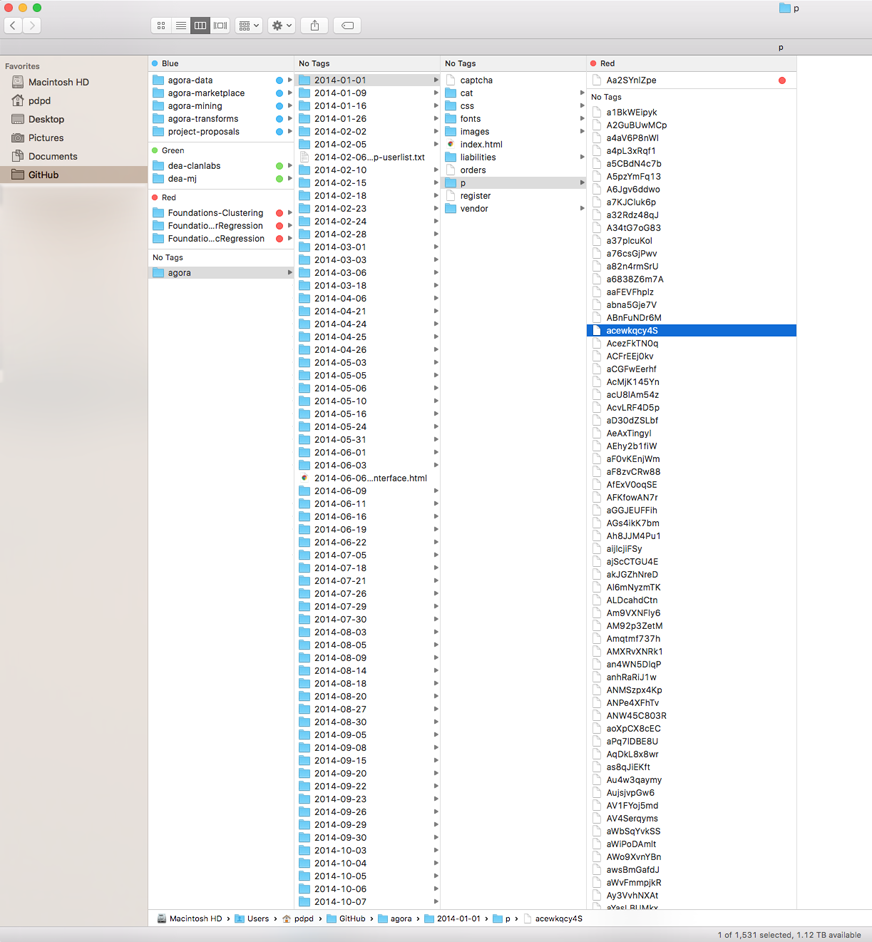

# Agora - Directory/HTML page structure

What follows below are notes on the structure of the harvest. For each day the market was crawled, there were all the elements of the webpage within that directory (e.g. `index.html`, `css` directory, `fonts` directory, and such).

To view the pages locally, I used `simpleHTTPServer` in Python. 

Handwritten notes and images were a way to deal with the unstructured nature and scale of the data, and below are the directories from each day's harvest that would be relevant for analysis. 

- [directory structure](#directory-structure-notes)
- [relevant tags](#relevant-tags)

Further notes on relevant tags for sorting the scrape using `rvest` can be found here:

- [p directory tags](ag-RelevantTags-p.md)
- [vendor directory tags](ag-RelevantTags-vendor.md)
- [cat directory tags](ag-RelevantTags-vendor.md)

## directory structure notes

Data was originally compiled by indpendent researcher Gwern and is [available here](gwern.net/Black-market archives).

The main directory, with weekly and sometimes more frequent crawls. 208 total.

The `p` directory, which contains individual product listings. The number of pages in directory varies by day, as it corresponds to the listings that were made available for that day. This will likely be the main directory working data will be extracted from. From the pages in `p`, we have information on:

	- name of product
	- description of product
	- list price
	- vendor name
	- ship from
	- ship to
	- vendor feedback

The `vendor` directory, which acts as a vendor's 'storefront' with a description of their wares and process - and also a table of all their listings for that particular day. This directory might be useful, if not exhaustive, for aggregating vendors by product.

The `cat` directory, which contains pages grouped by category. These categories are found on the left sidebar of the webpages. Examples of categories include `Chemicals`, `Counterfeits`, `Data`, and `Drugs`. These categories drill down into more specific categories such as `Weed`, `MDMA`, `Books`, and such. Other research has suggested that these categories might not be the most reliable for classification due to vendors cross-posting specific products. 

This directory would also vary in number of listings on a day to day basis, and there are also subfolders for categories that had many listings and thus many pages.

# Relevant Tags

For extraction: 

**'p' directory:**

- product title via page title: "title"
- product title via header: "#single-product h1"
- product description: "#single-product"
- vendor name: "a.gen-user-link" 
- vendor rating: ".gen-user-ratings"
- ship_from: ".product-page-ships"
- ship_to: div class=".product-page-ships"
- list price: ".product-page-price"
- vendor feedback: ".embedded-feedback-list"

**'vendor' directory:**

- vendor bio: ".vendorbio-description"
- vendor pgp public key: ".pgptoken"
- feedback: ".embedded-feedback-list"
- product list (as a table): "table.products-list"
- product list : "#product-list" 

_children of div id Product List:_

- Product Name: "#product-list a"
- Product Description preview: ".description-preview"
- Price in BTC: "#product-list td"
- Ship_From location: ".column-name~ td+ td"
- Ship\_To location: "td" or ".column-name~ td+ td"

**'cat' directory:**

- Category on Page- ".topnav-element"
- Subcategory List - ".leftmenu-subelements a"
- Main Categories - ".leftmenu-element a"
- Category Product List Table - "table.products-list"
- Listing Headers - ".products-list-header"
- Product Name - ".column-name a"
- Product Description (preview) - ".description-preview"
- Price - ".products-list td"
- Shipping info - ".column-name~ td+ td" "//td[((count(preceding-sibling::*) + 1) = 4)]" (xpath)
- Vendor - "a.gen-user-link"
- Vendor Rating - ".gen-user-ratings"

