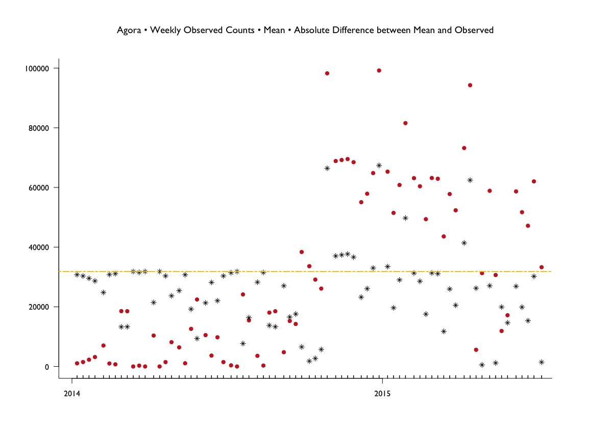
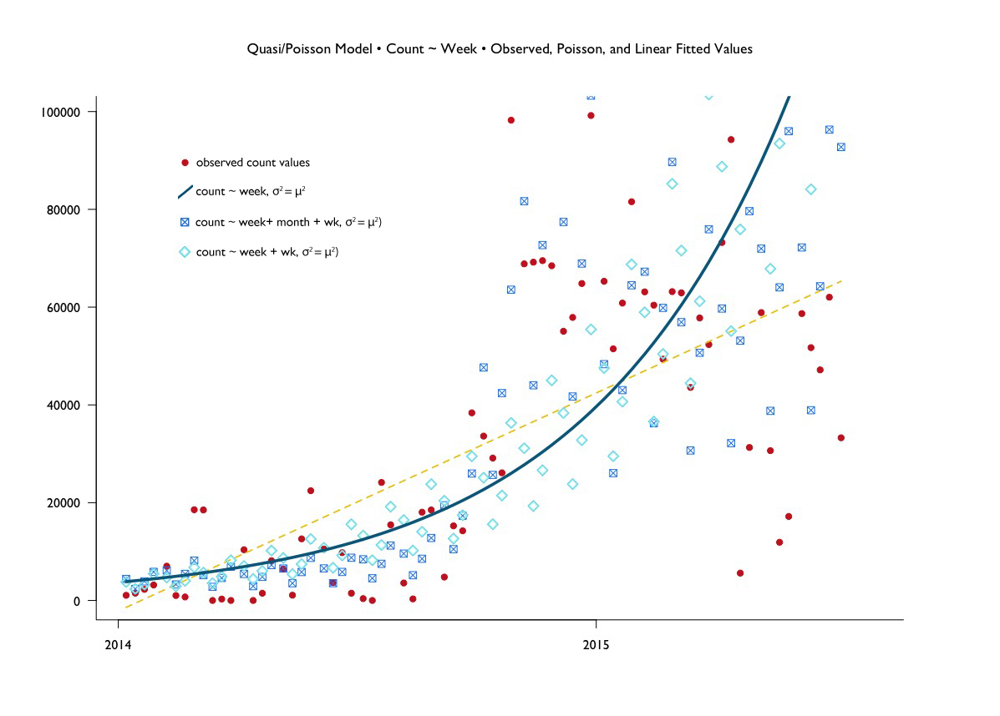
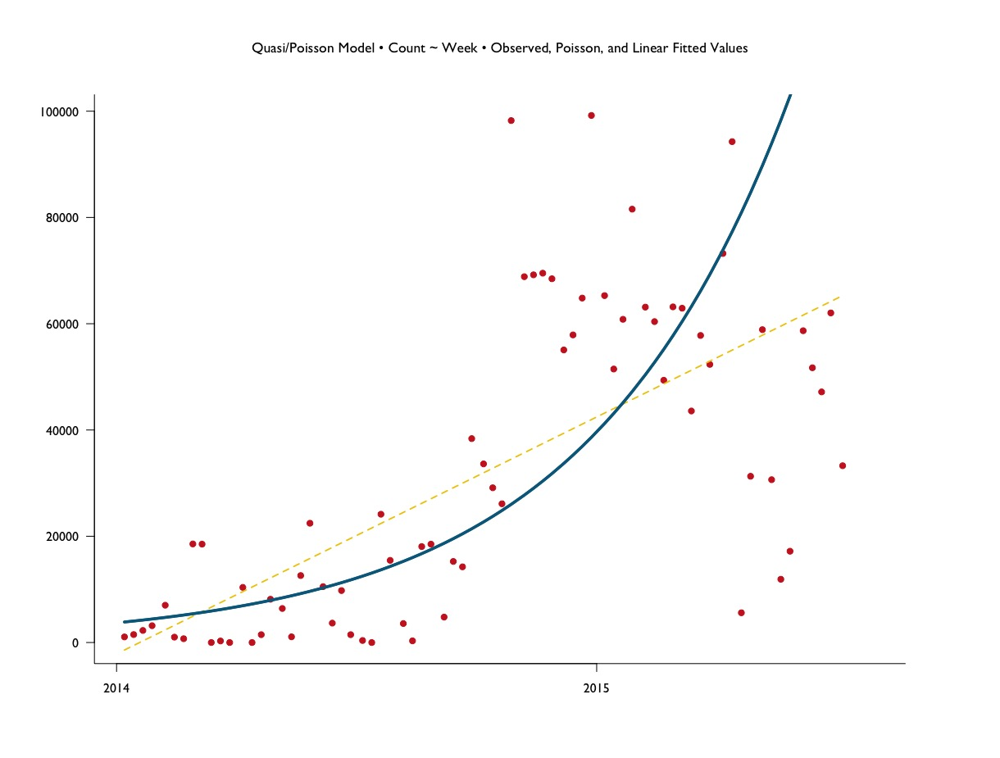
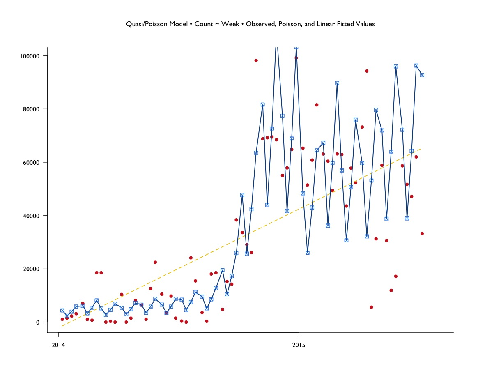
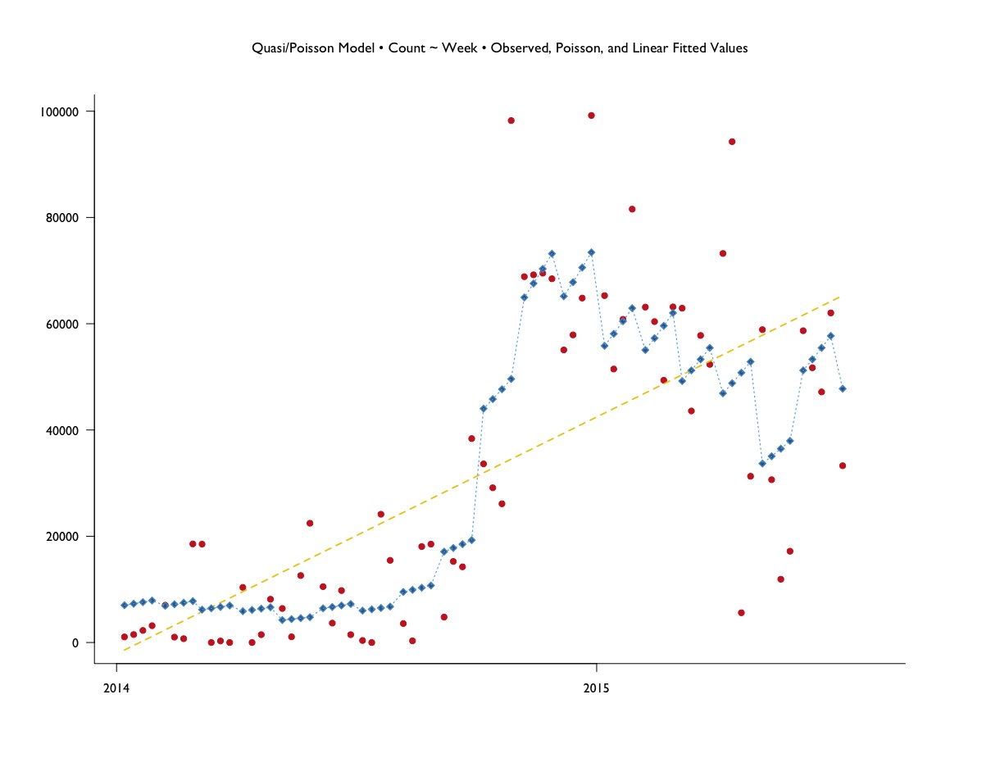
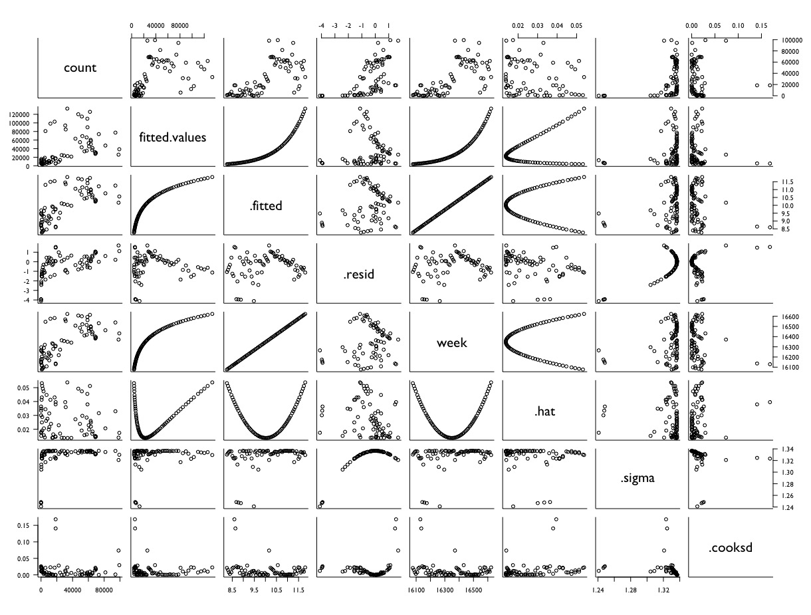

# Poisson Regression - Weekly Listings

One of issues with darknet markets is that they're in the dark. Answering some basic questions might shed some light. **How large are these markets?** and, if left unchecked, **How large could they be?**

What follows are basic attempts at models to answer these questions.

- ["How much is there?"](#how-much-is-there)
- ["How much could there be?"](#how-much-could-there-be)

I decided to try a Poisson Regression on weekly count data, after having a feeling that monthly count data would be far too general and and daily count data far too specific. 

A weekly interval seemed a good compromise. 

- [Poisson Model 01](#poisson-model-01)
- [Quasipoisson Model 02](#quasipoisson-model-02)
- [Quasipoisson Model 03](#quasipoisson-model-03)
- [Quasipoisson Model 04](#quasipoisson-model-04)
- [Quasipoisson Model 05](#quasipoisson-model-05)
- [pre-SilkRoad2 shutdown](#pre-silkroad2-shut-down)
- [post-SilkRoad2 shutdown](#post-silkroad2-shut-down)


# How much is there?

``` {r}
library(data.table)
library(sandwich)
library(plsRglm)
library(caret)
library(ggplot2)
library(vcd)

agora <- fread("~/GitHub/agora-data/agora-01b.csv", stringsAsFactors = T)
agora$date <- as.Date(agora$date)
```

This data represents the entirety of Agora raw data available. Altogether there are 2322961 observations of 18 variables. To make my life a bit simpler, I decided to split the gathering the count data into two `for()` loops by year. 

``` {R}
# convert to numeric
agora$day <- as.numeric(agora$day)
agora$month <- as.numeric(agora$month)

# loop over months and count rows - 2014 
w14 <- data.frame()

for (i in 1:12) {
  
  w1 <- nrow(subset(agora, agora$month == i & agora$year == "2014" & 
                      agora$day <= 7))
  w2 <- nrow(subset(agora, agora$month == i & agora$year == "2014" & 
                      agora$day <= 14 & agora$day > 7))
  w3 <- nrow(subset(agora, agora$month == i & agora$year == "2014" & 
                      agora$day <= 21 & agora$day > 14))
  w4 <- nrow(subset(agora, agora$month == i & agora$year == "2014" & 
                      agora$day <= 31 & agora$day > 21))
  
  wLog <- cbind(w = i, w1 = w1, w2 = w2, w3 = w3, w4 = w4)
  w14 <- rbind(w14, wLog)
}
```

After getting weekly count data with `nrow()`, some quick stacking and cleansing:

``` {R}
# stack counts + sort chronologically
w14 <- stack(w14, select = c(w1, w2, w3, w4))
w14$month <- c("01", "02", "03", "04", "05", "06", "07", "08", "09", "10", "11", "12")
w2$mw <- paste("2014", w14$month, w14$ind, sep = "-")
colnames(w14) <- c("count", "week", "month", "mw")
w14 <- w14[c(4, 1, 2, 3)]
w14 <- w14[order(w14$mw, decreasing = F), ]
rownames(w14) <- NULL
```

I repeated this process for 2015 data, bound `w14` and `w15` together, and cleaned up the temp names from the loop for readability:

``` {R}
weekly <- rbind(w14, w15)
weekly$mw <- gsub("\\bw1\\b", "07", weekly$mw)
weekly$mw <- gsub("\\bw2\\b", "14", weekly$mw)
weekly$mw <- gsub("\\bw3\\b", "21", weekly$mw)
weekly$mw <- gsub("\\bw4\\b", "28", weekly$mw)
```

Plot of observed weekly counts, with mean of counts and absolute differences bewtween mean and observed:



```{R}
par(mfrow = c(1, 1), mar = c(6, 6, 6, 6), family = "GillSans", bty = "l", las = 1)

plot(wk$week, wk$count, xlab = "", ylab = "", col = "firebrick3", pch = 19,
     main  = "Agora • Weekly Observed Counts • Mean • Absolute Difference between Mean and Observed", 
     xlim = c(as.Date("2014-01-07"), as.Date("2015-06-28")),
     cex.main = 1.2, cex.axis = 1)

points(wk$week, wk$count, col = "firebrick3", pch = 20, cex = 1.8)
points(wk$week, wk.abs.dev, col = "#000000", pch = 8, cex = 1)
abline(a = wk.avg, b = 0, lty = 6, col = "gold2", lwd = 2)

rug(wk$week, ticksize = 0.0085, side = 1, lwd = 1.5, 
    lty = 1, col = "#000000")
```    
# How much could there be?

Plot of observed values and values fitted from 3 different Poisson models: 



This is probably a bit much to take in - so onto the individual models. 

# Poisson Model 01

The parameters for this regression were simple enough - `count ~ week` - but the the difference between the `residual deviance` and `degrees of freedom` were so large as to indicate massive overdispersion. On a somewhat positive note, the model exhibited an effect over the null - deviance reduced by a factor of approximate 1.75.

```{R}
pmw01 <- glm(count ~ week, family = poisson, data = wk)
summary(pmw01)
#                    Estimate    Std. Error z value            Pr(>|z|)    
#   (Intercept) -58.051732708   0.076378255  -760.1 <0.0000000000000002 ***
#   week          0.004171856   0.000004644   898.4 <0.0000000000000002 ***
# 
# (Dispersion parameter for poisson family taken to be 1)
#
#     Null deviance: 2106049  on 72  degrees of freedom
# Residual deviance: 1191952  on 71  degrees of freedom
# AIC: 1192752
```

# Quasipoisson Model 02

This model seemed to be the most interesting out of all the fits. Again the formula is simple enough with `count ~ week`, but this time we've got the variance set to mean squared.

```{R}
qmw02 <- glm(count ~ week, data = wk, 
             family = quasi(link = "log", variance = "mu^2"))

summary(qmw02)
#                 Estimate  Std. Error  t value           Pr(>|t|)
#  (Intercept) -96.0231972  10.3609211  -9.268 0.00000000000007527 ***
#  week          0.0064864   0.0006337  10.236 0.00000000000000128 ***
#
# (Dispersion parameter for quasi family taken to be 0.8623852)
#
#     Null deviance: 175.35  on 72  degrees of freedom
# Residual deviance: 125.06  on 71  degrees of freedom
# AIC: NA
```

It appears that the data are just a touch underdispersed at 0.86. For now, I'll say that might not be bad given the rather large differencees observed before.



- red points: observed counts
- blue line: quasipoisson fitted values
- yellow line: linear regression fitted values (`lm(count~week)`)

# Quasipoisson Model 03

In the third model, I tried adding `month` and `wk` as independent variables, while keeping the variance set to mu^2. The `wk` variable describes which week of a particular month a count was taken (e.g. 1st week of month, 3rd week of month). 

Perhaps this points to a weakness in how I binned the counts to weeks. The total came out to 48 weeks per year rather than 52 - because I assigned extracted counts based on an assumption of there being 4 weeks per month.

``` {R}
qmw03 <- glm(count ~ week + month + wk, data = wk,
             family = quasi(link = "log", variance = "mu^2"))

summary(qmw03)
#                  Estimate  Std. Error t value           Pr(>|t|)    
#   (Intercept) -97.2697515  10.8407891  -8.973 0.0000000000017118 ***
#   week          0.0065719   0.0006659   9.869 0.0000000000000608 ***
#   month02       0.1264772   0.4348387   0.291             0.7722    
#   month03      -0.2241067   0.4361217  -0.514             0.6093    
#   month04      -0.3801890   0.4384636  -0.867             0.3895    
#   month05      -0.3906327   0.4416377  -0.885             0.3801    
#   month06      -0.5909993   0.4458353  -1.326             0.1903    
#   month07      -0.5377981   0.4985914  -1.079             0.2853    
#   month08      -0.6126249   0.5323287  -1.151             0.2546    
#   month09      -0.1076163   0.5334894  -0.202             0.8409    
#   month10       0.5905783   0.5353687   1.103             0.2746    
#   month11       0.9254168   0.5380835   1.720             0.0909 .  
#   month12       0.6748475   0.5414475   1.246             0.2177    
#   wkw2         -0.6642139   0.2864937  -2.318             0.0240 *  
#   wkw3         -0.2085034   0.2864374  -0.728             0.4696    
#   wkw4          0.1500150   0.2864569   0.524             0.6025    
#
# (Dispersion parameter for quasi family taken to be 0.7546344)
#
#     Null deviance: 175.35  on 72  degrees of freedom
# Residual deviance: 104.19  on 57  degrees of freedom
# AIC: NA
```



- red points: observed counts
- yellow line: linear regression fitted values 
- blue points + line: quasipoisson fitted values


# Quasipoisson Model 04

I found this model to also be potentially interesting - the main update being removing the `month` variable from (qmw03-model 03) and again maintaining `variance = "mu^2"`. 

``` {R}
qmw04 <- glm(count ~ week + wk, data = wk,
             family = quasi(link = "log", variance = "mu^2"))

summary(qmw04)
#                   Estimate   Std. Error t value             Pr(>|t|) 
#   (Intercept) -103.2768372   10.2482057 -10.078  0.00000000000000398 ***
#   week           0.0069363    0.0006267  11.068 < 0.0000000000000002 ***
#   wkw2          -0.5252828    0.2819037  -1.863               0.0667 .  
#   wkw3          -0.2534276    0.2818581  -0.899               0.3718    
#   wkw4           0.2231234    0.2818809   0.792               0.4314 
#
# (Dispersion parameter for quasi family taken to be 0.7343154)
#
#     Null deviance: 175.35  on 72  degrees of freedom
# Residual deviance: 119.80  on 68  degrees of freedom
# AIC: NA
```


- red points: observed counts
- yellow line: linear regression fitted values 
- blue points + line: quasipoisson fitted values

Examining the plot, it appears that the wk variable exerts an influence - fitted values seem to take on noticeable intervals.

# Quasipoisson Model 05

The final model looks at `count ~ week + month` - it wasn't possible to specify a multiplicative factor for the variance, so essentially this returned to the standard Poisson assumptions of mean = variance (and overdispersion). Attempts to fit `var = mu^2` led to

``` {R}
Error: inner loop 1; cannot correct step size
In addition: Warning message:
step size truncated due to divergence 
```
If anything might've been positive with this fit - it was a much more pronounced difference in the `null` and `residual` deviances (3.67 times less): 

```{r}
qmw05 <- glm(count ~ week + month, data = wk,
             family = quasipoisson(link = "log"))

summary(qmw05)
#                  Estimate  Std. Error t value        Pr(>|t|)    
#   (Intercept) -82.5262770  11.1654955  -7.391 0.0000000005373 ***
#   week          0.0056840   0.0006802   8.356 0.0000000000121 ***
#   month02      -0.1904705   0.2693681  -0.707        0.482241    
#   month03      -0.4616820   0.2793409  -1.653        0.103605    
#   month04      -0.6860241   0.2866559  -2.393        0.019848 *  
#   month05      -1.1875311   0.3190765  -3.722        0.000438 ***
#   month06      -0.9447352   0.2922034  -3.233        0.001991 ** 
#   month07      -1.1850169   0.4121759  -2.875        0.005583 ** 
#   month08      -0.8993667   0.5272357  -1.706        0.093215 .  
#   month09      -0.4901348   0.4128782  -1.187        0.239860    
#   month10       0.2850663   0.2968744   0.960        0.340795    
#   month11       0.4977691   0.2657779   1.873        0.065960 .  
#   month12       0.3306845   0.2652787   1.247        0.217405  
#
# (Dispersion parameter for quasipoisson family taken to be 9563.747)
#
#     Null deviance: 2106049  on 72  degrees of freedom
# Residual deviance:  573847  on 60  degrees of freedom
# AIC: NA
```


As with (qmf04 - quasipoisson model 04), it appears the additional variable `month` exerts influence as seen in the intervals in fitted values.

# Plots of Fortified Models

Quasipoisson Model 02:




