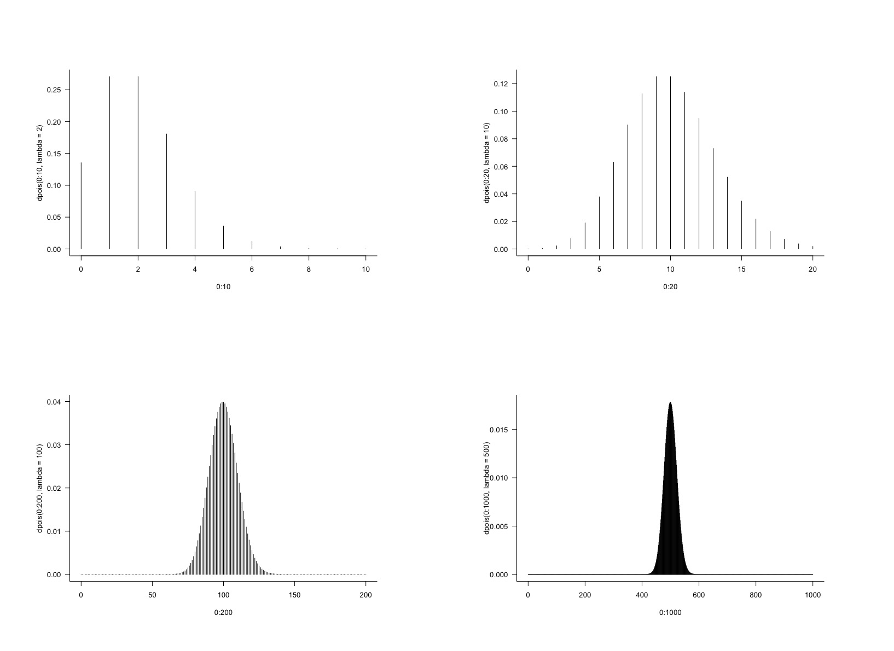
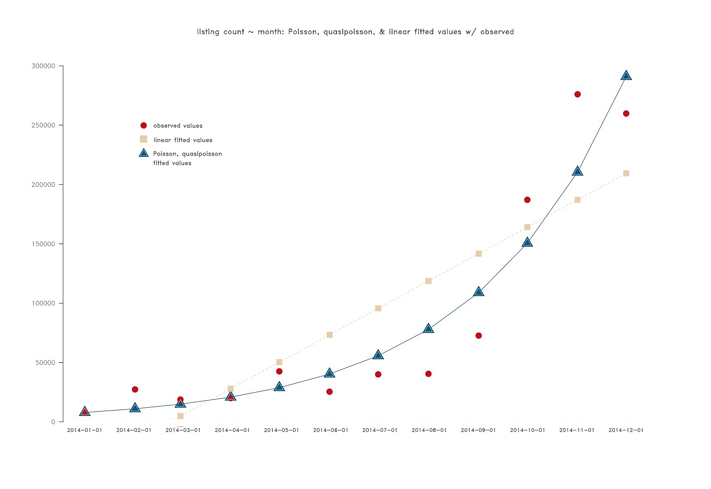
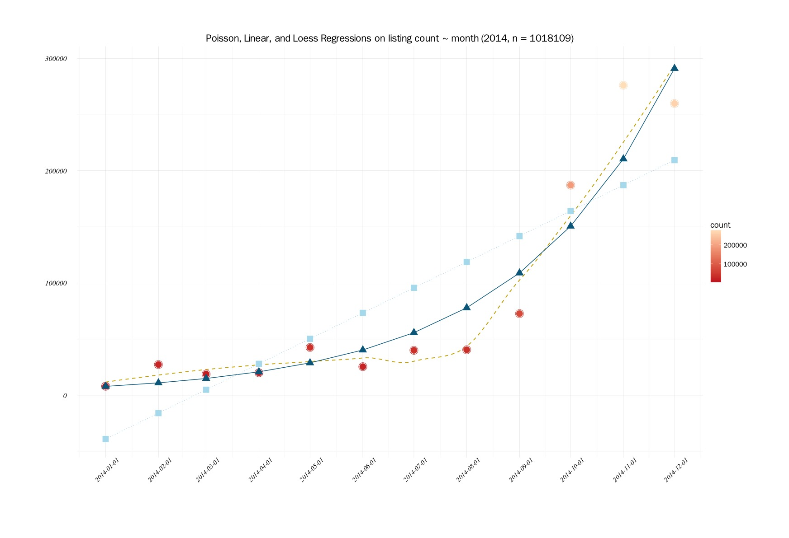

# Poisson Regressions

One of issues with darknet markets is that they're in the dark. Answering some basic questions might shed some light. **How large are these markets?** and, if left unchecked, **How large could they be?**

What follows are basic attempts at models to answer these questions.

- ["How much is there?"](#how-much-is-there)
- ["How much could there be?"](#how-much-could-there-be)

## Poisson Distrubution

It's been noted that as `lambda` gets larger, the Poisson distribution begins to approximate the Normal. A quick look at this:

``` {r}
par(mfrow = c(2, 2), mar = c(8, 8, 8, 8), bty = "l", las = 1)
plot(0:10, dpois(0:10, lambda = 2), type = "h")
plot(0:20, dpois(0:20, lambda = 10), type = "h")
plot(0:200, dpois(0:200, lambda = 100), type = "h")
plot(0:1000, dpois(0:1000, lambda = 500), type = "h")
```



It does appear that as `lambda` grows larger, the distribution approaches normal with mean at `lambda`.

# How much is there?

``` {r}
library(data.table)
p14 <- fread("~/GitHub/agora-data/ag07-2014.csv", stringsAsFactors = T)
```

There are 1018109 observations of 17 variables. After subsetting all the data by month, we can create a dataframe with listing counts to use for a simple Poisson regression.

```
# (...)
dec <- subset(p14, p14$month == "12")

mo <- data.frame(month = seq(as.Date("2014-01-01"), by = "month", length.out = 12), 
                 count = c(nrow(jan), nrow(feb), nrow(mar), nrow(apr), 
                           nrow(may), nrow(jun), nrow(jul), nrow(aug),
                           nrow(sep), nrow(oct), nrow(nov), nrow(dec)))

mo$month <- as.Date(mo$month)
```

A quick look shows that the count increases as the year goes on - more than doubling from September to October.

``` {r}
        month  count
1  2014-01-01   7986
2  2014-02-01  27300
3  2014-03-01  18807
4  2014-04-01  20000
5  2014-05-01  42535
6  2014-06-01  25422
7  2014-07-01  39989
8  2014-08-01  40465
9  2014-09-01  72666
10 2014-10-01 187091
11 2014-11-01 276028
12 2014-12-01 259820
```

# How much could there be?

Now to take a look at a simple Poisson model, and compare it to a linear model with the idea that the Poisson distribution approximates to normal for large `lambda` values. As it stands, the mean for the listing counts over the 12 month period is 84842.42, although this value may certainly be skewed due to explosive growth towards the end of the year.

``` {r}
pm01 <- glm(count ~ month, family = "poisson", data = mo)
summary(pm01)
# Coefficients:
#                 Estimate Std. Error z value Pr(>|z|)    
#   (Intercept) -1.647e+02  2.121e-01  -776.6   <2e-16 ***
#   month        1.081e-02  1.298e-05   832.3   <2e-16 ***

# (Dispersion parameter for poisson family taken to be 1)

#     Null deviance: 1052014  on 11  degrees of freedom
# Residual deviance:  100674  on 10  degrees of freedom
```

The residual deviance is far greater than the degrees of freedom, which implies the mean != variance in this case. Is the data overdispersed? Very likely. Currently, the difference between residual deviance and degrees of freedom is on the order of 10^4.

On an encouraging note - the null deviance is much greater than the residual deviance, so the model is having an effect.
 
Moving on, how does a linear model look? 

``` {r}
lm01 <- lm(count ~ month, data = mo)
summary(lm01)
# Coefficients:
#                 Estimate Std. Error t value Pr(>|t|)    
#   (Intercept) -1.199e+07  2.511e+06  -4.776 0.000751 ***
#   month        7.438e+02  1.546e+02   4.810 0.000713 ***

# Multiple R-squared:  0.6982,	Adjusted R-squared:  0.668 
#   F-statistic: 23.13 on 1 and 10 DF,  p-value: 0.0007134

# correlation test, if month were not time based.
sqrt(0.6982) 						# 0.8355836
cor(mo$count, as.numeric(mo$month)) # 0.8355671
```

How does Poisson look against the linear model and observed values? A quasipoisson model was also fit, yielding identical values to the `pm01` original poisson model. Adding the poisson and linear fitted values to the dataframe, we can plot and see. 

``` {r}
# add fitted values to dataframe
mo$pm01.fitted <- pm01$fitted.values
mo$lm.fitted <- lm01$fitted.values

        month  count pm01.fitted  lm.fitted
1  2014-01-01   7986    7876.885 -38998.460
2  2014-02-01  27300   11011.516 -15940.999
3  2014-03-01  18807   14902.523   4885.094
4  2014-04-01  20000   20833.028  27942.555
5  2014-05-01  42535   28810.560  50256.226
6  2014-06-01  25422   40275.812  73313.686
7  2014-07-01  39989   55698.512  95627.358
8  2014-08-01  40465   77863.908 118684.818
9  2014-09-01  72666  108850.093 141742.279
10 2014-10-01 187091  150531.745 164055.950
11 2014-11-01 276028  210436.321 187113.411
12 2014-12-01 259820  291018.096 209427.082
```

Of course one of the issues with a linear model on this data is the negative fitted values returned. We can see that the fitted values on the poisson regression line up well in the first and fourth months' observed values. How does it look plotted? 

``` {r}
par(mfrow = c(1, 1), mar = c(8, 8, 8, 8), las = 1, bty = "n", family = "HersheySans")
plot(mo$month, pm01$fitted.values, cex = 3.0, col = "deepskyblue4", pch = 17,
     main = "listing count ~ month: Poisson, quasipoisson, & linear fitted values w/ observed", xlab = "", ylab = "", xaxt = "n")
points(mo$month, mo$count, cex = 2.0, col = "firebrick3", pch = 19)
points(mo$month, pm02$fitted.values, cex = 2.0, col = "lightblue2", pch = 2)
points(mo$month, lm01$fitted.values, cex = 2.0, col = "bisque2", pch = 15)
lines(mo$month, pm01$fitted.values, cex = 2.0, col = "deepskyblue4", lty = 1)
lines(mo$month, lm01$fitted.values, cex = 2.0, col = "bisque2", lty = 2)
text(seq(mo$month[1], mo$month[12], length.out = 12), 0, 
     labels = mo$month, srt = 0, cex = 0.85, font = 2)
```



And one more plot using `ggplot2`, with additional `loess` regression line by default with `stat-smooth()`. 

``` {r}
pm01p <- ggplot(mo, aes(month, count)) + 
  stat_smooth(colour = "gold3", se = F, size = 0.65, linetype = "dotdash") +
  geom_point(size = 4.5, colour = "firebrick4", shape = 19) +
  geom_point(size = 6, colour = "firebrick4", shape = 1) +
  geom_point(size = 4.5, colour = "deepskyblue4", shape = 17,
             aes(month, pm01.fitted)) +
  geom_point(size = 4.5, colour = "lightblue2", shape = 15, aes(month, lm.fitted)) +
  geom_line(colour = "deepskyblue4", linetype = "solid", aes(month, pm01.fitted)) +
  geom_line(colour = "lightblue2", linetype = "dotted", aes(month, lm.fitted)) +
  scale_x_date(breaks = mo$month) +
  theme_minimal(base_size = 14, base_family = "FranklinGothicSSK") +
  theme(axis.text.x = element_text(angle = 45)) +
  theme(plot.margin = unit(c(2, 2, 2, 2), "cm")) +
  labs(title = "Poisson, Linear, and Loess Regressions on listing count ~ month", 
       x = "", y = "", fill = "")
```



From looking at the plots, the Poisson certainly looks to be a better fit than the Linear model. And when compared to the observed values, not a bad fit at all. But how would this model perform with more granular (daily) data? And once trained on  2014 daily data, would it do well on a test set of 2015 values? 

Once an adequate model is in place on overall listing counts, can models be developed for specific subcategories (e.g. Cannabis, MDMA?). How do Poisson models differ and relate to time-series (e.g. ARIMA) models?

