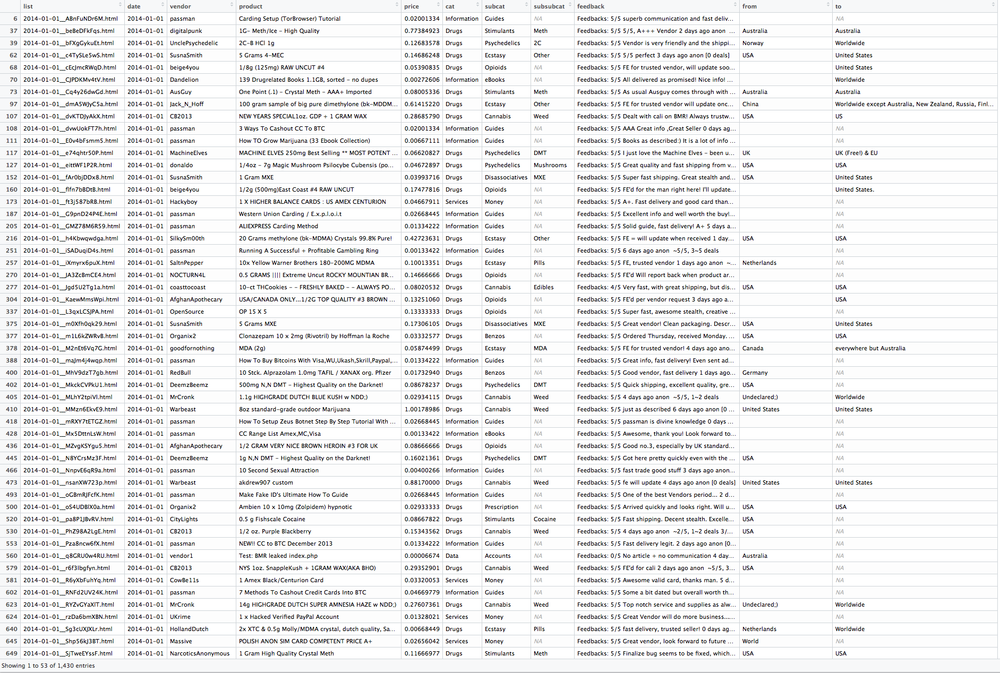
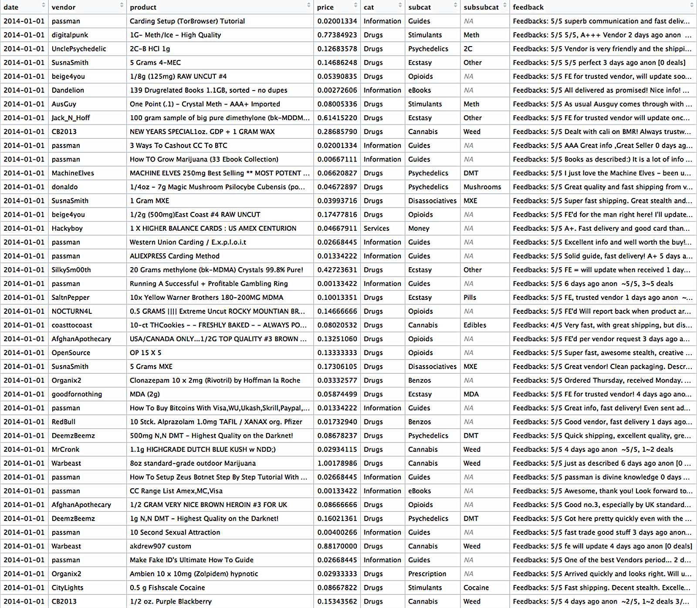
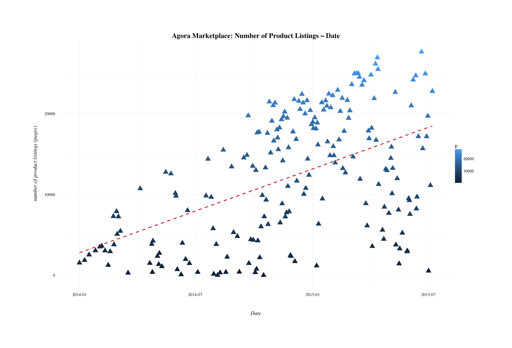
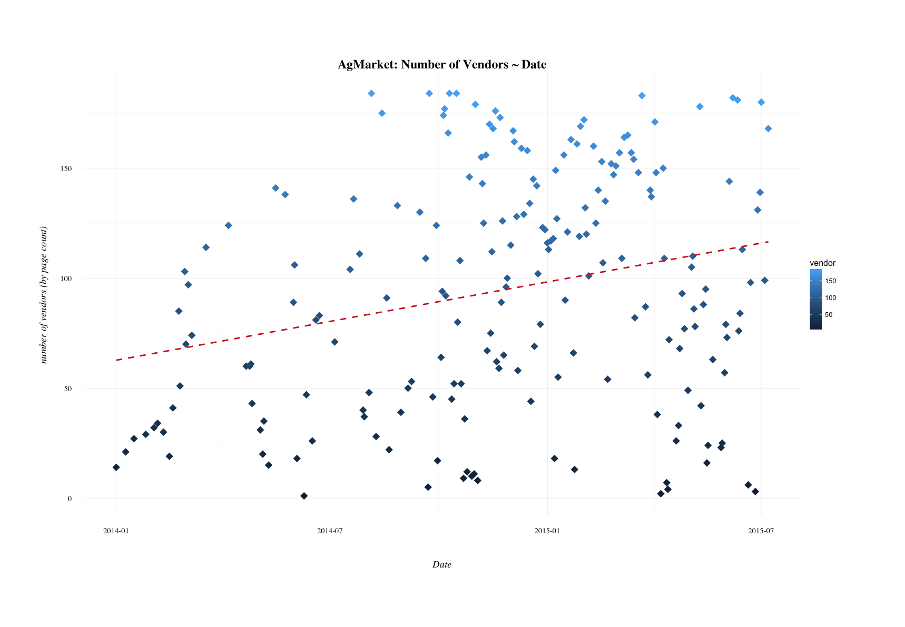
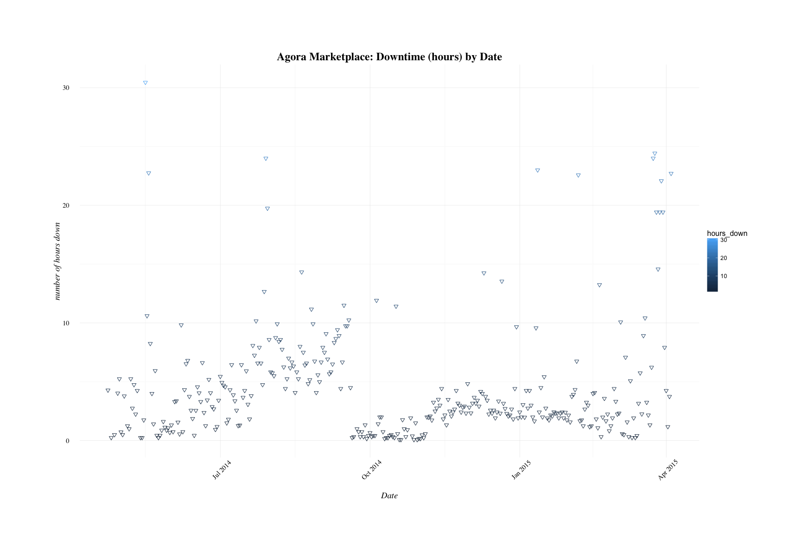

# Agora Marketplace Analysis

_student work in R_

data:
- [the Problem](#the-problem)
- [the Data](#the-data)
- [current strategy](#current-strategy)

domain: 
- [some images](#images)
- [Agora and anonymous marketplaces](#agora-and-anonymous-marketplaces)

exploratory:
- [product and vendor counts](#exploratory-data-analysis)

programming:
- [product page extraction](R/product-page-extraction.R)
- [vendor page extractions](R/extract-vendor-all-01B.R)
- [individual html page extractions](R)
- [scrape cleanse / html parsing](parse-html/readme.md)
- [grams](grams) - archive of exploratory analysis on the 'Grams' dataset.

## the Problem

_**Who is your client and why do they care about this problem? What will your client DO or DECIDE based on your analysis that they wouldn’t have otherwise?**_

My client is Amazon.com. 

Their currently-in-development Medical Marijuana, Research Chemical, and Counterfeit Outerwear departments are lacking in market values and product groupings due to the previously illegal nature of the goods to be offered. 

They want to get a headstart tranining their recommender systems for a seamless transition when President ToBe Determined signs into law a bill broadening the definition of 'legal'.

By conducting a market basket analysis of vendor listings on the anonymous marketplace Agora, Amazon will discover which vendors cluster into 'hit' products and which might reside in the 'long tail' of their e-commerce network.

_This client scenario is fictional._

_**Deliverables**_ 

It'd probably be nice to have a network map written in d3, wouldn't it? Maybe a [force-directed tree](https://bl.ocks.org/mbostock/95aa92e2f4e8345aaa55a4a94d41ce37) or [radial tidy tree](https://bl.ocks.org/mbostock/2e12b0bd732e7fe4000e2d11ecab0268). But only after the information is dense and the analysis is sturdy. 

## the Data

Agora was a referral-based darknet market that rose to prominence after the demise of Silk Road 2 in 2013. 

The data was acquired via gwern's [black market archives](http://www.gwern.net/Black-market%20archives#grams); specifically from the torrent/magnet link. Comprising this archive are weekly crawls of multiple anonymous marketplaces on the darknet - well-trafficked and documented sites such as Silk Road and Evolution in addition to smaller, more ephemeral markets.

For Agora specifically, the crawl dates begin on 2014-01-01 and end on 2015-07-07. There are 206 daily crawls total, occurring weekly and occassionally more frequently.

From these daily crawls, I found the most relevant directories to be: 

- [cat]() - pages of listings by category e.g. "Books", "Drugs", "Counterfeits"
- [p](parse-html/ag-RelevantTags-p.md) - individual product listing pages
- [vendor](parse-html/ag-RelevantTags-vendor.md) - vendor pages with bio, pgp key, and vendor's listings.

The scale of gwern's harvest prevents it from being posted here. Here is a glimpse of the extraction from html, subsetted for listings that contained client feedback - potential indicator of a transaction.




_*to download the data for yourself, please refer to gwern's black market archives link above. For me it took about 8-10 hours to download; Agora is roughly 127 GB total, but each daily crawl contains many subfolders which adds to the download and tar.gz extraction time._

## current strategy

The ultimate goal will be to conduct a Market Basket Analysis; to mine associate rules given the products and services available in the data. While some transaction data is available, in much more abundace is vendor data. Given this, it will likely be that associate rules will be created from vendor listings - i.e. "vendors who sell this, also sell that". 

There are many ways to categorize illegal substances - [DEA Scheduling](https://www.dea.gov/druginfo/ds.shtml) comes to mind. With this particular data, we can possibly derive another classification scheme using association rules on vendor listings - a look at what products (drugs) tend to cluster together from a supply-side perspective. 

## images

Agora Marketplace index page on July 7th, 2015:


Agora Marketplace index page on January 1st, 2014 (printout with notes)


## Agora and anonymous marketplaces

Agora was chosen as a market to analyze because of it's immense popularity and high usage. Additionally and subjectively, the conditions of Agora's shutdown were unique to me in that the admins voluntarily shut it down after a [paper was published in August 2015](https://www.usenix.org/system/files/conference/usenixsecurity15/sec15-paper-kwon.pdf) that exposed vulnerabilities that could de-anonymize Tor users. 

This is in contrast to other markets of similar scale. The largest examples are Silk Road's demise at the hands of law enforcement; darknet markets [Evolution](https://www.deepdotweb.com/2015/03/18/evolution-marketplace-exit-scam-biggest-exist-scam-ever/) and [Sheep](https://www.deepdotweb.com/2013/11/30/sheep-marketplace-scammed-over-40000000-in-the-biggets-darknet-scam-ever/) turning out to be massive exit-scams.

It's a stretch to say (and impossible to prove) that Agora's administrators were completely altruisitic in their voluntary shutdown; but such protections of themselves and their clients might suggest that conducting business professionally was a priority above others. 

## Exploratory Data Analysis

Before diving into extraction of the data, I took a look at counts of the crawls themselves to get a sense of the scale of the market. Each page in the `p` directory corresponds to a single product listing; each in the `vendor` directory corresponds to a vendor's 'storefront' page. 

While not definitive in it's conclusion, the purpose of this exploration was to explore the question
	
		"What if Agora never shut down? What would the trend be?"

We know Agora began operations sometime in 2013, and picked up steam in 2014 after the downfall of Silk Road 2 - many buyers and vendors migrated over to Agora to continue business. 

``` r
pv <- read.csv("data/counts/crawl-distribution.csv")
str(pv)

pv$date <- as.Date(pv$date)
pv$vendor <- as.integer(pv$vendor)
summary(pv)

#         date                  p             vendor     
# Min.   :2014-01-01   Min.   :    1   Min.   :  1.0  
# 1st Qu.:2014-09-11   1st Qu.: 4453   1st Qu.: 49.5  
# Median :2014-12-07   Median :12697   Median : 96.0  
# Mean   :2014-11-26   Mean   :12154   Mean   : 94.8  
# 3rd Qu.:2015-03-17   3rd Qu.:19030   3rd Qu.:140.5  
# Max.   :2015-07-07   Max.   :27654   Max.   :184.0 

sum(pv$p)
# [1] 2467200

sum(pv$vendor)
# [1] 19245

```

total days | product listings | vendor pages  |
-----------| :--------------: | :------------:|
533		   |	2,467,200     |	   19,245     |

Time Period: January 1st, 2014 through July 7th, 2015




``` r
p.lm <- (product ~ date, data = pv)

#                 Estimate  Std.Error  t value 		Pr(>|t|)    
#   (Intercept) -4.542e+05  5.579e+04  	-8.142 	4.04e-14 ***
#   date         2.843e+01  3.401e+00    8.360 	1.03e-14 ***
# 	Multiple R-squared:  0.258,	Adjusted R-squared:  0.2543 
```

Given the limited number of variables, these models probably shouldn't be considered for drawing definitive conclusions. In addition to that, there are many outside factors with the crawls and markets that can influence product and vendor listing counts. 

It can't be assumed that every crawl represents a complete day's listings; the market itself would be down at seemingly random times to address server or security issues. Many pages (> 10,000) were removed during the extraction process because they were blank - too many requests had been made to the server. Gwern himself has made clear that it's best to consider his crawls a lower-bound for market activity. 

But maybe the best reason these plots are spurious is that ordinary least squares regression isn't exactly suited for count data or time series modeling.



``` r
# Coefficients:
#                 Estimate   Std.Error  t value Pr(>|t|)    
#   (Intercept) -1.505e+03   4.271e+02  -3.523 	0.000528 ***
#   date         9.752e-02   2.604e-02   3.745 	0.000235 ***
# 	Multiple R-squared:  0.06523,	Adjusted R-squared:  0.06058
```

Since the market could go offline for periods ranging from hours to days, listings could disappear and then reappear somewhat randomly as well. The anonymous nature of the marketplace did not contribute to traditional efficiency in this respect. What follows is a partial plot of market downtimes - ranging from the dates 2014-04-23 until 2015-04-04. 

What if we assume there was no downtime for security issues? Can we project a reasonable market size if growth were to stabilize? 	

Actual Market downtimes - an influence on number of listings and vendors:




