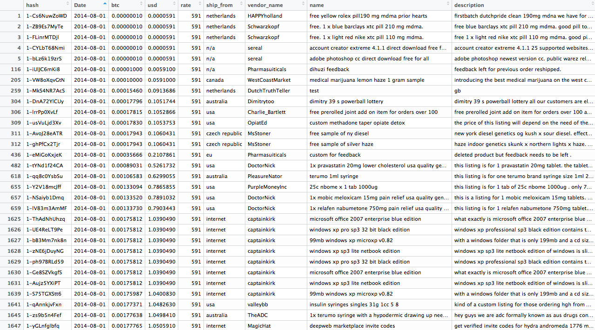

# Agora Marketplace Analysis

_student work in R_

- [the Data](#the-data)
- [the Problem](#the-problem)
- [current Strategy](#current-strategy)
- [Agora and Darknet Markets](#agora-and-darknet-markets)

## the Data

Agora was a referral-based darknet market that rose to prominence after the demise of Silk Road 2 in 2013. 

The data was acquired via gwern's [black market archives](http://www.gwern.net/Black-market%20archives#grams); specifically the `Grams` (darknet market search engine) crawls. The data itself is comprised of daily listings of goods and services on offer from vendors, and ranges from 06-29-2014 until 07-12-2015. Some data is missing; likely due to markets going offline while taking measures to avoid law enforcement or hackers. 

Here is a glimpse of the data:

- 4,371,382 observations of 9 variables

variable info:
- **hash**: hash value of listing
- **Date**: date of listing
- **btc** : list price of product/service in Bitcoin
- **usd** : list price of product/service in US Dollar
- **rate**: exchange rate of Bitcoin to Dollar for that particular Date. 
- **ship_from**: where product/service claims to originate from
- **name**: 'headline' of the product/service listing
- **description**: further information on the product/service

## the Problem

_Who is your client and why do they care about this problem? In other words, what will your client DO or DECIDE based on your analysis that they wouldn’t have otherwise?_

My client is Amazon.com. 

Their currently-in-development Medical Marijuana, Research Chemical, and Counterfeit Outerwear departments are lacking in street market values and potential consumer behaviors due to the previously illegal nature of the products to be offered. 

They want to develop a rough model of the type of person who is interested in such things, so they can get a headstart tranining their recommender systems for a seamless transition when President ToBe Determined signs into law a bill broadening the definition of 'legal'. 

The client will decide, based on this analysis, the necessary scale for their newly legal departments, and they'll also decide if it is worth aggregating these darknet vendors into their network. By conducting a market basket analysis of vendor listings, Amazon will discover which vendors cluster into 'hit' products and which might reside in the 'long tail' of their ecommerce network. 

## current Strategy

Because of the size of the dataset, I've went in and [subsetted the whole by month](R_scripts/agora-subsets.R). From here, I was looking into the `name` field of the data, and doing text mining for keywords to hopefully reveal product clusters.  

Also in this script are categorical subsets for Location (based on the `ship_from` field) and Vendor name (based on the `vendor_name` field).

## Agora and Darknet Markets

Agora was distinct from other darknet markets such as Silk Road and Evolution in that in word and action they appeared to have their client's best interests in mind. While suffering from recurring downtime issues, they made efforts to change servers and remain as anonymous as possible in the face of threats from LE, hackers, and DDOS attacks. And in contrast to markets such as Evolution, which ended in a large exit scam where the admins absconded with millions of dollars worth of bitcoin still in escrow - Agora voluntarily shut down their services once a [Tor vulnerability was published](https://www.usenix.org/system/files/conference/usenixsecurity15/sec15-paper-kwon.pdf) in July 2015. Rather than continue to operate in the face of a potential risk of deanonymization, the administrators of Agora chose to allow vedors and buyers to cash out before they closed down. 

