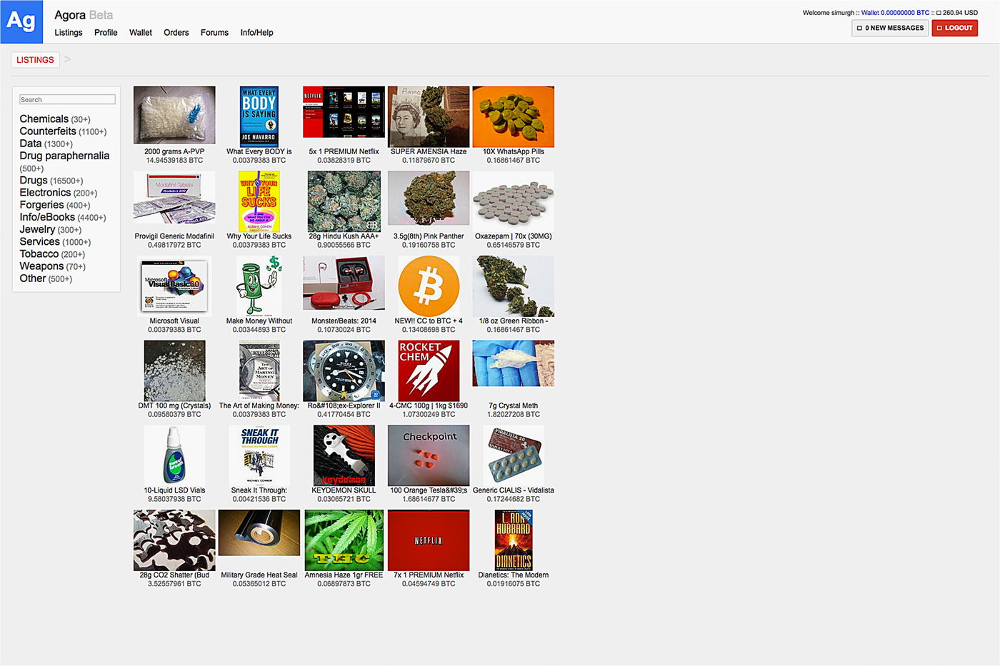

# Agora Marketplace Analysis

_student work in R_

data:
- [the Problem](#the-problem)
- [the Data](#the-data)
- [current strategy](#current-strategy)

domain: 
- [Agora and anonymous marketplaces](#agora-and-anonymous-marketplaces)
- [some images](#images)

programming:
- [individual html page extractions](R)
- [scrape cleanse / html parsing](parse-html/readme.md)
- [grams](grams) - archive of exploratory analysis on the 'Grams' dataset.

## the Problem

_**Who is your client and why do they care about this problem? What will your client DO or DECIDE based on your analysis that they wouldn’t have otherwise?**_

My client is Amazon.com. 

Their currently-in-development Medical Marijuana, Research Chemical, and Counterfeit Outerwear departments are lacking in market values and product groupings due to the previously illegal nature of the goods to be offered. 

They want to get a headstart tranining their recommender systems for a seamless transition when President ToBe Determined signs into law a bill broadening the definition of 'legal'.

By conducting a market basket analysis of vendor listings on the anonymous marketplace Agora, Amazon will discover which vendors cluster into 'hit' products and which might reside in the 'long tail' of their e-commerce network.

_This client scenario is fictional._

_**Deliverables**_ 

It'd probably be nice to have a network map written in d3, wouldn't it? Maybe a [force-directed tree](https://bl.ocks.org/mbostock/95aa92e2f4e8345aaa55a4a94d41ce37) or [radial tidy tree](https://bl.ocks.org/mbostock/2e12b0bd732e7fe4000e2d11ecab0268). But only after the information is dense and the analysis is sturdy. 

## the Data

Agora was a referral-based darknet market that rose to prominence after the demise of Silk Road 2 in 2013. 

The data was acquired via gwern's [black market archives](http://www.gwern.net/Black-market%20archives#grams); specifically from the torrent/magnet link. Comprising this archive are weekly crawls of multiple anonymous marketplaces on the darknet - well-trafficked and documented sites such as Silk Road and Evolution in addition to smaller, more ephemeral markets.

For Agora specifically, the crawl dates begin on 2014-01-01 and end on 2015-07-07. There are 206 daily crawls total, occurring weekly and occassionally more frequently.

From these daily crawls, I found the most relevant directories to be: 

- [cat]() - pages of listings by category e.g. "Books", "Drugs", "Counterfeits"
- [p](parse-html/ag-RelevantTags-p.md) - individual product listing pages
- [vendor](parse-html/ag-RelevantTags-vendor.md) - vendor pages with bio, pgp key, and vendor's listings.

The scale of gwern's harvest prevents it from being posted here. To get more of an idea of the data, please do refer to the [parse-html](parse-html/readme.md) folder. 

To download the data for yourself, please refer to gwern's black market archives link above. For me it took about 8-10 hours to download; Agora is roughly 127 GB total, but each daily crawl contains many subfolders which adds to the download time. 

## current strategy

The ultimate goal will be to conduct a Market Basket Analysis; to create associate rules given the products and services available in the data. While some transaction data is available, in much more abundace is vendor data. Given this, it will likely be that associate rules will be created from vendor listings - i.e. "vendors who sell this, also sell that". 

There are many ways to categorize illegal substances - [DEA Scheduling](https://www.dea.gov/druginfo/ds.shtml) comes to mind. With this particular data, we can possibly derive another classification scheme using association rules on vendor listings - a look at what products (drugs) tend to cluster together from a supply-side perspective. 

## Agora and anonymous marketplaces

Agora was chosen as a market to analyze because of it's immense popularity and high usage. Additionally and subjectively, the conditions of Agora's shutdown were unique to me in that the admins voluntarily shut it down after a [paper was published in August 2015](https://www.usenix.org/system/files/conference/usenixsecurity15/sec15-paper-kwon.pdf) that exposed vulnerabilities that could de-anonymize Tor users. 

This is in contrast to other markets of similar scale. The largest examples are Silk Road's demise at the hands of law enforcement; darknet markets [Evolution](https://www.deepdotweb.com/2015/03/18/evolution-marketplace-exit-scam-biggest-exist-scam-ever/) and [Sheep](https://www.deepdotweb.com/2013/11/30/sheep-marketplace-scammed-over-40000000-in-the-biggets-darknet-scam-ever/) turning out to be massive exit-scams.

It's a stretch to say (and impossible to prove) that Agora's administrators were completely altruisitic in their voluntary shutdown; but such protections of themselves and their clients might suggest that conducting business professionally was a priority above others. 

## images

Agora Marketplace index page on July 7th, 2015:

