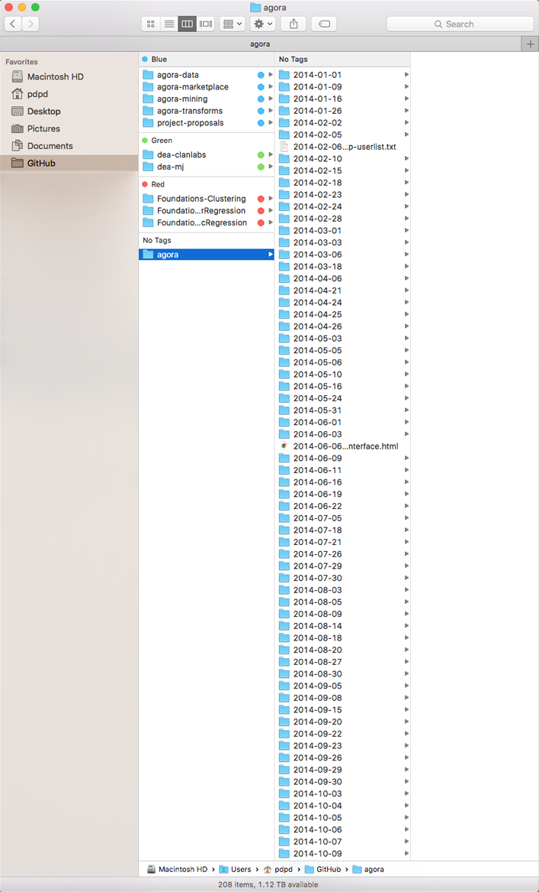
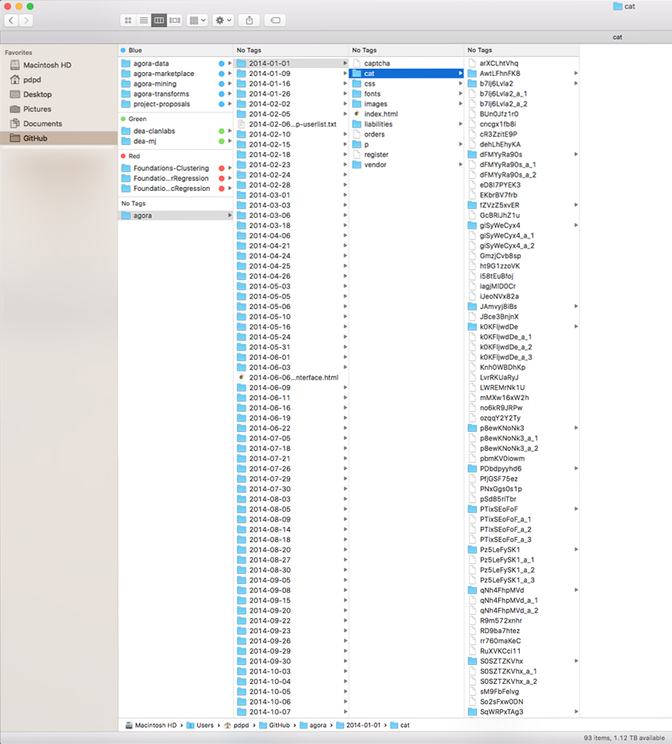

# Agora - Directory/HTML page structure

What follows below are notes on the structure of the harvest. For each day the market was crawled, there were all the elements of the webpage within that directory (e.g. `index.html`, `css` directory, `fonts` directory, and such).

To view the pages locally, I used `simpleHTTPServer` in python. 

Handwritten notes and images were a way to deal with the unstructured nature and scale of the data, and below are the directories from each day's harvest that would be relevant for analysis. 

Further notes on relevant tags for sorting the scrape using `rvest` can be found here:

- [p directory tags](agora-RelevantTags-p.md)
- [vendor directory tags](agora-RelevantTags-vendor.md)
- [cat directory tags]() - coming soon.

Data was originally compiled by indpendent researcher Gwern and is [available here](gwern.net/Black-market archives).

The main directory, with weekly and sometimes more frequent crawls. 208 total.

The `cat` directory, which contains pages grouped by category. These categories are found on the left sidebar of the webpages. Examples of categories include `Chemicals`, `Counterfeits`, `Data`, and `Drugs`. These categories drill down into more specific categories such as `Weed`, `MDMA`, `Books`, and such. 

The number of pages in directory varies by day, as it corresponds to the listings that were made available for that day. There are also subfolders for categories that had many listings and thus many pages.

The `p` directory, which contains individual product listings. This will likely be the main directory working data will be harvested from. From the pages in `p`, we have information on 

	- name of product
	- description
	- list price
	- vendor name
	- ship from
	- ship to
	- vendor feedback

This directory would also vary in number of listings on a day to day basis. 	

The `vendor` directory, which acts as a vendor's 'storefront' with a description of their wares and process - and also a list of all their listings for that particular day.

