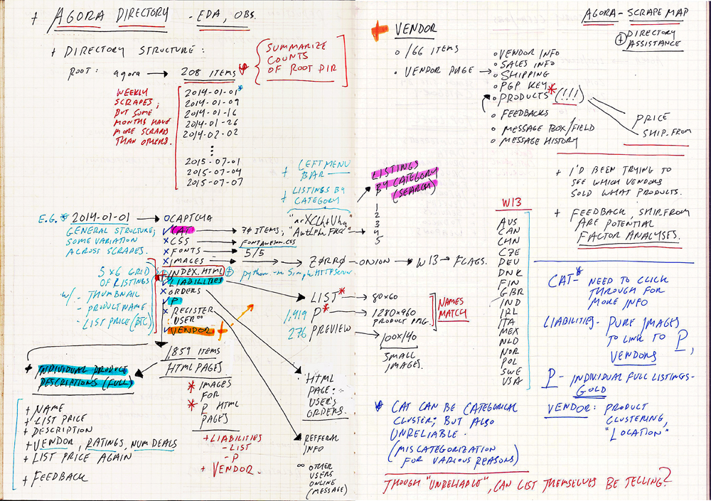
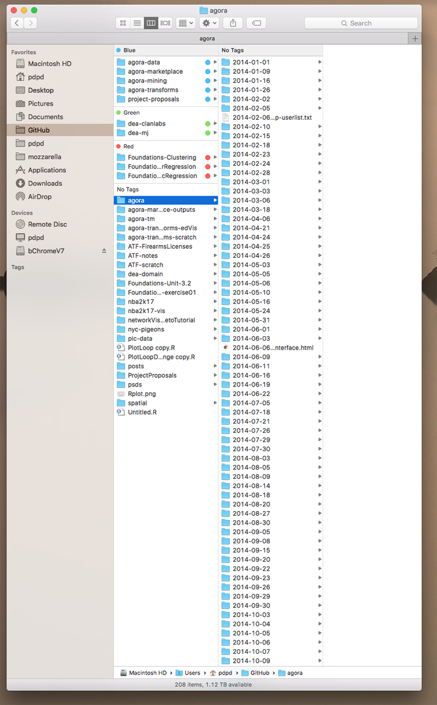
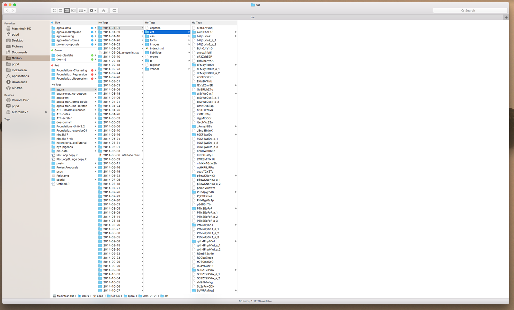
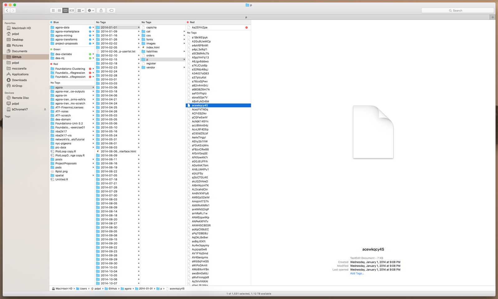
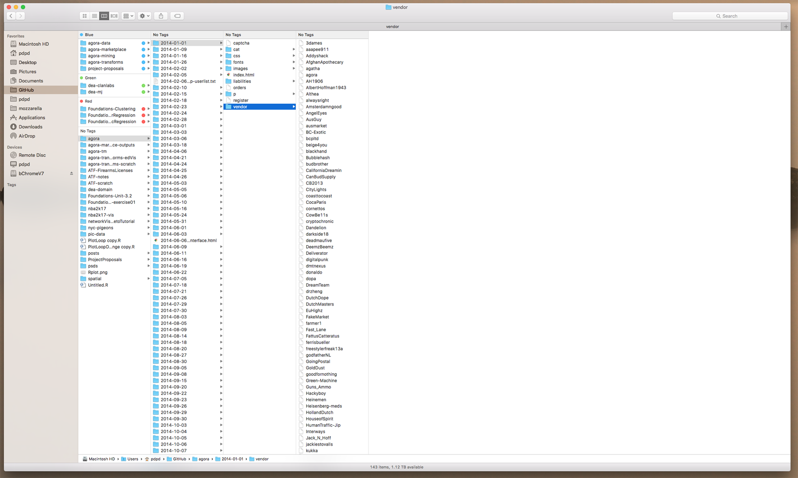

# agora - directory + html page structure notes

What follows below are notes on the structure of the harvest. Handwritten notes and images were a way to deal with the unstructured nature and scale of the data.

